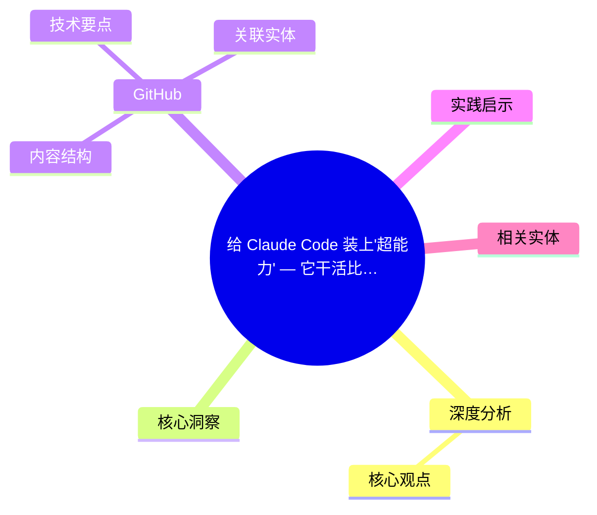
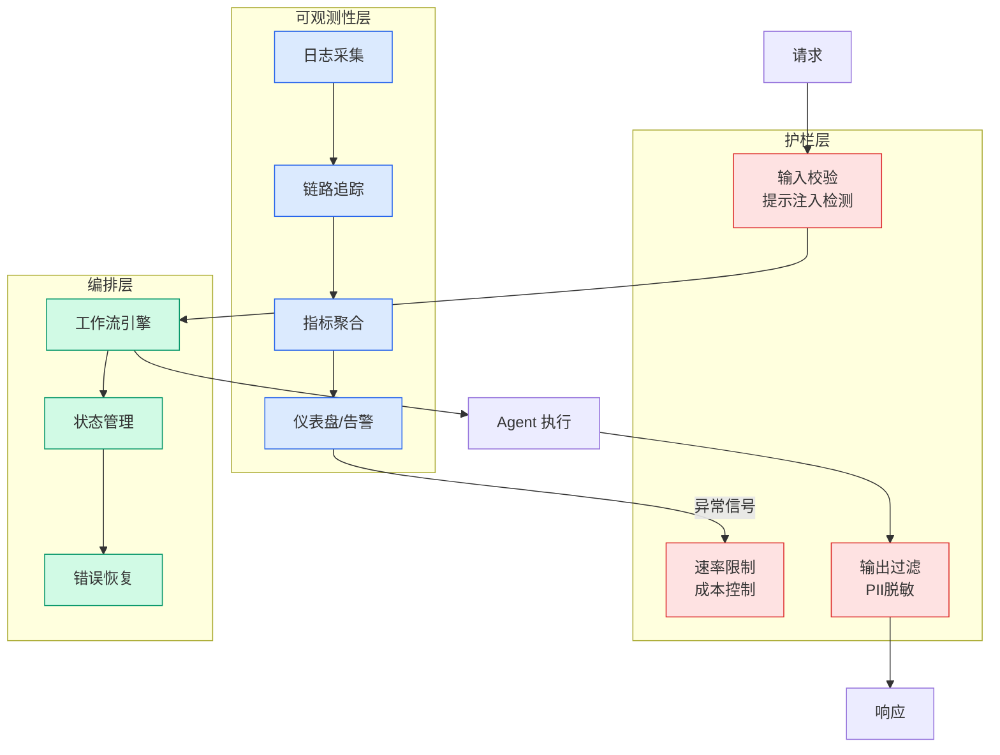

# 给 Claude Code 装上'超能力' — 它干活比我还靠谱

## Ch01.1136 给 Claude Code 装上'超能力' — 它干活比我还靠谱

> 📊 Level ⭐⭐ | 3.5KB | `entities/claude-code-superpowers-workflow-by-xinlingyuanyuanyuan.md`

# 给 Claude Code 装上'超能力' — 它干活比我还靠谱

→ [原文存档](https://github.com/QianJinGuo/wiki-book/tree/main/docs/raw/articles/claude-code-superpowers-workflow-by-xinlingyuanyuanyuan.md)

## 概念导图

## 深度分析

给 Claude Code 装上'超能力' — 它干活比我还靠谱 涉及agent领域的核心技术议题。
### 核心观点
1. # 给 Claude Code 装上"超能力" — 它干活比我还靠谱
> 来源：新世界圆圆圆 - 赛博虾酱，2026-03-24
> 评分：v=6, c=7, v×c=42 → 作为 [Superpowers entity](ch01/490-claude-code-skills-superpowers.html) 的补充
## 核心洞察

Claude Code 不只是需要一个会写代码的助手，它需要一个会干活的人。
2. com/obra/superpowers.
3. claude/skills
# 方式三：手动安装中文版
git clone https://github.
4. com/jnMetaCode/superpowers-zh.
5. claude/skills
## GitHub
- 英文版：https://github.

### 内容结构
- 给 Claude Code 装上"超能力" — 它干活比我还靠谱
- 核心洞察
- 14 个核心 Skills（英文版）
- 5 个中国特色 Skills（中文版 superpowers-zh）
- 安装方式
- 方式一：一键安装中文版（推荐）
- 方式二：手动安装英文版
- 方式三：手动安装中文版

### 技术要点

- **agent架构**: 本文在agent方向提出的设计理念与实现路径
- **工程挑战**: 实际落地中面临的关键问题与应对策略
- **claude趋势**: 相关技术演进方向与新兴范式
### 关联实体

- [两万字详解Claude Code源码核心机制](../ch03/078-claude-code.html)
- [深入理解 Claude Code 源码中的 Agent Harness 构建之道](../ch05/058-agent-harness.html)
- [龙虾装上了可以用来干啥分享下我的 Openclaw 多智能体团队搭建经验 V2](../ch11/235-openclaw.html)
- [Openclaw 完全指南这可能是全网最新最全的系统化教程了32W字建议收藏 V2](../ch11/235-openclaw.html)
- [构建基于多智能体架构的深度思考交易系统 V2](https://github.com/QianJinGuo/wiki/blob/main/entities/构建基于多智能体架构的深度思考交易系统-v2.md)
- [Openclaw 完全指南这可能是全网最新最全的系统化教程了32W字建议收藏](../ch11/235-openclaw.html)

## 实践启示
1. **工程落地**: agent领域方案需关注可观测性、可维护性和成本效率
2. **技术选型**: 根据场景选择合适的技术栈，避免过度设计或盲目追新
3. **持续迭代**: 建立数据驱动的反馈闭环，持续优化系统表现
4. **风险管控**: 引入新技术需评估对现有系统稳定性的影响，做好降级预案

## 相关实体

- [MOC](https://github.com/QianJinGuo/wiki/blob/main/moc/workflow-orchestration.md)

---

