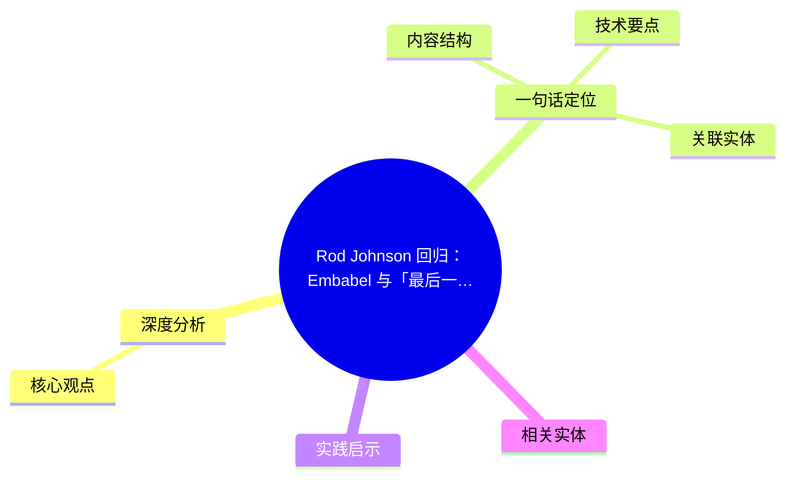
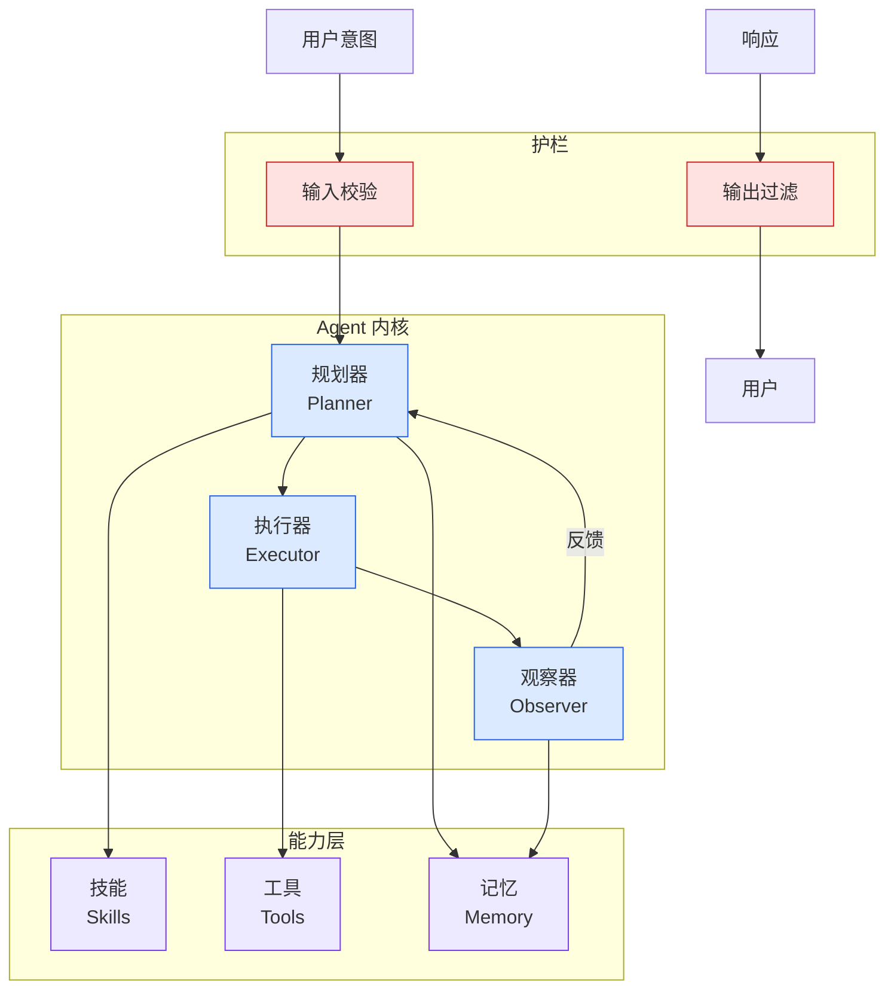

# Rod Johnson 回归：Embabel 与「最后一波由人类选择的框架」

## Ch01.1139 Rod Johnson 回归：Embabel 与「最后一波由人类选择的框架」

> 📊 Level ⭐⭐ | 3.5KB | `entities/embabel-rod-johnson-framework-era-interview.md`

# Rod Johnson 回归：Embabel 与「最后一波由人类选择的框架」

→ [原文存档](https://github.com/QianJinGuo/wiki-book/tree/main/docs/raw/articles/embabel-rod-johnson-framework-era-interview.md)

## 概念导图

## 深度分析

Rod Johnson 回归：Embabel 与「最后一波由人类选择的框架」 涉及agent领域的核心技术议题。
### 核心观点
1. # Rod Johnson 回归：Embabel 与「最后一波由人类选择的框架」
> 整理自 InfoQ 翻译的 Simon Whittaker 播客访谈
> 原文：https://mp.
2. com/s/qQfs6qSmNOt4JvPZQqNq7w
> 视频：https://www.
3. v=UcvxYltiS7E
> 编译：宇琪 · 策划：Tina
## 一句话定位

**Rod Johnson（Spring 创造者）2026 年再次创业，做 Embabel —— 一个面向企业 AI Agent 的 Kotlin/Java 开源框架（Apache 2.
4. ** 核心用 **GOAP（Goal-Oriented-Action-Planning）算法**（来自游戏 NPC）做**确定性规划**，让 LLM 嵌入可控、可解释、可审计的业务流程。
5. > "这可能已经是'最后一代由人类主动选择的框架'了。

### 内容结构
- Rod Johnson 回归：Embabel 与「最后一波由人类选择的框架」
- 一句话定位
- Rod Johnson：履历背景
- Embabel 核心设计
- 为什么不用 LangGraph 风格的状态机
- GOAP 两大特点
- 规划过程（A* 本质）
- 与 LangGraph/Crew.ai/Semantic Kernel 的关键差异

### 技术要点

- **agent架构**: 本文在agent方向提出的设计理念与实现路径
- **工程挑战**: 实际落地中面临的关键问题与应对策略
- **architecture趋势**: 相关技术演进方向与新兴范式
### 关联实体

- [两万字详解Claude Code源码核心机制](../ch03/078-claude-code.html)
- [龙虾装上了可以用来干啥分享下我的 Openclaw 多智能体团队搭建经验 V2](../ch11/235-openclaw.html)
- [Openclaw 完全指南这可能是全网最新最全的系统化教程了32W字建议收藏 V2](../ch11/235-openclaw.html)
- [Karpathy 最新访谈从 Vibe Coding 到 Agentic Engineering](../ch04/237-agentic.html)
- [Openclaw 完全指南这可能是全网最新最全的系统化教程了32W字建议收藏](../ch11/235-openclaw.html)
- [Ethan He Cosmos Grok Imagine Latent Space Video Agent 20260606](../ch03/035-agent.html)

## 实践启示
1. **工程落地**: agent领域方案需关注可观测性、可维护性和成本效率
2. **技术选型**: 根据场景选择合适的技术栈，避免过度设计或盲目追新
3. **持续迭代**: 建立数据驱动的反馈闭环，持续优化系统表现
4. **风险管控**: 引入新技术需评估对现有系统稳定性的影响，做好降级预案

## 相关实体

- [MOC](https://github.com/QianJinGuo/wiki/blob/main/moc/tool-use-mcp-patterns.md)

---

