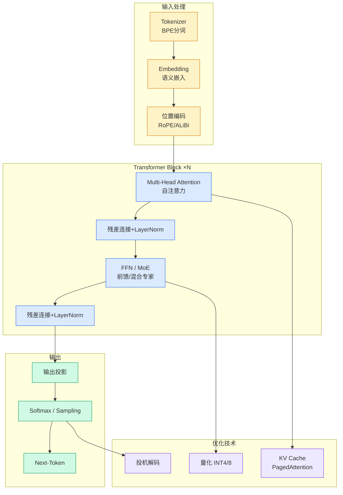

# 第一批ai原生本科生要毕业了

## Ch01.1141 第一批ai原生本科生要毕业了

> 📊 Level ⭐⭐ | 3.5KB | `entities/第一批ai原生本科生要毕业了.md`

> -> 原文存档
# 第一批ai原生本科生要毕业了
source: 

## 摘录
> 第一批「AI原生」本科生，要毕业了
Jay 发自 凹非寺
量子位 | 公众号 QbitAI
一眨眼，第一批「AI原生」本科生，  最近就要毕业了！
 2022  年   入学的那批本科生，几乎在ChatGPT的全程陪伴下完成了大学学业。
就在这一时间点，OpenAI宣布了  「未来之星」  计划，点名表扬了  26个  大学期间高频使用ChatGPT的年轻人和团队。
全部是  二十岁左右  的年纪，全部都是AI加持的超级个体。
过去四年里，「AI到底该不该深度参与大学教育」这事儿大家吵得急头白脸，没有一个定论。
但就OpenAI这份名单来看，答案或许是——
不必担心。
AI时代的大学生，正在交出一张张惊艳答卷：
 让1亿多张星系图像变得可搜索
 隔着废墟搜救灾害幸存者
 保护濒危语言
 绘制150万个此前未知太空物体的分布图
 ……
ChatGPT未来之星
OpenAI搞了个「AI之星严选」项目  （ChatGPT Futures）  ，专门表彰这一届「AI原生」学生里最令人意料之外的年轻人和团队。
在他们看来，观察AI走向最清晰的方式之一，就是看看下一代人今天正在怎么使用它。
这也是...
## 深度分析

**「AI原生」一代的标志性特征**：2022年入学的大学生是首批在ChatGPT全程陪伴下完成学业的一代。他们将AI深度整合进学习和研究流程，而非仅仅把AI当作查找资料的工具。这标志着AI从"辅助工具"向"认知伙伴"的转变。
**OpenAI「未来之星」计划的深层含义**：点名表扬26个高频使用ChatGPT的年轻人，传递了一个明确信号——AI使用能力而非AI恐惧能力，正成为下一代核心竞争力的评判标准。这与"AI影响就业"的担忧形成了有趣的对照。
**成果多样性反映AI普适性**：从星系图像搜索到灾害搜救，从濒危语言保护到天文探索，这些成果横跨多个领域，说明AI-native一代并非只在特定学科发挥AI优势，而是将AI作为通用能力渗透到各个研究方向。
**「不必担心」的深层逻辑**：面对"AI是否应该深度参与教育"的四年争论，OpenAI用实际成果给出了答案——关键不在于AI参与多少，而在于使用者是否有明确的目标和判断力。
## 实践启示
**对教育工作者的启示**：AI原生一代的学习方式已经改变，课程设计需要考虑如何引导学生在AI辅助下进行更深度的研究，而非限制AI使用。
**对学生群体的启示**：这26个案例表明，在AI时代，竞争力不在于"会不会用AI"，而在于"用AI做什么"。尽早建立清晰的研究方向和目标，利用AI放大执行力，是成为"超级个体"的关键路径。
**对企业招聘的启示**：AI-native一代的简历和成果可能与传统评估维度不同，需要新的评价框架——关注实际成果、创新性和AI驱动的研究能力，而非传统的实习经历或GPA。
## 标签
- source/wechat
## 相关实体
> 主题导航
- [AI 行业就业八大变化（腾讯研究院纵向对比）](../ch05/094-ai.html)
- [18岁高中生用ai挖出150万未知天体首批chatgpt原住民毕业](ch01/738-chatgpt.html)

---

