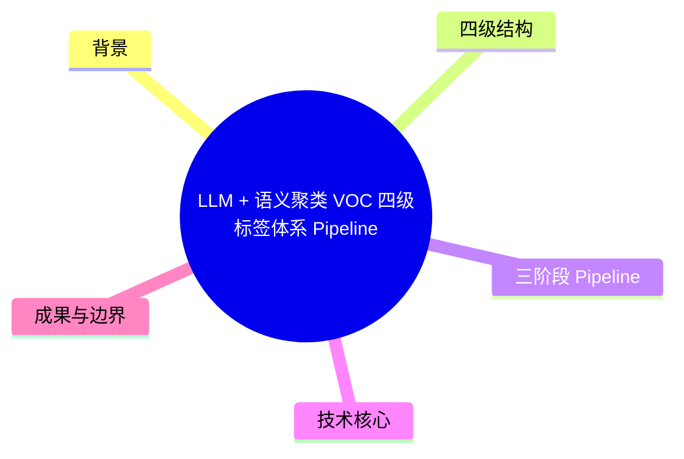
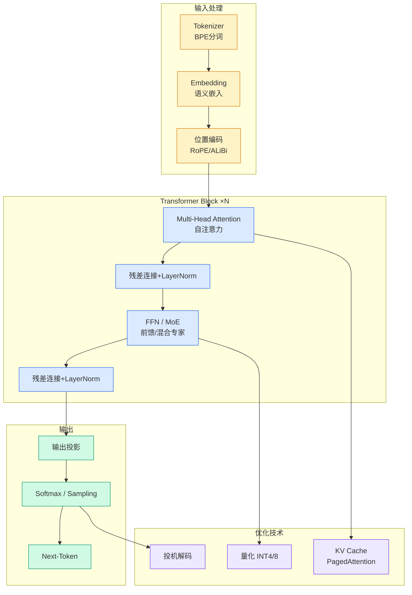

# LLM + 语义聚类 VOC 四级标签体系 Pipeline

## Ch01.1142 LLM + 语义聚类 VOC 四级标签体系 Pipeline

> 📊 Level ⭐⭐ | 3.5KB | `entities/llm-semantic-clustering-voc-tag-hierarchy-pipeline.md`

# LLM + 语义聚类 VOC 四级标签体系 Pipeline

本文详细阐述了一套将非结构化用户评论提炼为层级标签体系（VOC，Voice of Customer）的完整 pipeline 设计。在每个设计点交代了对应的可调参数及其对输出的影响。示例数据使用公开的中文电商评论数据集（online_shopping_10_cats 手机类，2323 条）。

## 概念导图

## 背景

任何有规模的产品都会积累海量用户声音——电商评论、应用商店评价、客服会话、问卷反馈。这些文本量大且非结构化。传统做法要么靠人工逐条打标（不可行），要么直接把评论丢给 LLM 让其"总结一下"（结果很快失控）。直接让 LLM 自由生成标签会遇到三个问题：标签乱（同一意思不同表述）、标签重（几千近义标签不收敛）、跨批次不可比。

## 四级结构

系统采用四级标签体系（L1-L4），每层有明确的语义分工：

- L1：用户旅程阶段（框架固定，跨批次可对比）
- L2：任务维度（如产品质量、客服体验、物流）
- L3：具体评价指标
- L4：细粒度标签

L1 框架固定，同层互斥，可复用，可量化（每个标签带频次）。

## 三阶段 Pipeline

整套流程分三个阶段：

**Stage1 — 建 L1-L2 标签体系**：先从数据中提炼出一套稳定的两级标签框架（用户旅程 → 任务维度）。使用 Map-Reduce 模式分片提取、多轮归并、评估优化。

**Stage2 — 逐条打标 + 生成 L3-L4**：用框架给每条评论打上 L1-L2，再为每条评论生成更细的 L3-L4 标签。

**Stage3 — 精炼收敛**：将 Stage2 产出的成千上万个细标签归并、去重、过滤、对齐，收敛成一棵干净的标签树。

共 11 个步骤，每个步骤都有可调参数。

## 技术核心

- **LLM 与向量模型的分工**：LLM 负责语义理解、标签生成和归并；Embedding + 聚类负责语义聚合，将相似标签自动归簇
- **Map-Reduce 式标签生成与归并**：分片提取 → 多轮归并 → 评估优化
- **低频过滤与对齐**：通过频率阈值过滤噪音标签，人工对齐确保质量
- **结构化输出（Structured Output）**：确保 LLM 输出格式一致，便于下游处理
- **Prompt Cache**：大量 LLM 调用使用相同 prompt 模板，使用 Prompt Cache 优化成本

## 成果与边界

文章附有完整代码、配置和参数速查表。适用边界包括：需要有足够样本量（建议千条以上）才能收敛出稳定标签树；对高度同质化的评论（如全是短评"好用"）效果受限。

→ [原文存档](https://github.com/QianJinGuo/wiki-book/tree/main/docs/raw/articles/llm-semantic-clustering-voc-tag-hierarchy-pipeline.md)

---
## 关联
- 相关概念: [Harness Engineering](https://github.com/QianJinGuo/wiki/blob/main/concepts/harness-engineering-framework.md)
- 相关: [Agent 架构](https://github.com/QianJinGuo/wiki/blob/main/concepts/agent-architecture.md)

---

