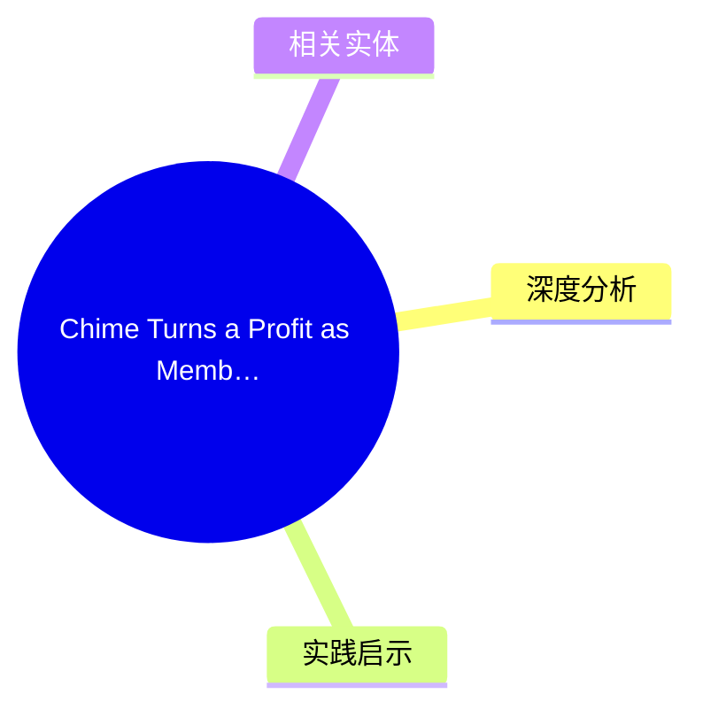
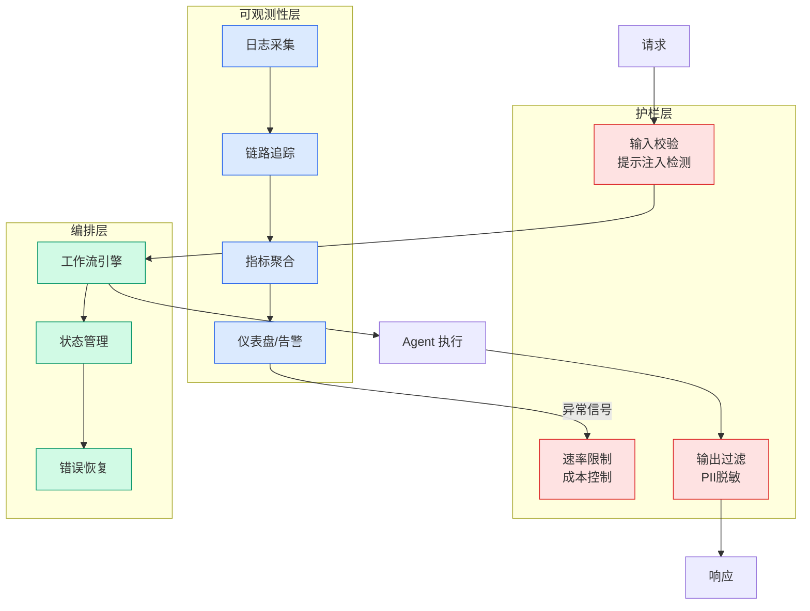

# Chime Turns a Profit as Members Hit 10.2 Million

## Ch01.1143 Chime Turns a Profit as Members Hit 10.2 Million

> 📊 Level ⭐⭐ | 3.5KB | `entities/chime-earnings-q1-2026-ai-upmarket.md`

## 概念导图

## 核心要点
- Chime 首次实现盈利，Q1 2026
- 会员数达 10.2 百万
- AI 驱动的高端化策略推动增长

## 摘要

Chime 通过 AI 技术推动高端化战略，首次实现盈利。

## 深度分析
**1. 从颠覆者到整合者的转型**
Chime 的 Q1 2026 财报揭示了一个重要的行业信号：FinTech 竞争格局已从「挑战传统银行的颠覆者」转向「类银行的整合平台」。Chime 虽仍保持 19% 的会员增长，但营收增长主要来自高利润率产品（MyPay earned wage access、Instant Loans、Premium Tier），而非传统 debit card 业务。
**2. AI 驱动的运营效率拐点**
Chime 披露 AI-assisted coding 从 29% 提升至 84%（四个月内），同时 headcount 增长持平——这代表 AI 在工程领域的生产力提升已跨越概念验证阶段，进入规模化实用。Operating leverage 改善直接贡献了盈利转正，说明 AI 效率增益已可被量化计入财务模型。
**3. 高端化战略的双刃剑**
Chime Prime 的推出（要求 $3,000+ 月薪 direct deposit）标志着从「服务传统银行遗漏用户」转向「争夺传统银行核心客户」。这一策略可能稀释 Chime 的品牌差异化，并引发与主流银行更直接的竞争。同时，class-action lawsuit（April 2026 数据泄露）暴露了快速扩张期的风险管理漏洞。

## 实践启示
- **AI 工程渗透率是运营杠杆的前瞻指标**：代码自动化比例从 29%→84% 的跳跃表明，当 AI 渗透率超过某一临界点（~80%），成本结构会呈现非线性改善
- **FinTech 盈利路径已从「规模优先」转向「产品组合优先」**：Payments revenue +15% vs Platform revenue +50% 的剪刀差说明，高毛利产品（earned wage access、instant loans）比支付手续费更有利于盈利
- **监管风险随规模扩大而上升**：Chime 类业务在触及 10M+ 会员后，合规成本和数据安全投入将成为不可忽视的利润压力

## 相关实体
- [Inngest - AI in Production: The 2026 Benchmark Report](ch01/561-inngest-ai-in-production-the-2026-benchmark-report.html)
- 吴恩达2026新课上线！3小时包教包会，零代码小白也能成为AI超级玩家

- [stripe sessions 2026 ai](../ch04/446-stripe-sessions-2026-ai.html)
- [stripe sessions 2026 ai agents](../ch04/363-stripe-sessions-2026-ai-agents.html)

→ [原文存档](https://github.com/QianJinGuo/wiki-book/tree/main/docs/raw/articles/2026.md)

- [吴恩达2026新课上线！3小时包教包会，零代码小白也能成为AI超级玩家](../ch05/094-ai.html)
→ [原文存档](https://github.com/QianJinGuo/wiki-book/tree/main/docs/raw/articles/chime-earnings-q1-2026-ai-upmarket.md)

---

