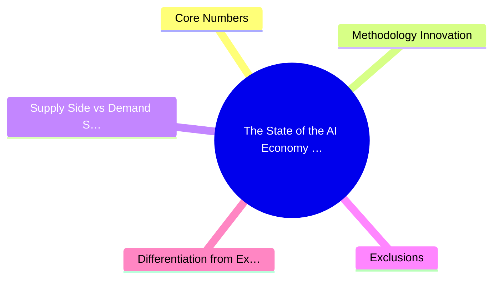
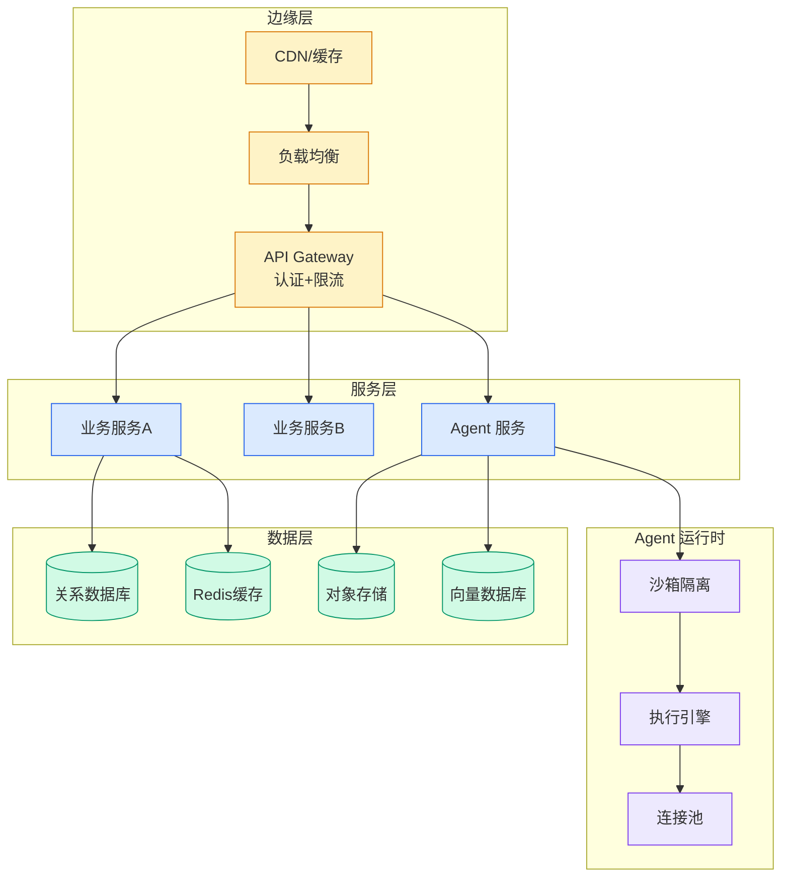

# The State of the AI Economy — $110B Revenue, Bottom-Up Deduplicated Model

## Ch01.1147 The State of the AI Economy — $110B Revenue, Bottom-Up Deduplicated Model

> 📊 Level ⭐⭐ | 3.5KB | `entities/exponentialview-ai-economy-110b-2026.md`

# The State of the AI Economy — $110B Revenue, Bottom-Up Deduplicated Model

> **Background**: Based on Exponential View's 2026-06-25 inaugural AI Economy report, using bottom-up, deduplicated financial modeling covering consumer and enterprise AI spending across the full stack.

## 概念导图

## Core Numbers

- **Past 12 months AI revenue**: $110B (deduplicated)
- **Annualized run rate**: $175B
- **Methodology**: Bottom-up per-company P&L modeling, cross-validated, no double-counting
- **Coverage**: Consumer + enterprise AI spending full stack (excluding internal AI uplift, professional services)

## Methodology Innovation

Traditional AI market sizing has a severe **double-counting** problem: user pays Anthropic $1, Anthropic pays AWS $0.5, traditional methods report $1.5. Exponential View reports only **end-user actual spend** of $1.

Approach:
1. Build item-by-item financial models (P&L, balance sheet, cash flow) for largest contributing companies and business units
2. Cross-validate using high-confidence public statements, supplier data, customer feedback
3. Assign confidence weights to leaked information and self-reported data
4. All numbers are auditable — traceable to specific data points with confidence weights

## Supply Side vs Demand Side

**Supply side** (well-understood):
- Chips, memory, power transformers, cooling, data center components
- Mostly public companies, trackable via disclosures, sales, forward order books

**Demand side** (much harder):
- OpenAI, Anthropic, Cursor, ElevenLabs etc. are private — no disclosure obligations
- Hyperscalers (AWS/GCP/Azure) inconsistently disclose AI segment revenue
- Requires piecing together public statements, leaks, self-reports

## Exclusions

- Internal AI uplift (e.g., recommendation system improvements increasing ad revenue)
- Efficiency savings from big tech internal tools
- Professional services and systems integration

## Differentiation from Existing Wiki Entities

| Dimension | This entity (Exponential View) | Nadella Token Capital | Dario Amodei Policy |
|-----------|-------------------------------|----------------------|---------------------|
| Angle | Data-driven market sizing | CEO enterprise strategy | AI policy/safety |
| Core contribution | $110B deduplicated revenue model | Token capital dual framework | Exponential growth policy response |
| Methodology | Bottom-up P&L modeling | Strategic vision | Policy analysis |
| Actionability | Investment/market judgment | Enterprise architecture decisions | Regulatory/compliance |

→ [source archive](https://github.com/QianJinGuo/wiki-book/tree/main/docs/raw/articles/the-state-of-the-ai-economy.md)
→ [Nadella Token Capital](../ch12/003-token.html)
→ [Dario Amodei Policy](../ch05/094-ai.html)

---

