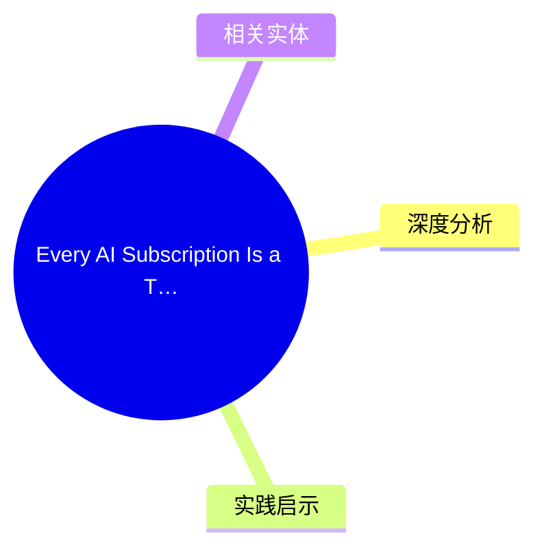
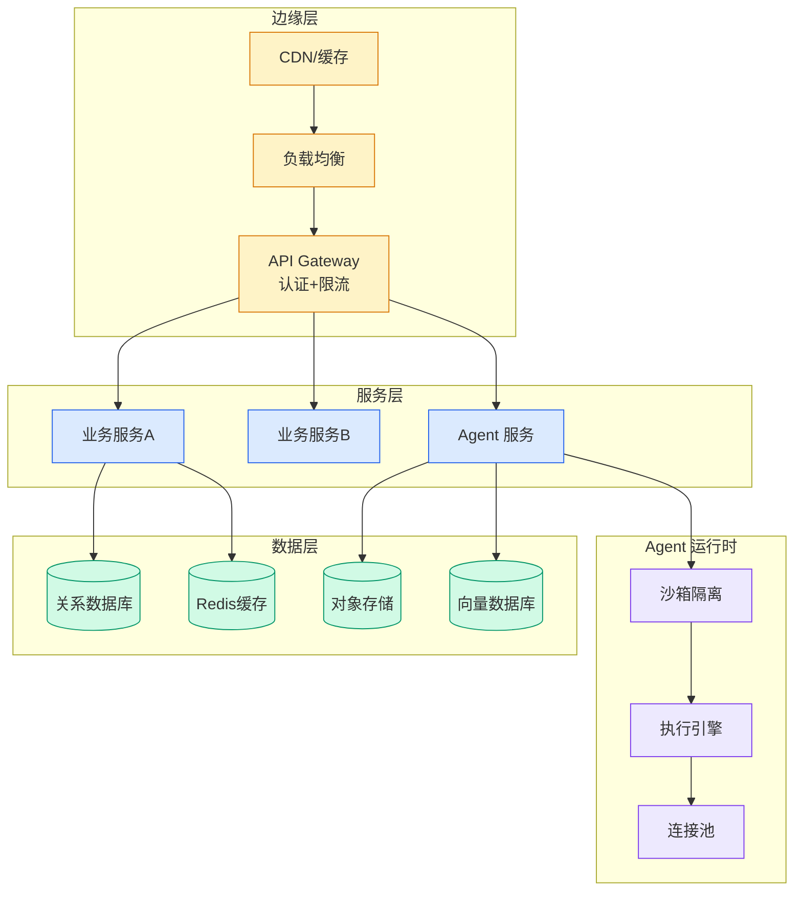

# Every AI Subscription Is a Ticking Time Bomb for Enterprise

## Ch01.1148 Every AI Subscription Is a Ticking Time Bomb for Enterprise

> 📊 Level ⭐⭐ | 3.5KB | `entities/every-ai-subscription-is-a-ticking-time-bomb-for-enterprise.md`

## 概念导图

## 核心要点
- AI 订阅模式正在形成企业级供应商锁定
- 订阅成本增长速度超过实际基础设施价值
- 企业需要对 AI 供应商合同进行更严格的评估
- 边际成本趋零但定价趋高，供应商的垄断溢价正在透支技术红利

## 深度分析

AI 订阅模式的结构性陷阱在于：企业正在用锁定换效率，用成本换便利。

**订阅经济的本质**是"时间套利"——供应商赌的是客户不会在涨价前离开。当 AI 服务从"工具"升级为"工作流核心"，企业失去议价能力的速度远快于预期。

**核心矛盾**：

- AI 订阅的边际成本趋零（云计算的规模效应）
- 但定价趋高（供应商的垄断溢价）
- 企业支付的价格远高于实际成本

**锁定效应**：

- 数据锁定：训练数据、fine-tune 数据、业务流程数据都在供应商生态中
- 工作流锁定：企业已将 AI 整合到核心业务流程
- 技能锁定：团队已习惯特定供应商的 API 和工具

**订阅经济的阴暗面**：

- 价格调整不透明
- 长期合约难以退出
- 供应商合并导致议价能力下降
- 竞争对手使用相同供应商导致差异化减少

## 实践启示
1. **合同谈判前置**：在签署长期合约前，明确数据迁移条款和价格锁定机制
2. **多云/多供应商策略**：避免单一供应商依赖，保持至少两家可切换的 AI 服务商
3. **成本透明度追踪**：建立 AI 支出的精细化核算体系，设置失控阈值告警
4. **内部能力建设**：对核心业务场景保留自研或开源替代方案，避免完全外包
5. **开源替代评估**：定期评估开源模型（如 Llama、Mistral）的成熟度，准备切换预案

## 相关实体
- `Openai Gpt Realtime Voice Models Qbitai` — GPT 订阅模式的标杆，其定价策略影响整个行业

## 相关实体
- [Www.Cio 4170978 Nearly Every Enterprise Is Investing In Ai But Only 5 Say Their ](ch01/146-nearly-every-enterprise-is-investing-in-ai-but-only-5-say.html)
- [Code Simulation For Enterprise Engineering Playerz](ch01/098-code-simulation-for-enterprise-engineering-playerzero.html)
- [Hs.Playerzero Ai Code Review](../ch05/094-ai.html)
- [From System Of Record To System Of Intelligence](ch01/252-from-system-of-record-to-system-of-intelligence.html)
- [要实现一个工作流选择 Agent Skills 还是 Ai 表格](../ch04/397-agent-skills.html)

→ [原文存档](https://github.com/QianJinGuo/wiki-book/tree/main/docs/raw/articles/every-ai-subscription-is-a-ticking-time-bomb-for-enterprise.md)

---

