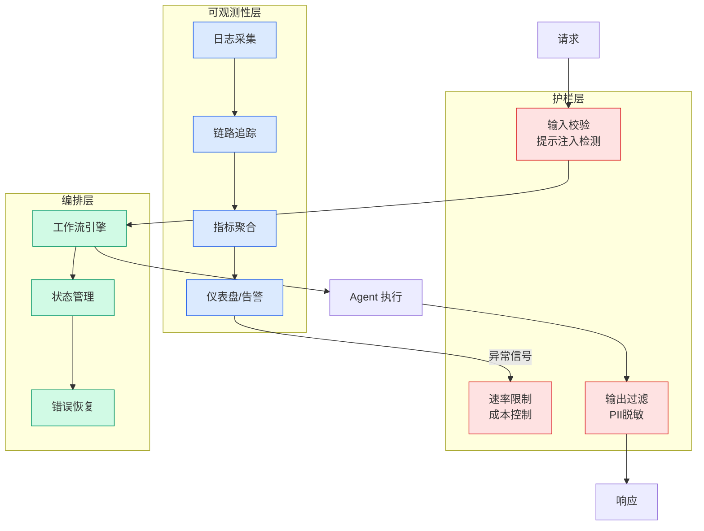

# Claude Code 动态工作流源码解析：pi-dynamic-workflows 架构实现

## Ch01.1149 Claude Code 动态工作流源码解析：pi-dynamic-workflows 架构实现

> 📊 Level ⭐⭐ | 3.5KB | `entities/claude-code-dynamic-workflows-source-code-architecture.md`

# Claude Code 动态工作流源码解析：pi-dynamic-workflows 架构实现

→ [原文存档](https://github.com/QianJinGuo/wiki-book/tree/main/docs/raw/articles/claude-code-dynamic-workflows-source-code-architecture.md)

## 深度分析

Claude Code 动态工作流源码解析：pi-dynamic-workflows 架构实现 涉及agent领域的核心技术议题。
### 核心观点
1. # Claude Code 动态工作流源码解析：pi-dynamic-workflows 架构实现
AI技术立文 | 2026-05-30
> [!
2. NOTE]
> 本文为 `claude-code-dynamic-workflows-multi-agent-orchestration` 的 raw supplement，补充源码级实现细节。
3. ## 源码架构总览
pi-dynamic-workflows（https://github.
4. com/Michaelliv/pi-dynamic-workflows）受 Claude Code 动态工作流启发，为 Pi-mono 实现了相同核心机制。
5. 六个文件，每个设计决策都值得细看。

### 内容结构
- Claude Code 动态工作流源码解析：pi-dynamic-workflows 架构实现
- 源码架构总览
- 沙箱与执行确定性
- 结果回收的两条路径
- 路径一：纯文本
- 路径二：结构化输出（capture 闭包机制）
- 优雅降级
- 三个编排原语

### 技术要点

- **agent架构**: 本文在agent方向提出的设计理念与实现路径
- **工程挑战**: 实际落地中面临的关键问题与应对策略
- **architecture趋势**: 相关技术演进方向与新兴范式
### 关联实体

- [两万字详解Claude Code源码核心机制](../ch03/078-claude-code.html)
- [龙虾装上了可以用来干啥分享下我的 Openclaw 多智能体团队搭建经验 V2](../ch11/235-openclaw.html)
- [深入理解 Claude Code 源码中的 Agent Harness 构建之道](../ch05/058-agent-harness.html)
- [你不知道的 Agent原理架构与工程实践 V2](../ch03/035-agent.html)
- [Openclaw 完全指南这可能是全网最新最全的系统化教程了32W字建议收藏 V2](../ch11/235-openclaw.html)
- [Karpathy 最新访谈从 Vibe Coding 到 Agentic Engineering](../ch04/237-agentic.html)

## 实践启示

1. **工程落地**: agent领域方案需关注可观测性、可维护性和成本效率
2. **技术选型**: 根据场景选择合适的技术栈，避免过度设计或盲目追新
3. **持续迭代**: 建立数据驱动的反馈闭环，持续优化系统表现
4. **风险管控**: 引入新技术需评估对现有系统稳定性的影响，做好降级预案

## 相关实体

- [MOC](https://github.com/QianJinGuo/wiki/blob/main/moc/observability-monitoring.md)

---

