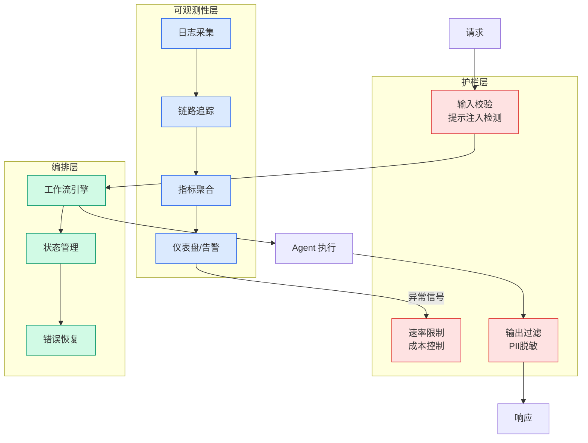

# 我把 Claude Design 做成了 Skill，人人都能成为顶级网站设计师

## Ch01.1150 我把 Claude Design 做成了 Skill，人人都能成为顶级网站设计师

> 📊 Level ⭐⭐ | 3.5KB | `entities/我把-claude-design-做成了-skill人人都能成为顶级网站设计师.md`

# 我把 Claude Design 做成了 Skill，人人都能成为顶级网站设计师

→ [原文存档](https://github.com/QianJinGuo/wiki-book/tree/main/docs/raw/articles/我把-claude-design-做成了-skill人人都能成为顶级网站设计师.md)

## 深度分析

我把 Claude Design 做成了 Skill，人人都能成为顶级网站设计师 涉及agent领域的核心技术议题。
### 核心观点
1. # 我把 Claude Design 做成了 Skill，人人都能成为顶级网站设计师
##  一、Claude Design 是什么？

2. 2026 年 4 月 17 日，Anthropic 发布了 Claude Design。
3. 这个产品上线当天，Figma 股价大跌。
4. Claude Design 由 Opus 4.
5. 7 驱动，提供给 Pro、Max、Team、Enterprise 订阅者使用。

### 内容结构
- 我把 Claude Design 做成了 Skill，人人都能成为顶级网站设计师
- 一、Claude Design 是什么？
- 二、拆解 Claude Design 的系统提示词
- 2.1 角色定位：设计师 + 工匠 + 产品经理
- 2.2 工作流：先问后做，尽早出活
- 2.3 去除 AI 味的秘诀
- 2.4 oklch 色彩系统：有理论支撑的配色策略
- 2.5 内容原则："一千个 No 换一个 Yes"

### 技术要点

- **agent架构**: 本文在agent方向提出的设计理念与实现路径
- **工程挑战**: 实际落地中面临的关键问题与应对策略
- **claude趋势**: 相关技术演进方向与新兴范式
### 关联实体

- [两万字详解Claude Code源码核心机制](../ch03/078-claude-code.html)
- [Ethan He Cosmos Grok Imagine Latent Space Video Agent 20260606](../ch03/035-agent.html)
- [你不知道的 Agent原理架构与工程实践 V2](../ch03/035-agent.html)
- [龙虾装上了可以用来干啥分享下我的 Openclaw 多智能体团队搭建经验 V2](../ch11/235-openclaw.html)
- [Karpathy 最新访谈从 Vibe Coding 到 Agentic Engineering](../ch04/237-agentic.html)
- [深入理解 Claude Code 源码中的 Agent Harness 构建之道](../ch05/058-agent-harness.html)

## 实践启示
1. **工程落地**: agent领域方案需关注可观测性、可维护性和成本效率
2. **技术选型**: 根据场景选择合适的技术栈，避免过度设计或盲目追新
3. **持续迭代**: 建立数据驱动的反馈闭环，持续优化系统表现
4. **风险管控**: 引入新技术需评估对现有系统稳定性的影响，做好降级预案

---

