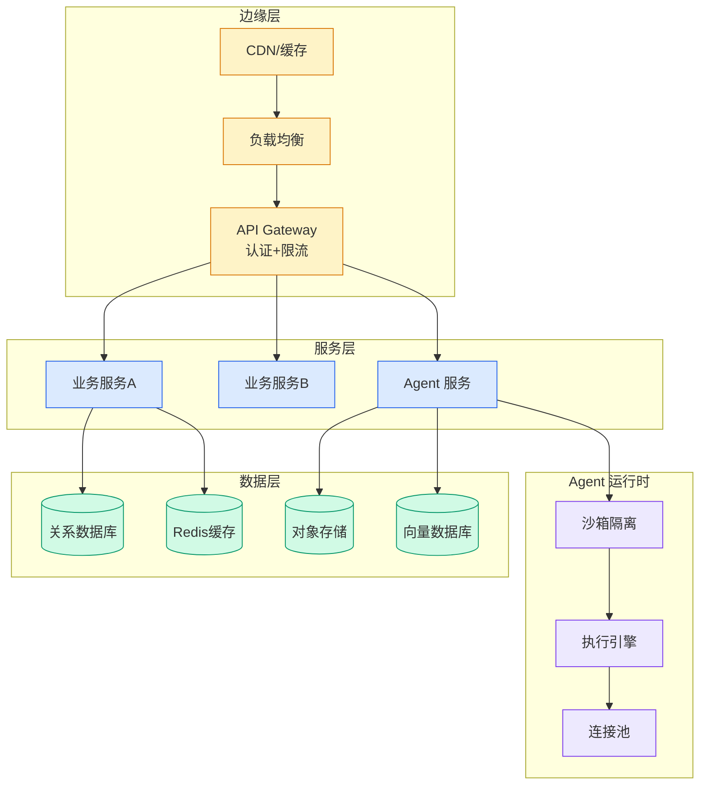

# 读完这篇，你就搞懂 DeepSeek v4 了

## Ch01.1151 读完这篇，你就搞懂 DeepSeek v4 了

> 📊 Level ⭐⭐ | 3.5KB | `entities/读完这篇你就搞懂-deepseek-v4-了.md`

# 读完这篇，你就搞懂 DeepSeek v4 了

→ [原文存档](https://github.com/QianJinGuo/wiki-book/tree/main/docs/raw/articles/读完这篇你就搞懂-deepseek-v4-了.md)

## 深度分析

读完这篇，你就搞懂 DeepSeek v4 了 涉及agent领域的核心技术议题。
### 核心观点
1. # 读完这篇，你就搞懂 DeepSeek v4 了
作者  ：d  orian
丨 导语  2026 年 4 月 24 日上午，DeepSeek 又一次把"开源炸弹"丢进了大模型圈。
2. 没有预热，官微只有一句话：“今天，我们全新系列模型 DeepSeek-V4 的预览版本正式上线并同步开源”。
3. 从评分上看，这次的模型已经非常接近“闭源三巨头”的水平了，同时也是当之无愧的“地表最强开源模型”。
4. 但细读这份技术报告「DeepSeek-V4: Towards Highly Efficient Million-Token Context Intelligence」，会发现DeepSeek的工作远比评分更硬核，无论是架构创新还是工程优化都是一如既往的精雕细琢。
5. ###  ** DeepSeek V4到底强在哪？

### 内容结构
- 读完这篇，你就搞懂 DeepSeek v4 了
- ** DeepSeek V4到底强在哪？  **
- 先看纸面参数：
- ** 开始之前的几个问题  **
- ** 为什么需要超长上下文？  **
- ** 在 1M 上下文的时代，原来的 Transformer 为什么不够用了？  **
- ** 架构层面的创新机制  **
- mHC：多流约束的残差连接

### 技术要点

- **agent架构**: 本文在agent方向提出的设计理念与实现路径
- **工程挑战**: 实际落地中面临的关键问题与应对策略
- **architecture趋势**: 相关技术演进方向与新兴范式
### 关联实体

- [Ethan He Cosmos Grok Imagine Latent Space Video Agent 20260606](../ch03/035-agent.html)
- [Scale Robot Reinforcement Learning With Nvidia Isaac Lab On ](ch01/1170-scale-robot-reinforcement-learning-with-nvidia-isaac-lab-on.html)
- [Nvidia Isaac Lab Sagemaker Robot Rl Humanoid](https://github.com/QianJinGuo/wiki/blob/main/entities/nvidia-isaac-lab-sagemaker-robot-rl-humanoid.md)
- [Openclaw 完全指南这可能是全网最新最全的系统化教程了32W字建议收藏 V2](../ch11/235-openclaw.html)
- [Openclaw 完全指南这可能是全网最新最全的系统化教程了32W字建议收藏](../ch11/235-openclaw.html)
- [存之有序治之有矩Agent 记忆系统的工程实践与演进](../ch03/035-agent.html)

## 实践启示

1. **工程落地**: agent领域方案需关注可观测性、可维护性和成本效率
2. **技术选型**: 根据场景选择合适的技术栈，避免过度设计或盲目追新
3. **持续迭代**: 建立数据驱动的反馈闭环，持续优化系统表现
4. **风险管控**: 引入新技术需评估对现有系统稳定性的影响，做好降级预案

---

