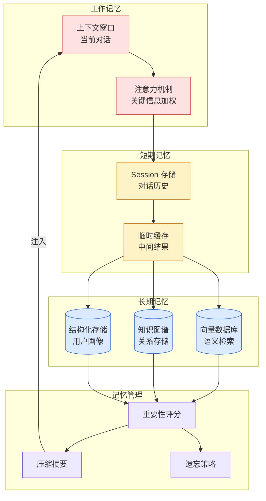

# Agent 记忆存储方案深度洞察

## Ch01.1154 Agent 记忆存储方案深度洞察

> 📊 Level ⭐⭐ | 3.5KB | `entities/agent-memory-storage-six-schools-quantumtransf-debate-frank.md`

# Agent 记忆存储方案深度洞察

→ [原文存档](https://github.com/QianJinGuo/wiki-book/tree/main/docs/raw/articles/agent-memory-storage-six-schools-quantumtransf-debate-frank.md)

## 深度分析

Agent 记忆存储方案深度洞察 涉及agent领域的核心技术议题。
### 核心观点
1. # Agent 记忆存储方案深度洞察
> 原文讨论来自 Twitter @QuantumTransf，围绕 ai-memory 项目的 Wiki 编译模式与原始数据直存模式的争论展开。
2. ## 一条推文引发的争论
最近，AI 编码 Agent 的记忆方案在社区引发热议。
3. @QuantumTransf 对 ai-memory 项目提出了尖锐质疑：
> 我没明白为什么要把 agent session 编译成 wiki。
4. 原始 session 本来就是结构化数据——messages、tool calls、tool results、files、subagents。
5. 直接放进 SQLite，就已经是一个很强的结构。

### 内容结构
- Agent 记忆存储方案深度洞察
- 一条推文引发的争论
- 当前主流方案全景
- 记忆分层模型：行业共识
- 核心争论：信息压缩 vs 信息保真
- 检索策略演进
- 前沿趋势
- 知识图谱记忆

### 技术要点

- **agent架构**: 本文在agent方向提出的设计理念与实现路径
- **工程挑战**: 实际落地中面临的关键问题与应对策略
- **architecture趋势**: 相关技术演进方向与新兴范式
### 关联实体

- [Openclaw 完全指南这可能是全网最新最全的系统化教程了32W字建议收藏 V2](../ch11/235-openclaw.html)
- [Openclaw 完全指南这可能是全网最新最全的系统化教程了32W字建议收藏](../ch11/235-openclaw.html)
- [Agentops Operationalize Agentic Ai At Scale With Amazon Bedr](../ch04/299-agentops-operationalize-agentic-ai-at-scale-with-amazon-bed.html)
- [存之有序治之有矩Agent 记忆系统的工程实践与演进](../ch03/035-agent.html)
- [你不知道的 Agent原理架构与工程实践 V2](../ch03/035-agent.html)
- [龙虾装上了可以用来干啥分享下我的 Openclaw 多智能体团队搭建经验 V2](../ch11/235-openclaw.html)

## 实践启示

1. **工程落地**: agent领域方案需关注可观测性、可维护性和成本效率
2. **技术选型**: 根据场景选择合适的技术栈，避免过度设计或盲目追新
3. **持续迭代**: 建立数据驱动的反馈闭环，持续优化系统表现
4. **风险管控**: 引入新技术需评估对现有系统稳定性的影响，做好降级预案

## 相关实体

- [MOC](https://github.com/QianJinGuo/wiki/blob/main/moc/mlops-training-inference.md)

---

