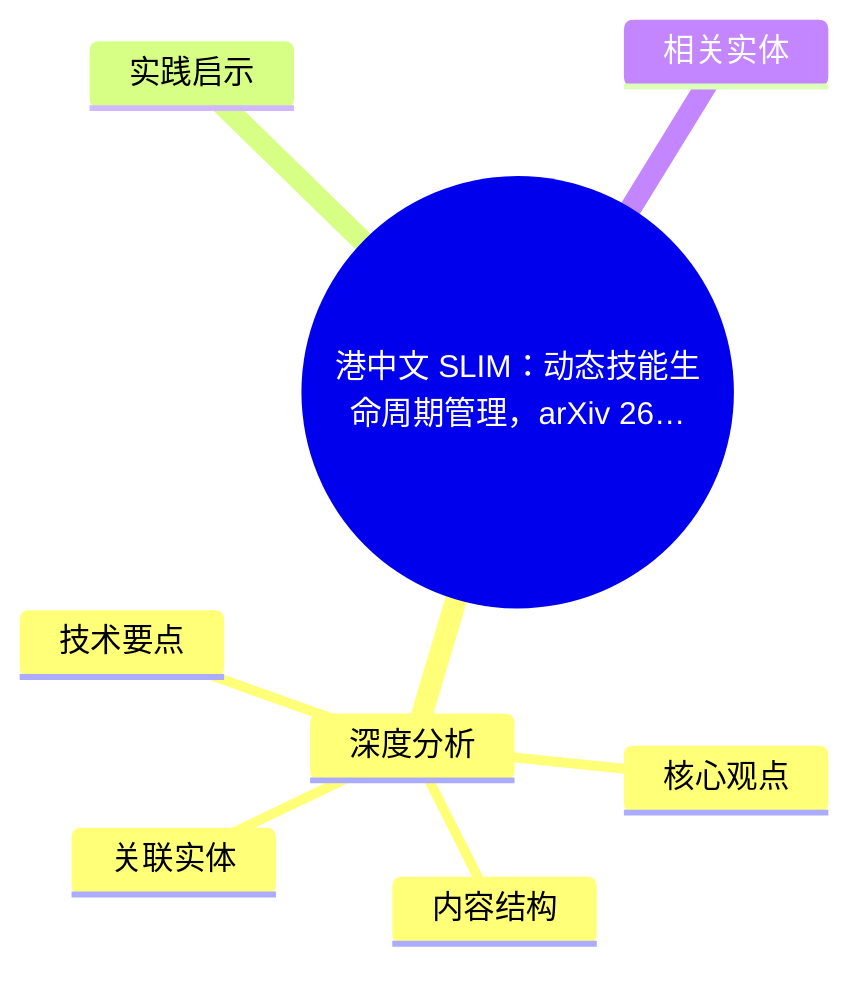
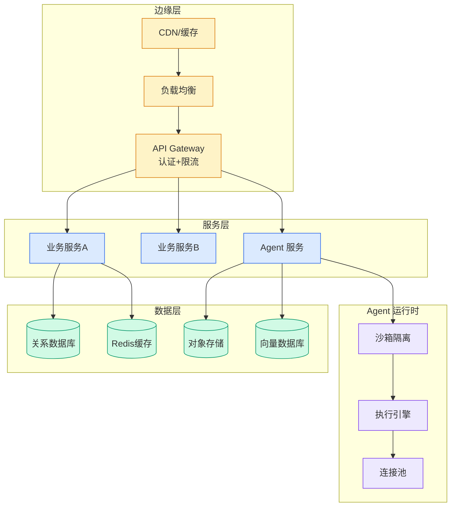

# 港中文 SLIM：动态技能生命周期管理，arXiv 2605.10923

## Ch01.1155 港中文 SLIM：动态技能生命周期管理，arXiv 2605.10923

> 📊 Level ⭐⭐ | 3.5KB | `entities/cuhk-slim-skill-lifecycle-agentic-rl-arxiv-2605-10923.md`

# 港中文 SLIM：动态技能生命周期管理，arXiv 2605.10923

→ [原文存档](https://github.com/QianJinGuo/wiki-book/tree/main/docs/raw/articles/cuhk-slim-skill-lifecycle-agentic-rl-arxiv-2605-10923.md)

## 概念导图

## 深度分析

港中文 SLIM：动态技能生命周期管理，arXiv 2605.10923 涉及agent领域的核心技术议题。
### 核心观点
1. # 港中文 SLIM：动态技能生命周期管理，arXiv 2605.
2. 10923
> AI科技评论 2026-06-01 10:04 报道，作者郑佳美。
3. 港中文团队《Dynamic Skill Lifecycle Management for Agentic Reinforcement Learning》论文解读。
4. ## 核心问题
**LLM agent 训练中，外部技能到底应该怎么变化？
5. ** 行业存在两派极端：
- **SkillRL 派**：技能持续累积，外部知识库越大越好
- **Skill0 派**：追求"零技能推理"，把技能全部内化进模型
两派都有问题：技能过多检索噪声、prompt 干扰；技能全删则丢失低频/长尾能力。

### 内容结构
- 港中文 SLIM：动态技能生命周期管理，arXiv 2605.10923
- 核心问题
- SLIM 的三操作循环
- Retain (保留)
- Retire (退休)
- Expand (扩展)
- 核心方法：Leave-One-Skill-Out 验证
- 实验结果 (Qwen3-4B)

### 技术要点

- **agent架构**: 本文在agent方向提出的设计理念与实现路径
- **工程挑战**: 实际落地中面临的关键问题与应对策略
- **data趋势**: 相关技术演进方向与新兴范式
### 关联实体

- [Karpathy 最新访谈从 Vibe Coding 到 Agentic Engineering](../ch04/237-agentic.html)
- [Openclaw 完全指南这可能是全网最新最全的系统化教程了32W字建议收藏](../ch11/235-openclaw.html)
- [Ethan He Cosmos Grok Imagine Latent Space Video Agent 20260606](../ch03/035-agent.html)
- [Karpathy Vibe Coding Agentic Engineering](../ch04/126-karpathy-vibe-coding-agentic-engineering.html)
- [Agentops Operationalize Agentic Ai At Scale With Amazon Bedr](../ch04/299-agentops-operationalize-agentic-ai-at-scale-with-amazon-bed.html)
- [存之有序治之有矩Agent 记忆系统的工程实践与演进](../ch03/035-agent.html)

## 实践启示

1. **工程落地**: agent领域方案需关注可观测性、可维护性和成本效率
2. **技术选型**: 根据场景选择合适的技术栈，避免过度设计或盲目追新
3. **持续迭代**: 建立数据驱动的反馈闭环，持续优化系统表现
4. **风险管控**: 引入新技术需评估对现有系统稳定性的影响，做好降级预案

## 相关实体

- [MOC](https://github.com/QianJinGuo/wiki/blob/main/moc/prompt-engineering-guide.md)

---

