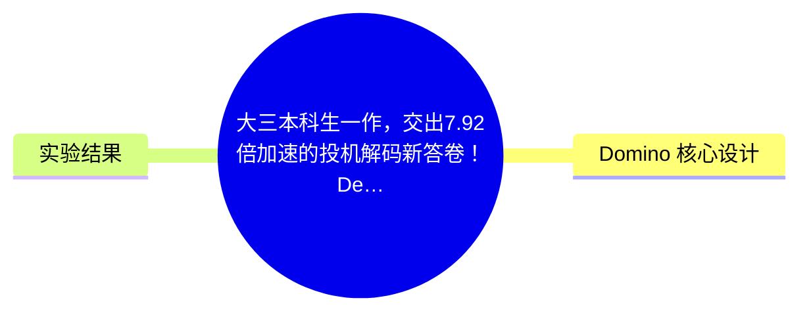
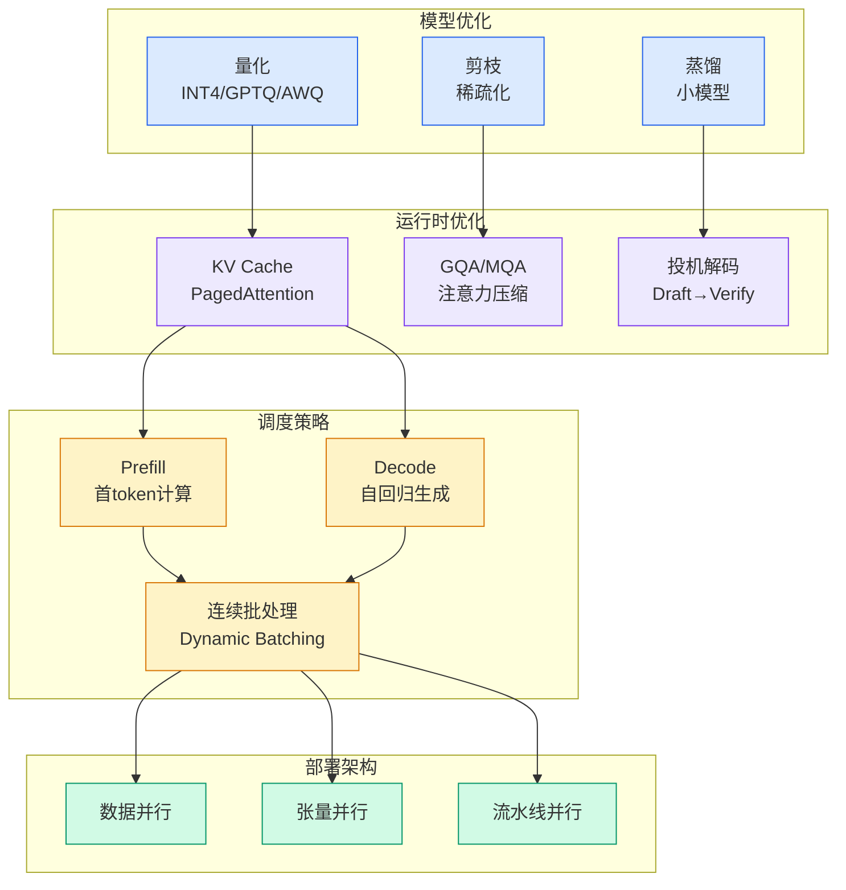

# 大三本科生一作，交出7.92倍加速的投机解码新答卷！DeepSeek和阶跃星辰双双引用

## Ch01.1157 大三本科生一作，交出7.92倍加速的投机解码新答卷！DeepSeek和阶跃星辰双双引用

> 📊 Level ⭐⭐ | 3.4KB | `entities/大三本科生一作交出792倍加速的投机解码新答卷deepseek和阶跃星辰双双引用.md`

# 大三本科生一作，交出7.92倍加速的投机解码新答卷！DeepSeek和阶跃星辰双双引用

> **Domino** 是由上海交通大学 EPIC Lab 联合华中科技大学、电子科技大学、复旦大学、华为等机构提出的投机解码（Speculative Decoding）框架。该工作的核心贡献是在保留并行 draft 的低开销优势的同时，用轻量因果修正重新引入 token 间依赖，实现了最高 7.92x 的端到端加速。

投机解码的基本思路是让轻量 draft model 一次猜出多个未来 token，再交给 target model 批量验证。其效率取决于两个因素的平衡：自回归 drafter 质量高但生成开销大，并行 drafter 速度快但 token 间因果依赖弱。Domino 关注的正是如何解决并行 draft 中的 suffix decay 问题——后缀 token 容易偏离已采样的前缀。

## 概念导图

## Domino 核心设计

Domino 由两部分组成：**parallel draft backbone** 为整个 draft block 并行产生 hidden states 和 base logits，保持主要计算的高吞吐；**Domino head** 使用轻量 GRU causal encoder 汇总已生成 draft token，通过 low-rank correction head 生成 logit-space 残差修正，把昂贵的主干计算与必要的因果修正拆开。

训练上使用 teacher-forced causal encoding 和 base-anchored curriculum：前者让 causal encoder 在正确前缀条件下学习修正；后者先强化 parallel backbone，再逐渐转向修正后的 final logits，避免 correction branch 过强导致 backbone 变弱。

## 实验结果

在 Qwen3-4B 和 Qwen3-8B 上，Domino 在数学、代码、对话等任务中都取得稳定提升。在 greedy decoding 设置下，Qwen3-4B 上平均达到 5.47x 端到端加速，Qwen3-8B 上平均达 5.49x，GSM8K 等任务上最高可达 7.92x。消融实验显示，关闭 Domino head 后平均接受长度从 4.19 降到 3.49，平均速度从 3.31x 降到 2.84x，说明轻量 prefix-dependent correction 是 Domino 的关键来源。

→ [DeepSeek DSpark 投机解码](ch01/794-deepseek-dspark.html)

→ [原文存档](https://github.com/QianJinGuo/wiki-book/tree/main/docs/raw/articles/大三本科生一作交出792倍加速的投机解码新答卷deepseek和阶跃星辰双双引用.md)

---
## 关联
- 相关概念: [Harness Engineering](https://github.com/QianJinGuo/wiki/blob/main/concepts/harness-engineering-framework.md)

---

