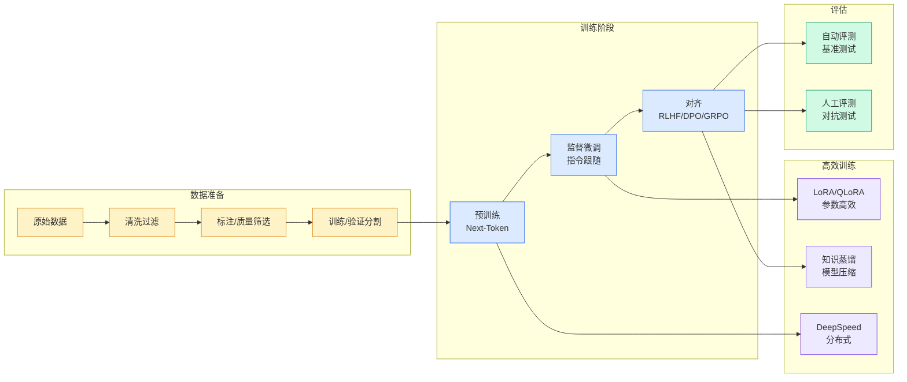

# AutoResearch 异步多 Agent AI 寒武纪新阶段

## Ch01.1160 AutoResearch 异步多 Agent AI 寒武纪新阶段

> 📊 Level ⭐⭐ | 3.4KB | `entities/autoresearch-next-phase-async-multi-agent-ai寒武纪.md`

# Autoresearch Next Phase Async Multi Agent Ai寒武纪

→ [原文存档](https://github.com/QianJinGuo/wiki-book/tree/main/docs/raw/articles/autoresearch-next-phase-async-multi-agent-ai寒武纪.md)

## 概念导图

## 深度分析

Autoresearch Next Phase Async Multi Agent Ai寒武纪 涉及agent领域的核心技术议题。
### 核心观点
1. ## 核心内容
### AutoResearch 当前状态
- Karpathy 把 autoresearch 项目整理成独立精简仓库
- 核心：nanochat LLM 训练代码压缩到单 GPU、单文件、约 630 行
- 运行逻辑：人负责迭代 prompt（.
2. md 文件），AI agent 负责迭代训练代码（.
3. py 文件）
- 目标：让 agent 在零人工介入下无限期推进研究
- 每次 LLM 训练恰好跑 5 分钟，agent 在 git feature branch 上自主循环，持续积累 commit
- 仓库：https://github.
4. com/karpathy/autoresearch
### 下一阶段：异步大规模 Agent 协作
**目标**：不是模拟一个博士生，而是模拟一个由博士生组成的研究社区。
5. 现有代码是同步的，沿单一研究方向串行增长 commit。

### 内容结构
- 核心内容
- AutoResearch 当前状态
- 下一阶段：异步大规模 Agent 协作
- 附：AGI 时间线赌注
- 暴力搜索种子训练神经网络脑洞

### 技术要点

- **agent架构**: 本文在agent方向提出的设计理念与实现路径
- **工程挑战**: 实际落地中面临的关键问题与应对策略
- **architecture趋势**: 相关技术演进方向与新兴范式
### 关联实体

- [Ethan He Cosmos Grok Imagine Latent Space Video Agent 20260606](../ch03/035-agent.html)
- [存之有序治之有矩Agent 记忆系统的工程实践与演进](../ch03/035-agent.html)
- [两万字详解Claude Code源码核心机制](../ch03/078-claude-code.html)
- [Scale Robot Reinforcement Learning With Nvidia Isaac Lab On ](ch01/1170-scale-robot-reinforcement-learning-with-nvidia-isaac-lab-on.html)
- [Nvidia Isaac Lab Sagemaker Robot Rl Humanoid](https://github.com/QianJinGuo/wiki/blob/main/entities/nvidia-isaac-lab-sagemaker-robot-rl-humanoid.md)
- [龙虾装上了可以用来干啥分享下我的 Openclaw 多智能体团队搭建经验 V2](../ch11/235-openclaw.html)

## 实践启示

1. **工程落地**: agent领域方案需关注可观测性、可维护性和成本效率
2. **技术选型**: 根据场景选择合适的技术栈，避免过度设计或盲目追新
3. **持续迭代**: 建立数据驱动的反馈闭环，持续优化系统表现
4. **风险管控**: 引入新技术需评估对现有系统稳定性的影响，做好降级预案

## 相关实体

- [MOC](https://github.com/QianJinGuo/wiki/blob/main/moc/mlops-training-inference.md)

---

