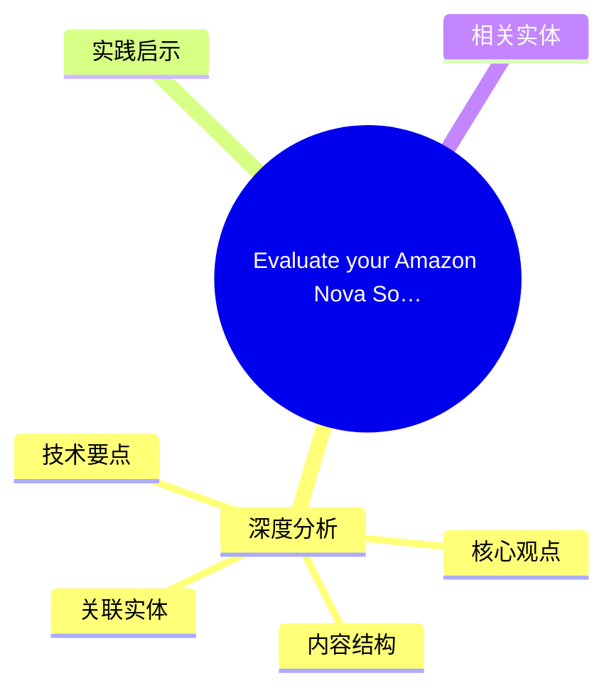

# Evaluate your Amazon Nova Sonic voice agent at scale, no microphone required

## Ch01.1162 Evaluate your Amazon Nova Sonic voice agent at scale, no microphone required

> 📊 Level ⭐⭐ | 3.4KB | `entities/evaluate-your-amazon-nova-sonic-voice-agent-at-scale-no-micr.md`

# Evaluate your Amazon Nova Sonic voice agent at scale, no microphone required

→ [原文存档](https://github.com/QianJinGuo/wiki-book/tree/main/docs/raw/articles/evaluate-your-amazon-nova-sonic-voice-agent-at-scale-no-micr.md)

## 概念导图

## 深度分析

Evaluate your Amazon Nova Sonic voice agent at scale, no microphone required 涉及agent领域的核心技术议题。
### 核心观点
1. But as these agents grow more capable, a fundamental challenge emerges: how do you test them?
2. Unlike text-based chatbots where you can script inputs and assert outputs, voice agents operate in a fundamentally different paradigm.
3. They stream audio bidirectionally, respond non-deterministically, maintain context across multi-turn conversations, and use tools in real time.
4. The only way most teams test today is to have someone physically talk to the system and listen to what comes back.
5. That’s slow, inconsistent, and doesn’t scale.

### 内容结构
- Evaluate your Amazon Nova Sonic voice agent at scale, no microphone required
- Why speech-to-speech testing is different
- How the test harness works
- Defining a test scenario
- Running the conversation
- What about long conversations?
- Evaluating quality
- Viewing results

### 技术要点

- **agent架构**: 本文在agent方向提出的设计理念与实现路径
- **工程挑战**: 实际落地中面临的关键问题与应对策略
- **architecture趋势**: 相关技术演进方向与新兴范式
### 关联实体

- [Agentops Operationalize Agentic Ai At Scale With Amazon Bedr](../ch04/299-agentops-operationalize-agentic-ai-at-scale-with-amazon-bed.html)
- [存之有序治之有矩Agent 记忆系统的工程实践与演进](../ch03/035-agent.html)
- [Karpathy 最新访谈从 Vibe Coding 到 Agentic Engineering](../ch04/237-agentic.html)
- [Karpathy Vibe Coding Agentic Engineering](../ch04/126-karpathy-vibe-coding-agentic-engineering.html)
- [两万字详解Claude Code源码核心机制](../ch03/078-claude-code.html)
- [你不知道的 Agent原理架构与工程实践 V2](../ch03/035-agent.html)

## 实践启示

```mermaid
graph TB
    subgraph "可观测性层"
        LOG[日志采集] --> TRACE[链路追踪]
        TRACE --> METRIC[指标聚合]
        METRIC --> DASH[仪表盘/告警]
    end
    subgraph "护栏层"
        IN_CHK[输入校验<br/>提示注入检测]
        RATE[速率限制<br/>成本控制]
        OUT_CHK[输出过滤<br/>PII脱敏]
    end
    subgraph "编排层"
        ORC[工作流引擎]
        STATE[状态管理]
        RETRY[错误恢复]
    end
    REQ[请求] --> IN_CHK --> ORC
    ORC --> AGENT[Agent 执行]
    AGENT --> OUT_CHK --> RES[响应]
    DASH -->|"异常信号"| RATE
    ORC --> STATE --> RETRY
    classDef obs fill:#dbeafe,stroke:#2563eb
    classDef guard fill:#fee2e2,stroke:#dc2626
    classDef orch fill:#d1fae5,stroke:#059669
    class LOG,TRACE,METRIC,DASH obs
    class IN_CHK,RATE,OUT_CHK guard
    class ORC,STATE,RETRY orch
```

1. **工程落地**: agent领域方案需关注可观测性、可维护性和成本效率
2. **技术选型**: 根据场景选择合适的技术栈，避免过度设计或盲目追新
3. **持续迭代**: 建立数据驱动的反馈闭环，持续优化系统表现
4. **风险管控**: 引入新技术需评估对现有系统稳定性的影响，做好降级预案

## 相关实体

- [MOC](https://github.com/QianJinGuo/wiki/blob/main/moc/data-infrastructure.md)

---

