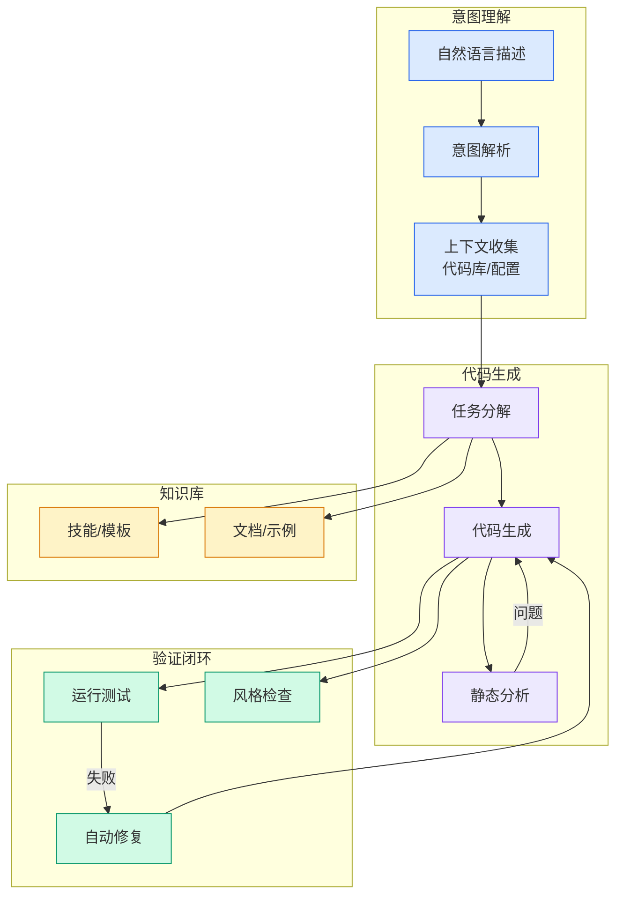

# Claude Code 泄露后的漏网之鱼 claude-code-best 这两个月到底演进了什么

## Ch01.1163 Claude Code 泄露后的漏网之鱼 claude-code-best 这两个月到底演进了什么

> 📊 Level ⭐⭐ | 3.4KB | `entities/claude-code-best-community-fork-evolution-vibecoder.md`

# Claude Code 泄露后的漏网之鱼 claude-code-best 这两个月到底演进了什么

→ [原文存档](https://github.com/QianJinGuo/wiki-book/tree/main/docs/raw/articles/claude-code-best-community-fork-evolution-vibecoder.md)

## 深度分析

Claude Code 泄露后的漏网之鱼 claude-code-best 这两个月到底演进了什么 涉及agent领域的核心技术议题。
### 核心观点
1. # Claude Code 泄露后的漏网之鱼 claude-code-best 这两个月到底演进了什么
## 项目背景

Claude Code 自 2.
2. 88 版本泄露后，GitHub 做了全网清理，但 claude-code-best/claude-code 社区仓库留存了下来，基于泄露代码继续演进。
3. 截至 2026年5月22日，已发到 v2.
4. 5，PR 已合并 136 个。
5. 多模型支持
最早一批 PR 就接入了 OpenAI-compatible、Gemini、Grok。

### 内容结构
- Claude Code 泄露后的漏网之鱼 claude-code-best 这两个月到底演进了什么
- 项目背景
- 演进方向
- 1. 多模型支持
- 2. 远程控制
- 3. SearchExtraTools（关键设计）
- 4. Local Memory 和 Vault
- 5. Autofix PR 闭环

### 技术要点

- **agent架构**: 本文在agent方向提出的设计理念与实现路径
- **工程挑战**: 实际落地中面临的关键问题与应对策略
- **claude趋势**: 相关技术演进方向与新兴范式
### 关联实体

- [两万字详解Claude Code源码核心机制](../ch03/078-claude-code.html)
- [龙虾装上了可以用来干啥分享下我的 Openclaw 多智能体团队搭建经验 V2](../ch11/235-openclaw.html)
- [你不知道的 Agent原理架构与工程实践 V2](../ch03/035-agent.html)
- [Openclaw 完全指南这可能是全网最新最全的系统化教程了32W字建议收藏 V2](../ch11/235-openclaw.html)
- [Karpathy 最新访谈从 Vibe Coding 到 Agentic Engineering](../ch04/237-agentic.html)
- [构建基于多智能体架构的深度思考交易系统 V2](https://github.com/QianJinGuo/wiki/blob/main/entities/构建基于多智能体架构的深度思考交易系统-v2.md)

## 实践启示
1. **工程落地**: agent领域方案需关注可观测性、可维护性和成本效率
2. **技术选型**: 根据场景选择合适的技术栈，避免过度设计或盲目追新
3. **持续迭代**: 建立数据驱动的反馈闭环，持续优化系统表现
4. **风险管控**: 引入新技术需评估对现有系统稳定性的影响，做好降级预案

## 相关实体

- [MOC](https://github.com/QianJinGuo/wiki/blob/main/moc/observability-monitoring.md)

---

