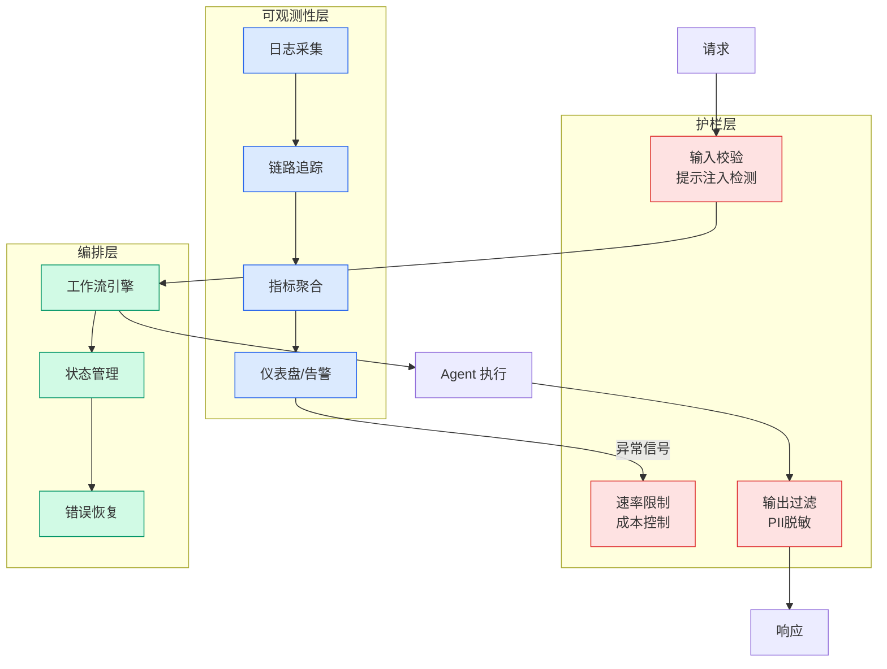

# ICML 2026 | 从提取漂移到聚合漂移，南大AREA重做CLIP增量学习

## Ch01.1166 ICML 2026 | 从提取漂移到聚合漂移，南大AREA重做CLIP增量学习

> 📊 Level ⭐⭐ | 3.4KB | `entities/icml-2026-从提取漂移到聚合漂移南大area重做clip增量学习.md`

# ICML 2026 | 从提取漂移到聚合漂移，南大AREA重做CLIP增量学习

# ICML 2026 | 从提取漂移到聚合漂移，南大AREA重做CLIP增量学习
---
source: wechat
source_url: https://mp.weixin.qq.com/s/TkoSd7Kg9eh_L3J5XNkkhg
ingested: 2026-07-08
source_published: 2026年7月7日 18:43
---
# ICML 2026 | 从提取漂移到聚合漂移，南大AREA重做CLIP增量学习
类别增量学习要求模型不断学习新类别，同时保持旧类别的识别能力。
  
近年来，基于 CLIP 等视觉语言模型的类别增量学习受到广泛关注，因为 CLIP 已经具备强大的视觉-文本对齐能力，可以通过冻结主干并训练轻量模块来适应新任务。
  
然而，CLIP 的分类通常被看作图像特征与类别文本特征之间的一次相似度匹配，这种整体式建模掩盖了模型决策中两个更细粒度的过程：属性提取和属性聚合。
  
例如，识别“猫”可能依赖毛发、胡须、耳朵等属性，而学习“汽车”时模型又需要引入车轮、车窗等新属性，并重新调整这些属性在共享表征空间中的权重。
  
本文提出 AREA，即 Attribute Extraction and Aggregation，用于缓解 CLIP-based CIL 中的灾难性遗忘。
  
AREA 首先利用主测地分析（Principal Geodesic Analysis，PGA）在 CLIP 的超球面嵌入空间中构建多模态属性锚点，使旧类别的属性结构在后续任务中保持稳定。
  
随后训练轻量级任务专家，通过属性打分和残差细化完成属性聚合；进一步通过变分信息瓶颈目标约束聚合过程，减少任务特定捷径。
  
推理阶段则使用基于 Sinkhorn 距离的最优传输路由，在任务属性流形上选择兼容专家并进行软融合。
  
大量实验表明，AREA

→ [原文存档](https://github.com/QianJinGuo/wiki-book/tree/main/docs/raw/articles/icml-2026-从提取漂移到聚合漂移南大area重做clip增量学习.md)

## 第 2 Source — PaperWeekly

> From WeChat MP PaperWeekly, supplemental coverage of the same topic.

-> [原文存档](https://github.com/QianJinGuo/wiki-book/tree/main/docs/raw/articles/icml-2026-从提取漂移到聚合漂移南大area重做clip增量学习-2026-07-08.md)

---
## 关联

- 相关概念: [Harness Engineering](https://github.com/QianJinGuo/wiki/blob/main/concepts/harness-engineering-framework.md)

---

