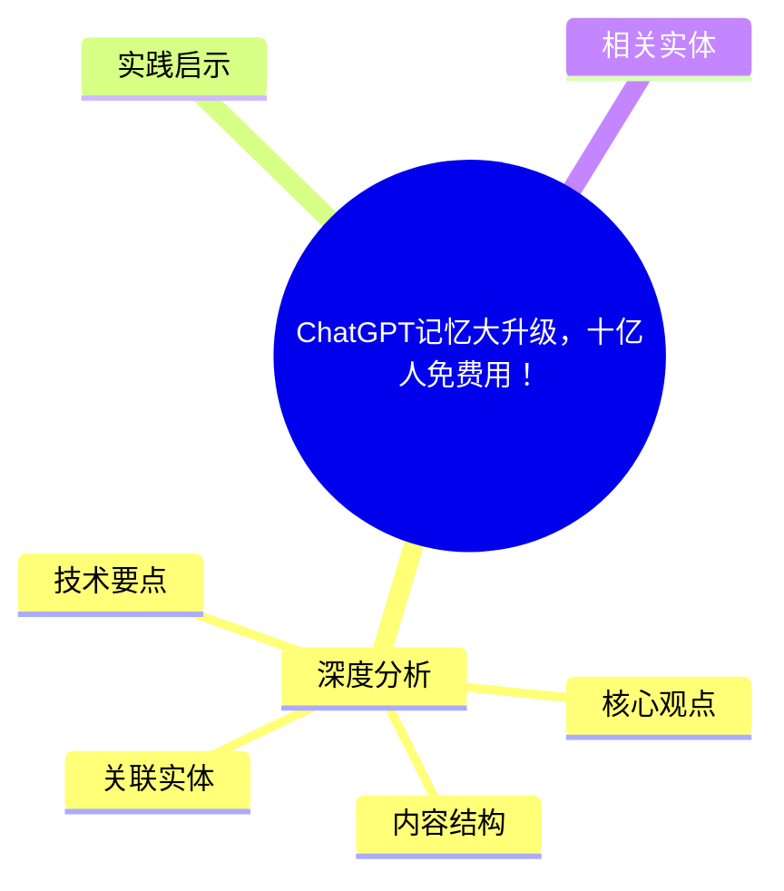
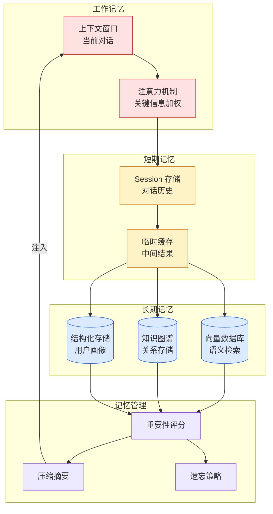

# ChatGPT记忆大升级，十亿人免费用！

## Ch01.1167 ChatGPT记忆大升级，十亿人免费用！

> 📊 Level ⭐⭐ | 3.4KB | `entities/chatgpt-dreaming-v3-long-term-memory-xinzhiyuan.md`

# ChatGPT记忆大升级，十亿人免费用！

→ [原文存档](https://github.com/QianJinGuo/wiki-book/tree/main/docs/raw/articles/chatgpt-dreaming-v3-long-term-memory-xinzhiyuan.md)

## 概念导图

## 深度分析

ChatGPT记忆大升级，十亿人免费用！ 涉及architecture领域的核心技术议题。
### 核心观点
1. # ChatGPT记忆大升级，十亿人免费用！
2. > 作者：ASI启示录（新智元） · 发布：2026-06-07
> 奥特曼官宣 ChatGPT 记忆重大升级！
3. 全新 Dreaming V3 架构正式上线：ChatGPT 会在后台「做梦」，首次向数亿免费用户开放。
4. ## 核心事实（与 51CTO 译本高度重叠）
OpenAI 祭出重量级更新：ChatGPT「记忆系统」彻底重写，全新记忆架构 **Dreaming V3** 正式上线，「做梦」功能向十亿人免费开放，Plus 和 Pro 记忆容量直接翻倍。
5. ## 三场大考
OpenAI 用三条硬标准衡量"好记忆"：记得住、用得对、跟得上时间。

### 内容结构
- ChatGPT记忆大升级，十亿人免费用！
- 核心事实（与 51CTO 译本高度重叠）
- 三场大考
- 算力狂降 5 倍
- ChatGPT 记忆"三级跳"
- 记忆，ASI 第一块拼图
- 参考资料
- 与已有实体的关系

### 技术要点

- **architecture架构**: 本文在architecture方向提出的设计理念与实现路径
- **工程挑战**: 实际落地中面临的关键问题与应对策略
- **data趋势**: 相关技术演进方向与新兴范式
### 关联实体

- [存之有序治之有矩Agent 记忆系统的工程实践与演进](../ch03/035-agent.html)
- [两万字详解Claude Code源码核心机制](../ch03/078-claude-code.html)
- [你不知道的 Agent原理架构与工程实践 V2](../ch03/035-agent.html)
- [龙虾装上了可以用来干啥分享下我的 Openclaw 多智能体团队搭建经验 V2](../ch11/235-openclaw.html)
- [Karpathy 最新访谈从 Vibe Coding 到 Agentic Engineering](../ch04/237-agentic.html)
- [Ethan He Cosmos Grok Imagine Latent Space Video Agent 20260606](../ch03/035-agent.html)

## 实践启示

1. **工程落地**: architecture领域方案需关注可观测性、可维护性和成本效率
2. **技术选型**: 根据场景选择合适的技术栈，避免过度设计或盲目追新
3. **持续迭代**: 建立数据驱动的反馈闭环，持续优化系统表现
4. **风险管控**: 引入新技术需评估对现有系统稳定性的影响，做好降级预案

## 相关实体

- [MOC](https://github.com/QianJinGuo/wiki/blob/main/moc/memory-context-systems.md)

---

