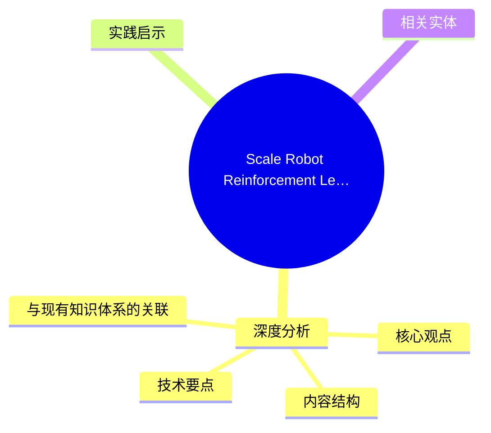
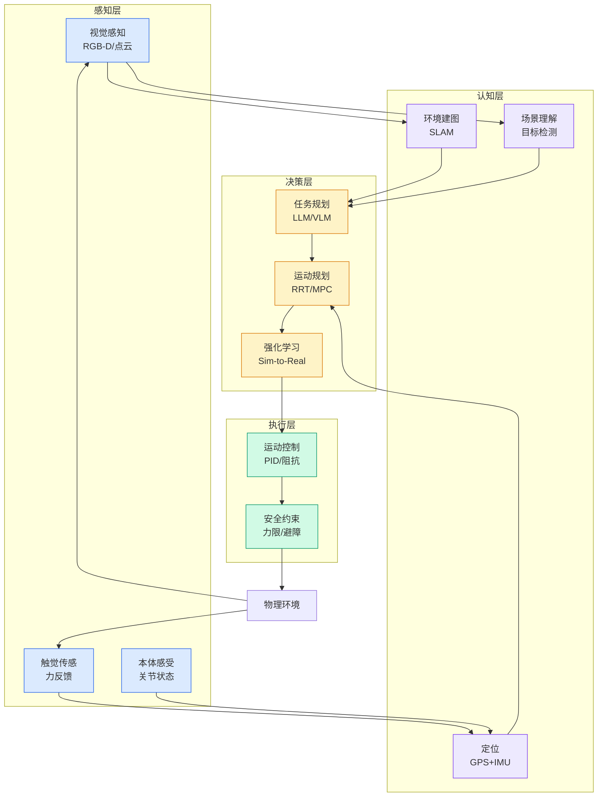

# Scale Robot Reinforcement Learning with NVIDIA Isaac Lab on Amazon SageMaker AI

## Ch01.1170 Scale Robot Reinforcement Learning with NVIDIA Isaac Lab on Amazon SageMaker AI

> 📊 Level ⭐⭐ | 3.3KB | `entities/scale-robot-reinforcement-learning-with-nvidia-isaac-lab-on-.md`

# Scale Robot Reinforcement Learning with NVIDIA Isaac Lab on Amazon SageMaker AI

→ [原文存档](https://github.com/QianJinGuo/wiki-book/tree/main/docs/raw/articles/scale-robot-reinforcement-learning-with-nvidia-isaac-lab-on-.md)

## 概念导图

## 深度分析

Scale Robot Reinforcement Learning with NVIDIA Isaac Lab on Amazon SageMaker AI 涉及agent领域的核心技术议题。基于原文内容的深入分析：

### 核心观点

1. # Scale Robot Reinforcement Learning with NVIDIA Isaac Lab on Amazon SageMaker AI
2. Physical AI is moving from research into production
3. The full code of this solution is available in the [accompanying GitHub repository](<https://github
4. Why Amazon SageMaker AI for Physical AI training

### 内容结构

- Scale Robot Reinforcement Learning with NVIDIA Isaac Lab on Amazon SageMaker AI
- 1\. Why Amazon SageMaker AI for Physical AI training
- Cluster resiliency and control with SageMaker HyperPod
- Ephemeral compute with SageMaker Training Jobs
- 2\. NVIDIA Isaac Lab and the training task
- 3\. Solution overview

### 技术要点

本文在agent方向提供以下关键技术洞察：

- **技术架构**: 基于agent的设计理念和实现路径
- **工程挑战**: 实际落地中面临的关键问题和解决思路
- **行业趋势**: 该领域的发展方向和新兴范式

### 与现有知识体系的关联

- [Nvidia Isaac Lab Sagemaker Robot Rl Humanoid](https://github.com/QianJinGuo/wiki/blob/main/entities/nvidia-isaac-lab-sagemaker-robot-rl-humanoid.md)
- [Ethan He Cosmos Grok Imagine Latent Space Video Agent 20260606](../ch03/035-agent.html)
- [存之有序治之有矩Agent 记忆系统的工程实践与演进](../ch03/035-agent.html)
- [Openclaw 完全指南这可能是全网最新最全的系统化教程了32W字建议收藏](../ch11/235-openclaw.html)
- [Openclaw 完全指南这可能是全网最新最全的系统化教程了32W字建议收藏 V2](../ch11/235-openclaw.html)

## 实践启示

1. **工程落地**: 将agent领域的理论转化为可执行方案时，需关注可观测性和可维护性
2. **技术选型**: 根据实际场景需求选择合适的技术栈，避免过度工程化
3. **持续迭代**: 建立反馈闭环，通过数据驱动的方式持续优化系统表现
4. **风险管控**: 在引入新技术时，充分评估其对现有系统稳定性的影响

## 相关实体

- [MOC](https://github.com/QianJinGuo/wiki/blob/main/moc/aws-cloud-ai-infrastructure.md)

---

