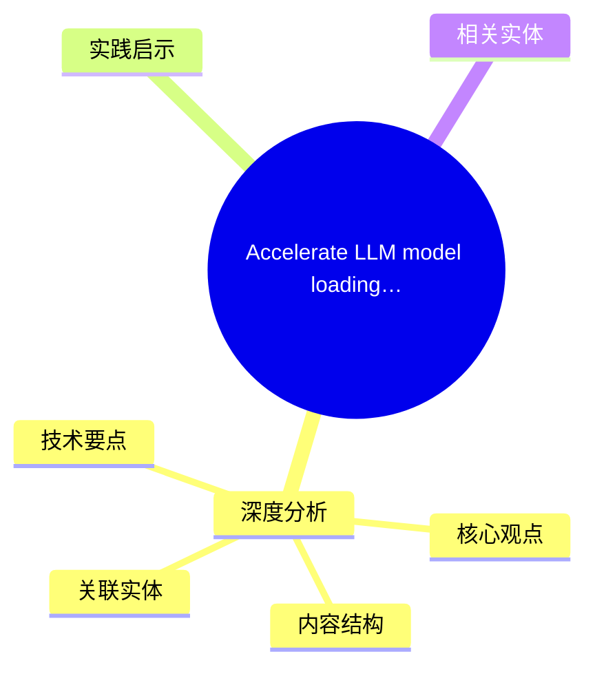
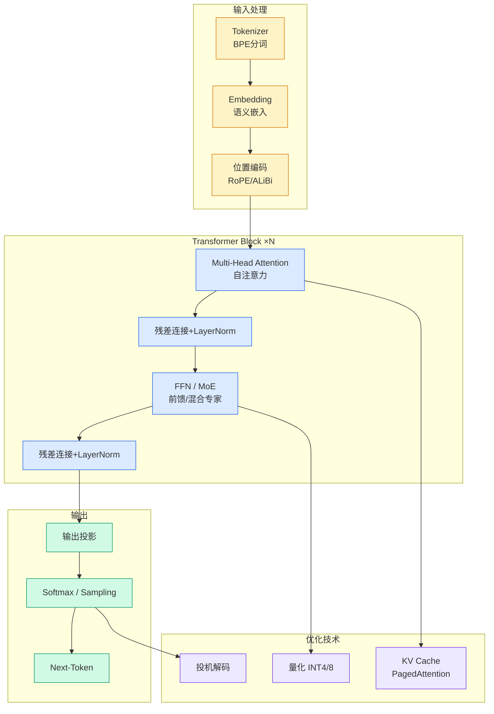

# Accelerate LLM model loading and increase context windows with GPUDirect on Amazon FSx for Lustre and TurboQuant

## Ch01.1172 Accelerate LLM model loading and increase context windows with GPUDirect on Amazon FSx for Lustre and TurboQuant

> 📊 Level ⭐⭐ | 3.3KB | `entities/accelerate-llm-model-loading-and-increase-context-windows-wi.md`

# Accelerate LLM model loading and increase context windows with GPUDirect on Amazon FSx for Lustre and TurboQuant

→ [原文存档](https://github.com/QianJinGuo/wiki-book/tree/main/docs/raw/articles/accelerate-llm-model-loading-and-increase-context-windows-wi.md)

## 概念导图

## 深度分析

Accelerate LLM model loading and increase context windows with GPUDirect on Amazon FSx for Lustre and TurboQuant 涉及architecture领域的核心技术议题。
### 核心观点
1. As models grow to hundreds of billions of parameters and GPU environments grow ever larger, model load time negatively affects your end-to-end total time to first token (TTFT).
2. This post explores how Amazon FSx for Lustre, combined with NVIDIA GPUDirect Storage (GDS), plus a bit of clever planning, can fundamentally change the cold-start TTFT equation.
3. It reduces minutes of unproductive load time to seconds each time your model starts.
4. While we’re on the topic of optimization, this post will also cover the effect of the recently announced TurboQuant KV cache in terms of a massive increase in context window size.
5. ## Background: NVIDIA Blackwell architecture on AWS
AWS recently launched the Amazon EC2 P6e and P6 instance families, powered by NVIDIA’s Blackwell architecture (watch the announcement).

### 内容结构
- Background: NVIDIA Blackwell architecture on AWS
- The model loading bottleneck
- A direct path: FSx for Lustre with GPUDirect Storage
- Sharded parallel loading on P5en (8x H200)
- The performance difference
- Measured: Llama 3.1 70B Instruct (8-way TP, cold cache)
- Measured: Llama 3.1 405B Instruct (8-way TP, cold cache)
- Integration with serving frameworks

### 技术要点

- **architecture架构**: 本文在architecture方向提出的设计理念与实现路径
- **工程挑战**: 实际落地中面临的关键问题与应对策略
- **aws趋势**: 相关技术演进方向与新兴范式
### 关联实体

- [Scale Robot Reinforcement Learning With Nvidia Isaac Lab On ](ch01/1170-scale-robot-reinforcement-learning-with-nvidia-isaac-lab-on.html)
- [Nvidia Isaac Lab Sagemaker Robot Rl Humanoid](https://github.com/QianJinGuo/wiki/blob/main/entities/nvidia-isaac-lab-sagemaker-robot-rl-humanoid.md)
- [Openclaw 完全指南这可能是全网最新最全的系统化教程了32W字建议收藏](../ch11/235-openclaw.html)
- [Ethan He Cosmos Grok Imagine Latent Space Video Agent 20260606](../ch03/035-agent.html)
- [存之有序治之有矩Agent 记忆系统的工程实践与演进](../ch03/035-agent.html)
- [Openclaw 完全指南这可能是全网最新最全的系统化教程了32W字建议收藏 V2](../ch11/235-openclaw.html)

## 实践启示

1. **工程落地**: architecture领域方案需关注可观测性、可维护性和成本效率
2. **技术选型**: 根据场景选择合适的技术栈，避免过度设计或盲目追新
3. **持续迭代**: 建立数据驱动的反馈闭环，持续优化系统表现
4. **风险管控**: 引入新技术需评估对现有系统稳定性的影响，做好降级预案

## 相关实体

- [MOC](https://github.com/QianJinGuo/wiki/blob/main/moc/llm-core-technology.md)

---

