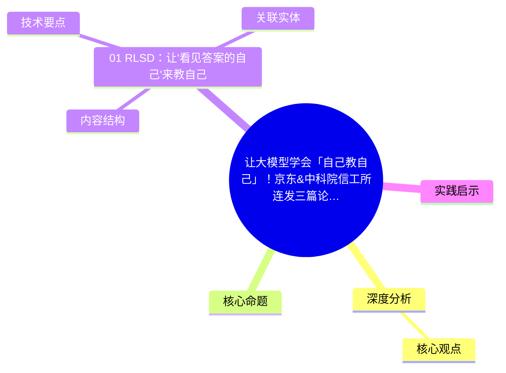
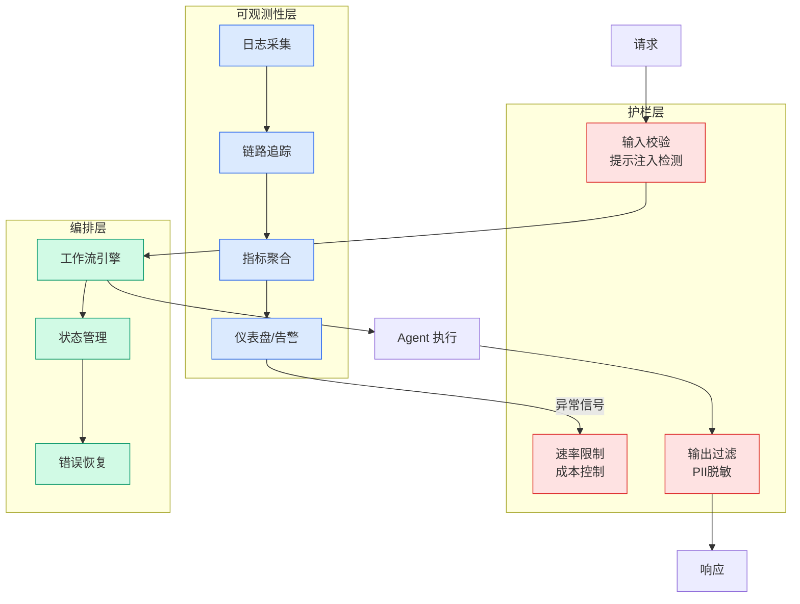

# 让大模型学会「自己教自己」！京东&中科院信工所连发三篇论文定义Self-TaughtRLVR

## Ch01.1174 让大模型学会「自己教自己」！京东&中科院信工所连发三篇论文定义Self-TaughtRLVR

> 📊 Level ⭐⭐ | 3.3KB | `entities/self-taught-rlvr-jd-cii-2026.md`

# 让大模型学会「自己教自己」！京东&中科院信工所连发三篇论文定义Self-TaughtRLVR

→ [原文存档](https://github.com/QianJinGuo/wiki-book/tree/main/docs/raw/articles/self-taught-rlvr-jd-cii-2026.md)

## 概念导图

## 深度分析

让大模型学会「自己教自己」！京东&中科院信工所连发三篇论文定义Self-TaughtRLVR 涉及code领域的核心技术议题。
### 核心观点
1. # 让大模型学会「自己教自己」！
2. 京东&中科院信工所连发三篇论文定义Self-TaughtRLVR
## 核心命题

Self-Taught RLVR系列研究核心：**如何让大模型自我指导，实现迭代演化？
3. **RLSD（informed self）**：由特权信息增强的自身来教自己
2.
4. **NPO（temporal self）**：由近未来的自身教自己
3.
5. **CoPD（parallel-self）**：由走另一条路的自身来教自己
## 01 RLSD：让"看见答案的自己"来教自己
**问题**：当我们给同一个模型注入特权信息（参考答案）后，它能不能成为老师来指导自己？

### 内容结构
- 让大模型学会「自己教自己」！京东&中科院信工所连发三篇论文定义Self-TaughtRLVR
- 核心命题
- 01 RLSD：让"看见答案的自己"来教自己
- 02 NPO：让"短暂未来后的自己"教自己
- 03 CoPD：让"走另一条路的自己"教自己
- 资源链接

### 技术要点

- **code架构**: 本文在code方向提出的设计理念与实现路径
- **工程挑战**: 实际落地中面临的关键问题与应对策略
- **data趋势**: 相关技术演进方向与新兴范式
### 关联实体

- [Karpathy 最新访谈从 Vibe Coding 到 Agentic Engineering](../ch04/237-agentic.html)
- [Karpathy Vibe Coding Agentic Engineering](../ch04/126-karpathy-vibe-coding-agentic-engineering.html)
- [存之有序治之有矩Agent 记忆系统的工程实践与演进](../ch03/035-agent.html)
- [Scale Robot Reinforcement Learning With Nvidia Isaac Lab On ](ch01/1170-scale-robot-reinforcement-learning-with-nvidia-isaac-lab-on.html)
- [Nvidia Isaac Lab Sagemaker Robot Rl Humanoid](https://github.com/QianJinGuo/wiki/blob/main/entities/nvidia-isaac-lab-sagemaker-robot-rl-humanoid.md)
- [Openclaw 完全指南这可能是全网最新最全的系统化教程了32W字建议收藏](../ch11/235-openclaw.html)

## 实践启示
1. **工程落地**: code领域方案需关注可观测性、可维护性和成本效率
2. **技术选型**: 根据场景选择合适的技术栈，避免过度设计或盲目追新
3. **持续迭代**: 建立数据驱动的反馈闭环，持续优化系统表现
4. **风险管控**: 引入新技术需评估对现有系统稳定性的影响，做好降级预案

---

