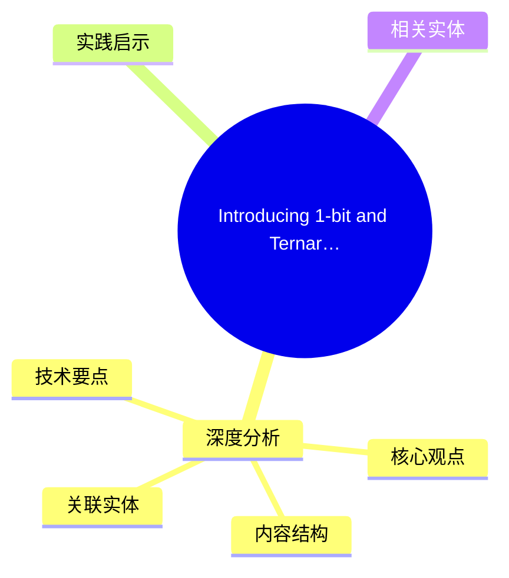
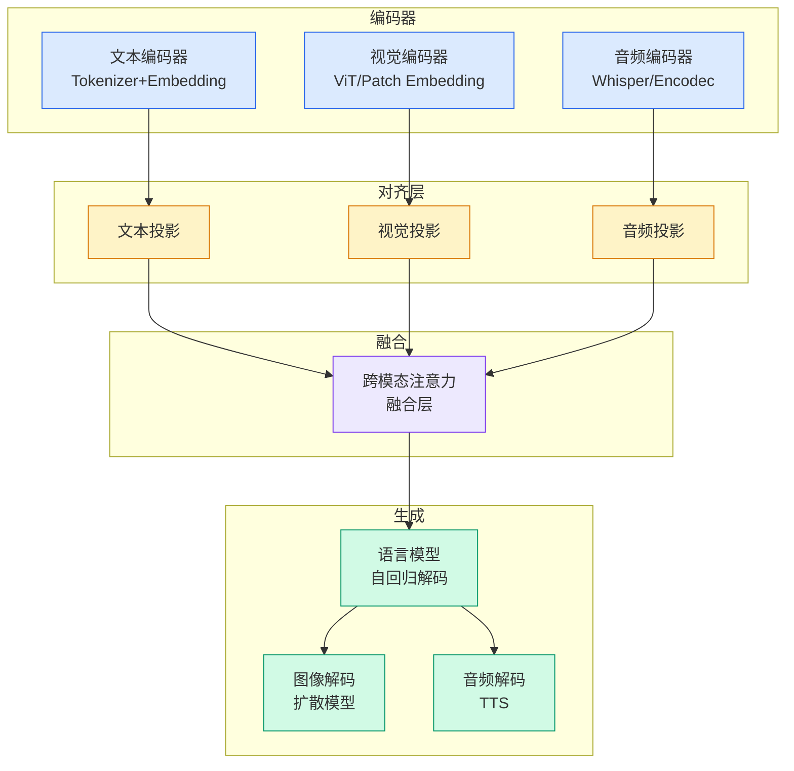

# Introducing 1-bit and Ternary Bonsai Image 4B: Image Generation for Local Devices

## Ch01.1175 Introducing 1-bit and Ternary Bonsai Image 4B: Image Generation for Local Devices

> 📊 Level ⭐⭐ | 3.3KB | `entities/introducing-1-bit-and-ternary-bonsai-image-4b-image-generati-352fe9.md`

# Introducing 1-bit and Ternary Bonsai Image 4B: Image Generation for Local Devices

→ [原文存档](https://github.com/QianJinGuo/wiki-book/tree/main/docs/raw/articles/introducing-1-bit-and-ternary-bonsai-image-4b-image-generati-352fe9.md)

## 概念导图

## 深度分析

Introducing 1-bit and Ternary Bonsai Image 4B: Image Generation for Local Devices 涉及architecture领域的核心技术议题。
### 核心观点
1. Bonsai Image 4B comes in two variants:
*   **1-bit Bonsai Image 4B** uses binary {−1, +1} transformer weights with an FP16 group-wise scaling factor, giving 1.
2. 125 effective bits per weight.
3. It targets maximum compression and is the right fit when memory pressure, bandwidth, and the deployment footprint are the primary constraints.
4. *   **Ternary Bonsai Image 4B** uses {−1, 0, +1} transformer weights with an FP16 group-wise scaling factor, giving 1.
5. 71 effective bits per weight.

### 内容结构
- Built for local generation
- Benchmarking performance
- Why this is important
- Availability
- Join Us
- Resources

### 技术要点

- **architecture架构**: 本文在architecture方向提出的设计理念与实现路径
- **工程挑战**: 实际落地中面临的关键问题与应对策略
- **code趋势**: 相关技术演进方向与新兴范式
### 关联实体

- [Scale Robot Reinforcement Learning With Nvidia Isaac Lab On ](ch01/1170-scale-robot-reinforcement-learning-with-nvidia-isaac-lab-on.html)
- [Nvidia Isaac Lab Sagemaker Robot Rl Humanoid](https://github.com/QianJinGuo/wiki/blob/main/entities/nvidia-isaac-lab-sagemaker-robot-rl-humanoid.md)
- [Karpathy 最新访谈从 Vibe Coding 到 Agentic Engineering](../ch04/237-agentic.html)
- [Ethan He Cosmos Grok Imagine Latent Space Video Agent 20260606](../ch03/035-agent.html)
- [Karpathy Vibe Coding Agentic Engineering](../ch04/126-karpathy-vibe-coding-agentic-engineering.html)
- [存之有序治之有矩Agent 记忆系统的工程实践与演进](../ch03/035-agent.html)

## 实践启示

1. **工程落地**: architecture领域方案需关注可观测性、可维护性和成本效率
2. **技术选型**: 根据场景选择合适的技术栈，避免过度设计或盲目追新
3. **持续迭代**: 建立数据驱动的反馈闭环，持续优化系统表现
4. **风险管控**: 引入新技术需评估对现有系统稳定性的影响，做好降级预案

## 相关实体

- [MOC](https://github.com/QianJinGuo/wiki/blob/main/moc/data-infrastructure.md)

---

