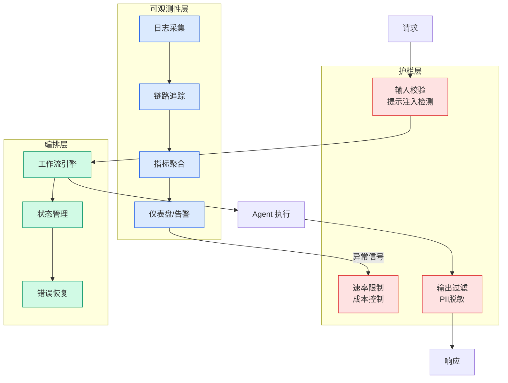

# LLMShare: using shared chatbot pages to distribute malware

## Ch01.1179 LLMShare: using shared chatbot pages to distribute malware

> 📊 Level ⭐⭐ | 3.2KB | `entities/llmshare-using-shared-chatbot-pages-to-distribute-malware-20260606.md`

# LLMShare: using shared chatbot pages to distribute malware

→ [原文存档](https://github.com/QianJinGuo/wiki-book/tree/main/docs/raw/articles/llmshare-using-shared-chatbot-pages-to-distribute-malware-20260606.md)

## 深度分析

Shared conversations on AI chatbot platforms have become the latest delivery mechanism for malware campaigns targeting macOS and Windows users.

### 核心观点

1. Attackers create content on platforms like ChatGPT and Claude that appears to offer installation guidance or service updates, then drive traffic to it via search engine results in the form of malvertising and SEO poisoning.
2. The content lives on chatgpt.
3. ai — domains that users and security tools trust implicitly — so the attack bypasses URL reputation checks before the victim even reaches the malicious payload.
4. Several variants of this technique have been reported over the past few months.
5. The earliest examples used shared Claude.

### 技术要点

- **article架构**: 本文在article方向提出的设计理念与实现路径
- **工程挑战**: 实际落地中面临的关键问题与应对策略
- **code趋势**: 相关技术演进方向与新兴范式

### 关联实体

- [How Wed Market To Software Developers At Startups 20260606](ch01/913-20.html)
- [Google Brings Local Ai Agents To Laptops With Gemma 4 12B 20260606](ch01/1033-google-brings-local-ai-agents-to-laptops-with-gemma-4-12b.html)
- [Code As Agent Harness Survey](../ch09/051-code-as-agent-harness.html)
- [Hermes Agent V014 Architecture Shugex](../ch03/096-hermes-agent.html)
- [Deepseek Code Harness Competitor Tina](../ch09/092-deepseek-code-harness.html)
- [Headroom Context Compression Agent Vibecoder](../ch03/035-agent.html)

## 实践启示

1. **威胁建模**: 建立持续的安全评估机制，关注供应链和身份安全
2. **纵深防御**: 多层防护优于单点加固，关注攻击链的每个环节
3. **自动化响应**: 利用 AI 加速威胁检测和事件响应流程
4. **合规先行**: 安全方案需与监管要求对齐，避免事后补救

## 相关实体

- [MOC](https://github.com/QianJinGuo/wiki/blob/main/moc/reinforcement-learning-rlhf.md)

---

