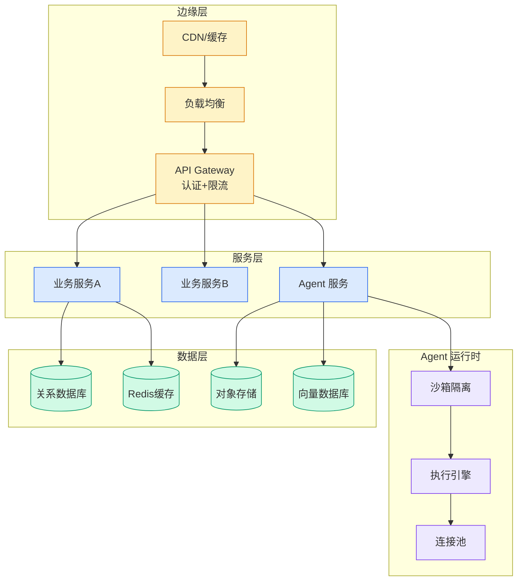

# 长周期 Agent 详解：从 Ralph Loop 到可接管 Harness

## Ch01.1180 长周期 Agent 详解：从 Ralph Loop 到可接管 Harness

> 📊 Level ⭐⭐ | 3.2KB | `entities/long-running-agent-ralph-loop-harness-takeover.md`

# 长周期 Agent 详解：从 Ralph Loop 到可接管 Harness

→ [原文存档](https://github.com/QianJinGuo/wiki-book/tree/main/docs/raw/articles/long-running-agent-ralph-loop-harness-takeover.md)

## 深度分析

长周期 Agent 详解：从 Ralph Loop 到可接管 Harness 涉及agent领域的核心技术议题。
### 核心观点
1. # 长周期 Agent 详解：从 Ralph Loop 到可接管 Harness
> 来源：架构师（JiaGouX） | 作者：若飞 | 2026-05-10
## 太长不看

- Codex `/goal` 很重要，但它解决的主要是"能不能一直干下去"，不等于把长任务的正确性也一起解决了。
2. - 朴素 Ralph Loop 的问题不在循环次数，而在每一轮都在悄悄积累目标漂移、上下文漂移和质量漂移。
3. - 长周期 Agent 比起"半途而废"，更怕"勤奋地跑偏"。
4. - 前置 Spec 的价值，是把错误的决策分叉提前剪掉，避免后面的 token 在错路上越跑越远。
5. - 外部状态文件比聊天记录靠谱。

### 内容结构
- 长周期 Agent 详解：从 Ralph Loop 到可接管 Harness
- 太长不看
- 核心论点
- 关键框架
- Ralph Loop 的边界
- 可接管的四类证据
- 外部状态文件分层
- 参考来源

### 技术要点

- **agent架构**: 本文在agent方向提出的设计理念与实现路径
- **工程挑战**: 实际落地中面临的关键问题与应对策略
- **architecture趋势**: 相关技术演进方向与新兴范式
### 关联实体

- [深入理解 Claude Code 源码中的 Agent Harness 构建之道](../ch05/058-agent-harness.html)
- [两万字详解Claude Code源码核心机制](../ch03/078-claude-code.html)
- [龙虾装上了可以用来干啥分享下我的 Openclaw 多智能体团队搭建经验 V2](../ch11/235-openclaw.html)
- [Openclaw 完全指南这可能是全网最新最全的系统化教程了32W字建议收藏 V2](../ch11/235-openclaw.html)
- [构建基于多智能体架构的深度思考交易系统 V2](https://github.com/QianJinGuo/wiki/blob/main/entities/构建基于多智能体架构的深度思考交易系统-v2.md)
- [Openclaw 完全指南这可能是全网最新最全的系统化教程了32W字建议收藏](../ch11/235-openclaw.html)

## 实践启示
1. **工程落地**: agent领域方案需关注可观测性、可维护性和成本效率
2. **技术选型**: 根据场景选择合适的技术栈，避免过度设计或盲目追新
3. **持续迭代**: 建立数据驱动的反馈闭环，持续优化系统表现
4. **风险管控**: 引入新技术需评估对现有系统稳定性的影响，做好降级预案

---

