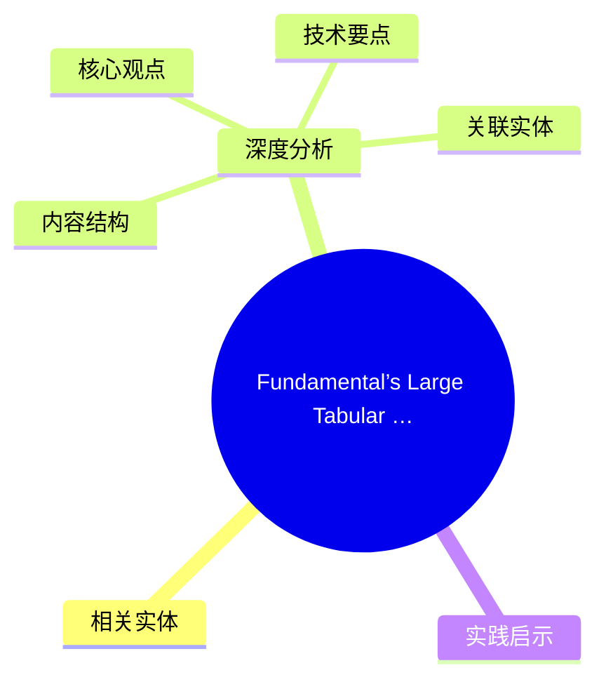
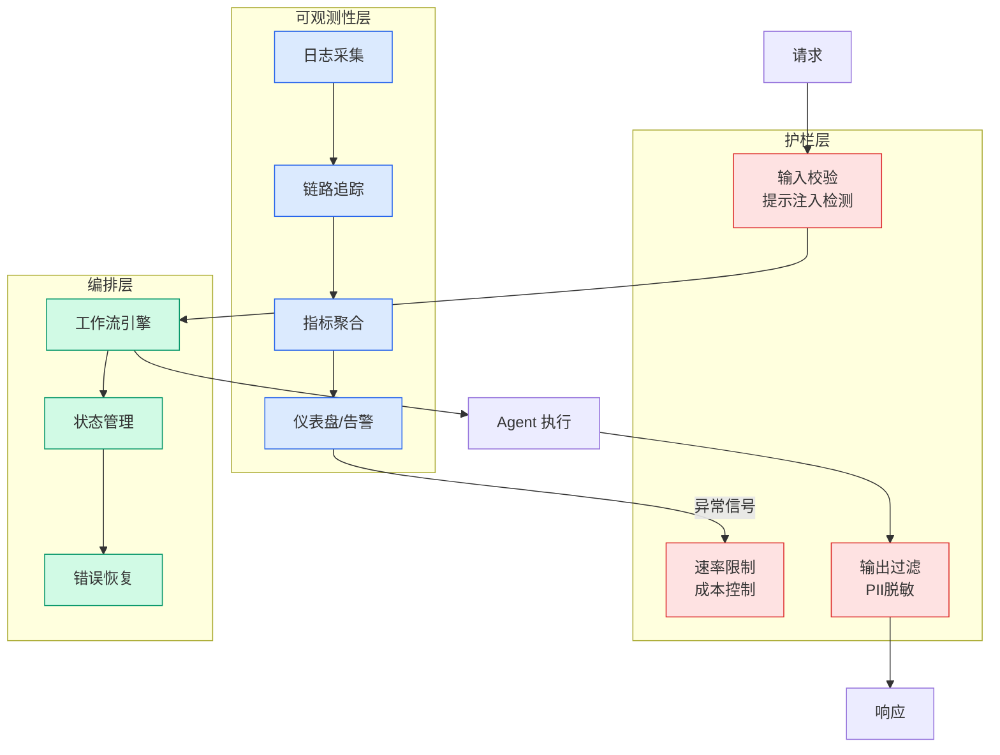

# Fundamental’s Large Tabular Model NEXUS is now available on Amazon SageMaker JumpStart

## Ch01.1181 Fundamental’s Large Tabular Model NEXUS is now available on Amazon SageMaker JumpStart

> 📊 Level ⭐⭐ | 3.2KB | `entities/fundamentals-large-tabular-model-nexus-is-now-available-on-a.md`

# Fundamental’s Large Tabular Model NEXUS is now available on Amazon SageMaker JumpStart

## 概念导图

## 相关实体

- [百型智能 ontoz：企业本体论 + 群智能体协同体系，新一代企业级 ai 基础设施](../ch05/094-ai.html)
- [面壁让ai写了训练框架forgetrain，然后它自己训出了最强1b模型](../ch05/094-ai.html)
→ [原文存档](https://github.com/QianJinGuo/wiki-book/tree/main/docs/raw/articles/fundamentals-large-tabular-model-nexus-is-now-available-on-a.md)

- [MOC](https://github.com/QianJinGuo/wiki/blob/main/moc/data-infrastructure.md)
## 深度分析

Fundamental’s Large Tabular Model NEXUS is now available on Amazon SageMaker JumpStart 涉及agent领域的核心技术议题。
### 核心观点
1. # Fundamental’s Large Tabular Model NEXUS is now available on Amazon SageMaker JumpStart
Today, we’re announcing support for Fundamental’s NEXUS model on Amazon SageMaker AI.
2. With this launch, you can deploy a foundation model (FM) purpose-built for tabular data prediction.
3. This model helps your enterprise generate accurate, deterministic predictions from structured data in days instead of months.
4. In this post, we show you how to get started with NEXUS on Amazon SageMaker JumpStart, walk through the deployment process, and demonstrate how to run predictions against your enterprise datasets.
5. ## What is NEXUS?

### 内容结构
- What is NEXUS?
- Why existing approaches fall short
- How NEXUS works on Amazon SageMaker AI
- Get started with NEXUS on Amazon SageMaker AI
- Enterprise use cases transforming industries
- Financial services
- Healthcare
- Manufacturing and supply chain

### 技术要点

- **agent架构**: 本文在agent方向提出的设计理念与实现路径
- **工程挑战**: 实际落地中面临的关键问题与应对策略
- **architecture趋势**: 相关技术演进方向与新兴范式
### 关联实体

- [Openclaw 完全指南这可能是全网最新最全的系统化教程了32W字建议收藏](../ch11/235-openclaw.html)
- [Scale Robot Reinforcement Learning With Nvidia Isaac Lab On ](ch01/1170-scale-robot-reinforcement-learning-with-nvidia-isaac-lab-on.html)
- [Nvidia Isaac Lab Sagemaker Robot Rl Humanoid](https://github.com/QianJinGuo/wiki/blob/main/entities/nvidia-isaac-lab-sagemaker-robot-rl-humanoid.md)
- [Openclaw 完全指南这可能是全网最新最全的系统化教程了32W字建议收藏 V2](../ch11/235-openclaw.html)
- [Karpathy 最新访谈从 Vibe Coding 到 Agentic Engineering](../ch04/237-agentic.html)
- [Ethan He Cosmos Grok Imagine Latent Space Video Agent 20260606](../ch03/035-agent.html)

## 实践启示
1. **工程落地**: agent领域方案需关注可观测性、可维护性和成本效率
2. **技术选型**: 根据场景选择合适的技术栈，避免过度设计或盲目追新
3. **持续迭代**: 建立数据驱动的反馈闭环，持续优化系统表现
4. **风险管控**: 引入新技术需评估对现有系统稳定性的影响，做好降级预案

---

