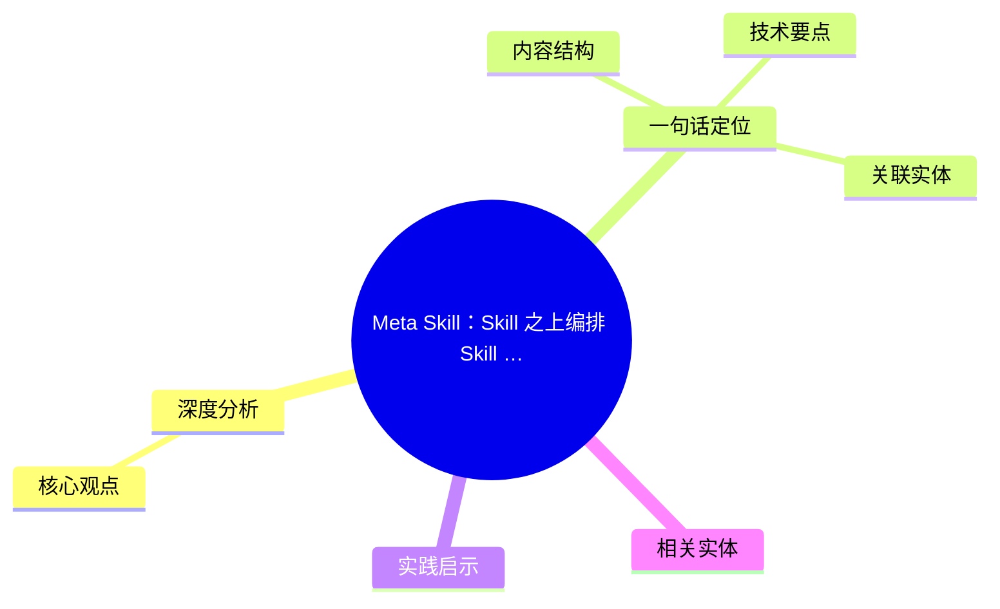
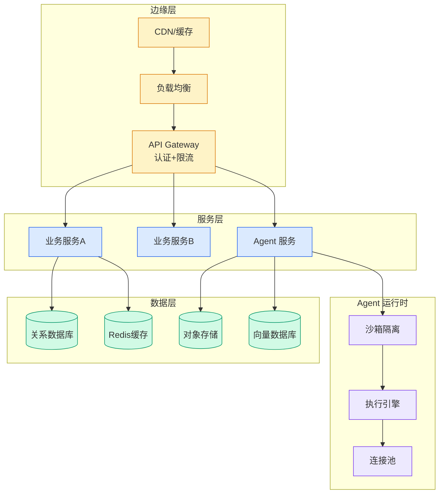

# Meta Skill：Skill 之上编排 Skill 的抽象层

## Ch01.1182 Meta Skill：Skill 之上编排 Skill 的抽象层

> 📊 Level ⭐⭐ | 3.2KB | `entities/meta-skill-skill-orchestration-opensquilla-jay.md`

# Meta Skill：Skill 之上编排 Skill 的抽象层

→ [原文存档](https://github.com/QianJinGuo/wiki-book/tree/main/docs/raw/articles/meta-skill-skill-orchestration-opensquilla-jay.md)

## 概念导图

## 深度分析

Meta Skill：Skill 之上编排 Skill 的抽象层 涉及agent领域的核心技术议题。
### 核心观点
1. # Meta Skill：Skill 之上编排 Skill 的抽象层
> 整理自量子位 Jay 报道
> 原文：https://mp.
2. com/s/bsuGN9a4XaeLpPwMM-WVag
> GitHub：https://github.
3. com/opensquilla/opensquilla
> 项目状态：2026-06-04，2,757 ⭐，Apache-2.
4. 0，Python
> 团队：基元律动（创始人王云鹤）
## 一句话定位

**Meta Skill = "Skill 的 Skill" = 多个原子 Skill 的"项目经理操作手册"。
5. ** 把多步骤编排、并行/串行决策、产出物上下游衔接，**全部内嵌到一份 SKILL.

### 内容结构
- Meta Skill：Skill 之上编排 Skill 的抽象层
- 一句话定位
- 解决了什么问题
- 9 个内置 Meta Skill（仓库）
- 典型实测：meta-kid-project-planner
- 三大要素组合
- 真实痛点
- 解决方案：个人 × 社区索引协议

### 技术要点

- **agent架构**: 本文在agent方向提出的设计理念与实现路径
- **工程挑战**: 实际落地中面临的关键问题与应对策略
- **data趋势**: 相关技术演进方向与新兴范式
### 关联实体

- [两万字详解Claude Code源码核心机制](../ch03/078-claude-code.html)
- [Agentops Operationalize Agentic Ai At Scale With Amazon Bedr](../ch04/299-agentops-operationalize-agentic-ai-at-scale-with-amazon-bed.html)
- [龙虾装上了可以用来干啥分享下我的 Openclaw 多智能体团队搭建经验 V2](../ch11/235-openclaw.html)
- [Karpathy 最新访谈从 Vibe Coding 到 Agentic Engineering](../ch04/237-agentic.html)
- [构建基于多智能体架构的深度思考交易系统 V2](https://github.com/QianJinGuo/wiki/blob/main/entities/构建基于多智能体架构的深度思考交易系统-v2.md)
- [Openclaw 完全指南这可能是全网最新最全的系统化教程了32W字建议收藏](../ch11/235-openclaw.html)

## 实践启示
1. **工程落地**: agent领域方案需关注可观测性、可维护性和成本效率
2. **技术选型**: 根据场景选择合适的技术栈，避免过度设计或盲目追新
3. **持续迭代**: 建立数据驱动的反馈闭环，持续优化系统表现
4. **风险管控**: 引入新技术需评估对现有系统稳定性的影响，做好降级预案

## 相关实体

- [MOC](https://github.com/QianJinGuo/wiki/blob/main/moc/reinforcement-learning-rlhf.md)

---

