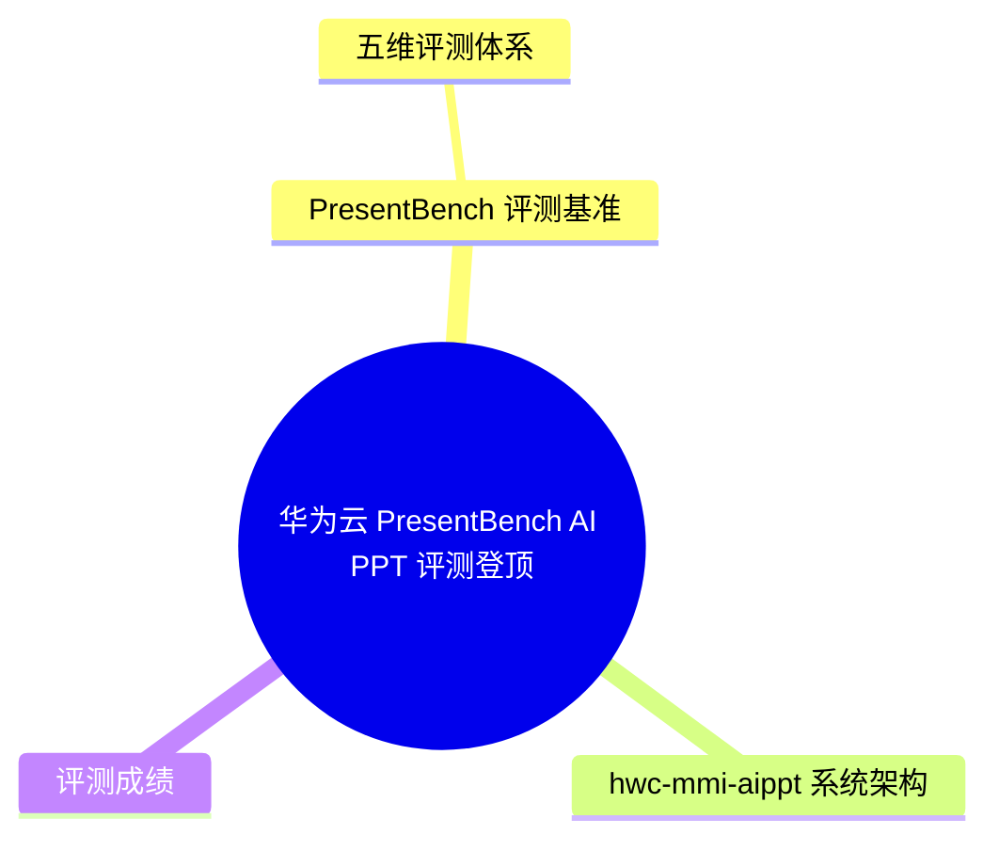
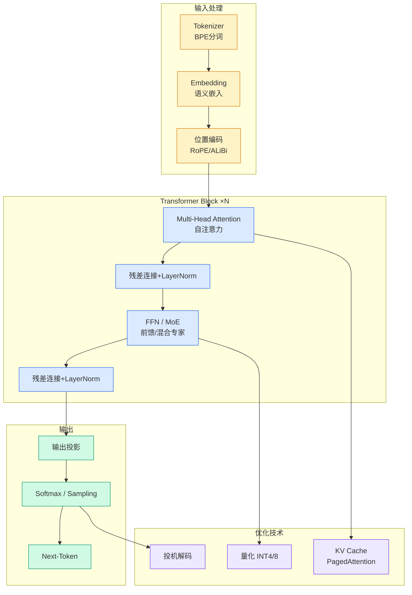

# 华为云 PresentBench AI PPT 评测登顶

## Ch01.1183 华为云 PresentBench AI PPT 评测登顶

> 📊 Level ⭐⭐ | 3.2KB | `entities/huawei-cloud-presentbench-ai-ppt-hwc-mmi-aippt-2026.md`

# 华为云行业大模型多模态智能团队 PresentBench 评测夺冠

> **Background**：华为云行业大模型多模态智能团队开发的 AI PPT 系统（hwc-mmi-aippt）在清华大学 PresentBench 细粒度幻灯片生成评测基准中取得总榜第一（70.8 分），在五大场景中斩获四项第一。该系统覆盖从材料解析到成品交付的全流程智能创作。

## 概念导图

## PresentBench 评测基准

PresentBench（A Fine-Grained Rubric-Based Benchmark for Slide Generation）由清华大学团队发布，是一个细粒度的、基于评分量表的幻灯片生成评测基准。与传统仅依据整体观感打分不同，PresentBench 关注的是系统是否真正完成了一项真实的演示文稿创作任务。

基准核心特性：
- **238 个专家筛选的真实评测实例**，覆盖五大场景：学术 91 个、教育 60 个、经济 41 个、演讲 30 个、广告 16 个
- 平均每个任务包含约 **2.22 万 Token** 的输入信息（相当于 34 页原始材料）
- 每个任务附带高度具体的生成要求：目标受众、结构、页数范围、必要章节、视觉布局等
- 人工设计的平均 **54 余条原子化检查项**，拆分到五个独立维度

### 五维评测体系

1. **演示基础规范**：逻辑是否清晰、表达是否简洁、语言是否恰当
2. **视觉设计与布局**：页面是否美观、易读，布局是否合理
3. **内容完整性**：关键信息是否被完整覆盖
4. **内容正确性**：数据、事实与结论是否准确
5. **内容忠实性**：内容是否真正扎根于背景材料，禁止无依据扩写或幻觉

## hwc-mmi-aippt 系统架构

hwc-mmi-aippt 构建了覆盖"解析—策划—生成—校验—导出"的完整智能创作流程，由 multi-Agent 驱动：

1. **材料解析**：从原始文档提取关键数字、事实、命名实体和引用信息，形成结构化数据资产清单
2. **内容策划**：自动规划演示结构、章节逻辑和逐页大纲，围绕核心论点展开叙事
3. **页面生成**：将文字、数据和图表需求转化为逐页页面，自动安排标题、数据卡片、图表和视觉层级
4. **校验交付**：进行字号、溢出、布局和内容完整性检查，自动修复后导出成品

## 评测成绩

总榜第一，70.8 分。五大场景成绩：
- **学术**：72.6 分，**第一**
- **广告**：60.1 分，**第一**
- **教育**：71.0 分，**第一**
- **经济**：72.8 分，**第一**
- **演讲**：66.5 分，**第二**

分维度表现：演示基础规范 90.3 分（第一）、内容完整性 79.9 分（第一）、内容正确性 72.2 分（第一）、视觉设计与布局 61.1 分（第二）、内容忠实性 50.3 分（第二）。

→ [原文存档](https://github.com/QianJinGuo/wiki-book/tree/main/docs/raw/articles/华为云行业大模型团队ai-ppt登顶presentbench榜单.md)

---

