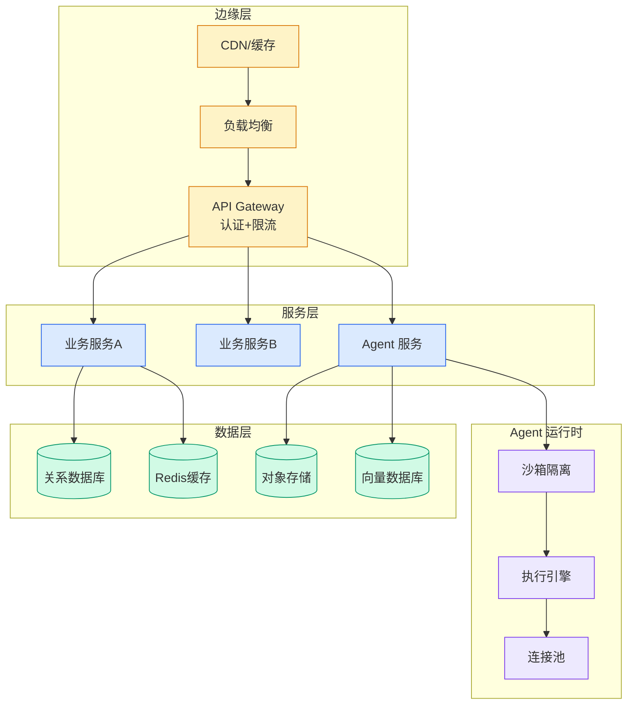

# 从零构建大语言模型 —— 读完这篇你就懂了

## Ch01.1184 从零构建大语言模型 —— 读完这篇你就懂了

> 📊 Level ⭐⭐ | 3.2KB | `entities/build-llm-from-scratch-7-chapters-zion.md`

# 从零构建大语言模型 —— 读完这篇你就懂了

→ [原文存档](https://github.com/QianJinGuo/wiki-book/tree/main/docs/raw/articles/build-llm-from-scratch-7-chapters-zion.md)

## 深度分析

从零构建大语言模型 —— 读完这篇你就懂了 涉及architecture领域的核心技术议题。
### 核心观点
1. # 从零构建大语言模型 —— 读完这篇你就懂了
> 锡安的自留地 | 2026-05-19 | 广东
这篇文章将让你对神秘莫测的大语言模型（LLM），从"这玩意儿到底怎么工作的？
2. ## 第1章：大语言模型是什么鬼？
3. LLM（Large Language Model），翻译成人话就是：一个特别大的神经网络，吃了海量的文本数据，然后学会了说人话。
4. LLM 的核心训练任务特别简单：**预测下一个词**。
5. 给你一句话的前半段，猜后半段。

### 内容结构
- 从零构建大语言模型 —— 读完这篇你就懂了
- 第1章：大语言模型是什么鬼？
- 1.1 LLM 到底是啥？
- 1.2 LLM 能干啥？
- 1.3 构建 LLM 的两步走
- 1.4 Transformer 架构：LLM 的"祖宗"
- 1.5 海量数据集
- 1.6 GPT 架构的精髓

### 技术要点

- **architecture架构**: 本文在architecture方向提出的设计理念与实现路径
- **工程挑战**: 实际落地中面临的关键问题与应对策略
- **code趋势**: 相关技术演进方向与新兴范式
### 关联实体

- [Karpathy 最新访谈从 Vibe Coding 到 Agentic Engineering](../ch04/237-agentic.html)
- [Ethan He Cosmos Grok Imagine Latent Space Video Agent 20260606](../ch03/035-agent.html)
- [Karpathy Vibe Coding Agentic Engineering](../ch04/126-karpathy-vibe-coding-agentic-engineering.html)
- [你不知道的 Agent原理架构与工程实践 V2](../ch03/035-agent.html)
- [Openclaw 完全指南这可能是全网最新最全的系统化教程了32W字建议收藏 V2](../ch11/235-openclaw.html)
- [Openclaw 完全指南这可能是全网最新最全的系统化教程了32W字建议收藏](../ch11/235-openclaw.html)

## 实践启示

1. **工程落地**: architecture领域方案需关注可观测性、可维护性和成本效率
2. **技术选型**: 根据场景选择合适的技术栈，避免过度设计或盲目追新
3. **持续迭代**: 建立数据驱动的反馈闭环，持续优化系统表现
4. **风险管控**: 引入新技术需评估对现有系统稳定性的影响，做好降级预案

## 相关实体

- [MOC](https://github.com/QianJinGuo/wiki/blob/main/moc/llm-core-technology.md)

---

