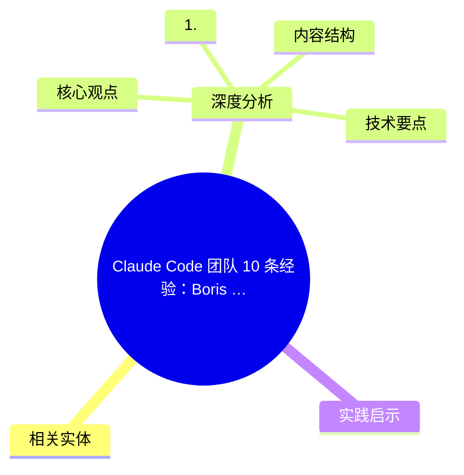
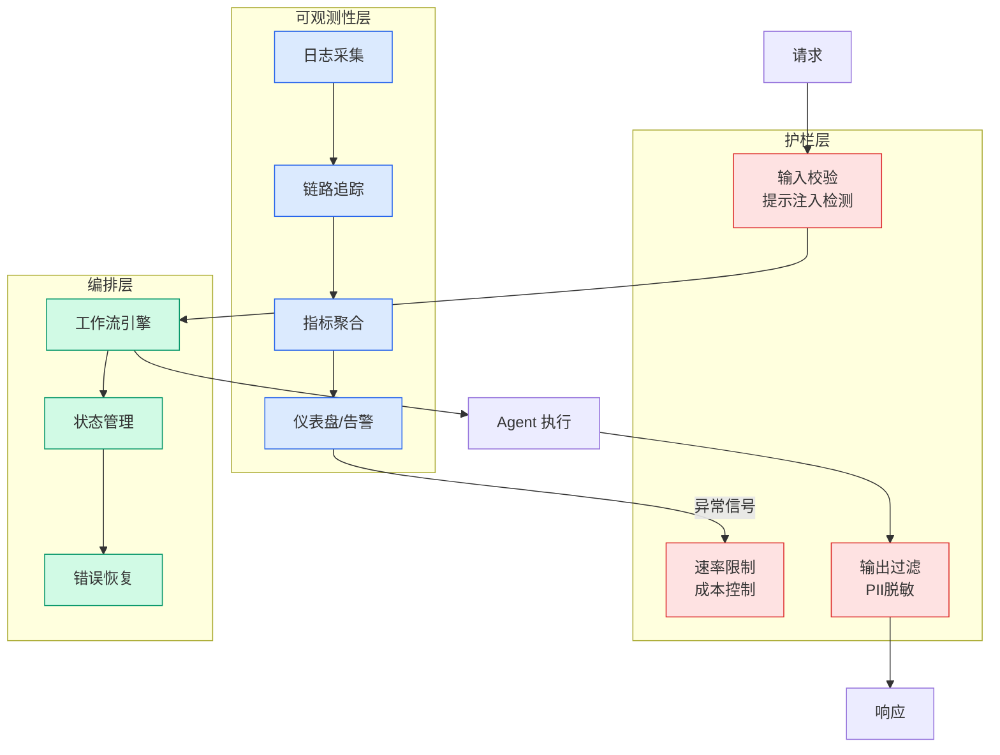

# Claude Code 团队 10 条经验：Boris 数据派 THU 分享

## Ch01.1185 Claude Code 团队 10 条经验：Boris 数据派 THU 分享

> 📊 Level ⭐⭐ | 3.2KB | `entities/claude-code-team-10-tips-boris-data派THU.md`

# Claude Code Team 10 Tips Boris Data派Thu

## 概念导图

## 相关实体

- [claude skill 质检工具 skill craft](ch01/976-claude.html)
- [karpathy × boris 访谈：software 3.0 时代编程完整地图](ch01/1274-llm.html)
→ [原文存档](https://github.com/QianJinGuo/wiki-book/tree/main/docs/raw/articles/claude-code-team-10-tips-boris-data派THU.md)

- [MOC](https://github.com/QianJinGuo/wiki/blob/main/moc/workflow-orchestration.md)
## 深度分析

Claude Code Team 10 Tips Boris Data派Thu 涉及agent领域的核心技术议题。
### 核心观点
1. 这是 Boris 在 X 上**第二次**公开的 Claude Code 使用技巧——这次是来自 Claude Code **团队内部**的 10 个技巧，干货满满。
2. 年初第一次公开的是 Boris 个人的使用习惯，本次则是团队成员的多样化实践汇总。
3. ## 10 个团队使用技巧
### 1.
4. 并行处理更多任务
同时开启 3–5 个 git worktree，让每个 worktree 都运行独立的 Claude 会话并行工作。
5. - 团队大多数成员偏爱 worktree（@amorriscode 专门在 Claude Desktop 应用里为 worktree 开发了原生支持）
- 给 worktree 命名并设置 Shell 别名（za、zb、zc），通过键盘指令在不同任务间一键切换
- 预留一个专门的"分析用" worktree，仅用来查看日志和运行 BigQuery
参阅文档：https://code.

### 内容结构
- 10 个团队使用技巧
- 1. 并行处理更多任务
- 2. 任何复杂任务，都从 Plan Mode 开始
- 3. 用心经营你的 CLAUDE.md
- 4. 创建你自己的专属 Skill 并提交到 Git，在所有项目中复用
- 5. Claude 几乎能自主搞定大部分 Bug
- 6. 提升你的 Prompt 技巧
- 7. 终端与环境配置

### 技术要点

- **agent架构**: 本文在agent方向提出的设计理念与实现路径
- **工程挑战**: 实际落地中面临的关键问题与应对策略
- **architecture趋势**: 相关技术演进方向与新兴范式
### 关联实体

- [两万字详解Claude Code源码核心机制](../ch03/078-claude-code.html)
- [存之有序治之有矩Agent 记忆系统的工程实践与演进](../ch03/035-agent.html)
- [你不知道的 Agent原理架构与工程实践 V2](../ch03/035-agent.html)
- [龙虾装上了可以用来干啥分享下我的 Openclaw 多智能体团队搭建经验 V2](../ch11/235-openclaw.html)
- [Openclaw 完全指南这可能是全网最新最全的系统化教程了32W字建议收藏 V2](../ch11/235-openclaw.html)
- [Karpathy 最新访谈从 Vibe Coding 到 Agentic Engineering](../ch04/237-agentic.html)

## 实践启示
1. **工程落地**: agent领域方案需关注可观测性、可维护性和成本效率
2. **技术选型**: 根据场景选择合适的技术栈，避免过度设计或盲目追新
3. **持续迭代**: 建立数据驱动的反馈闭环，持续优化系统表现
4. **风险管控**: 引入新技术需评估对现有系统稳定性的影响，做好降级预案

---

