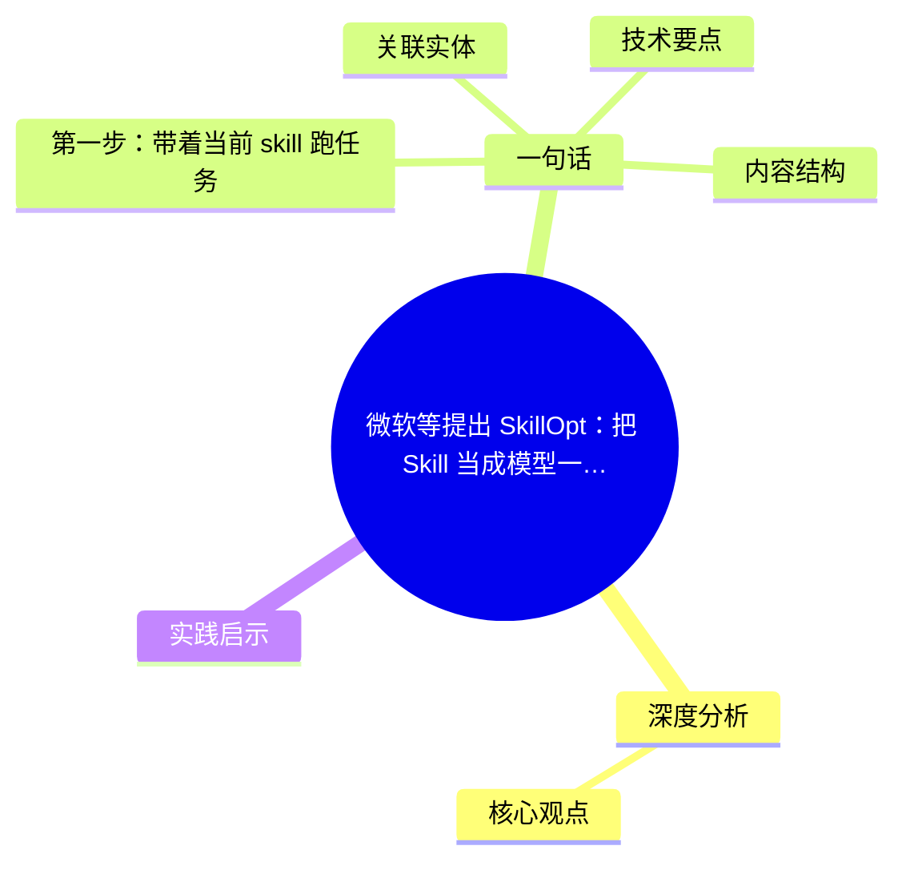
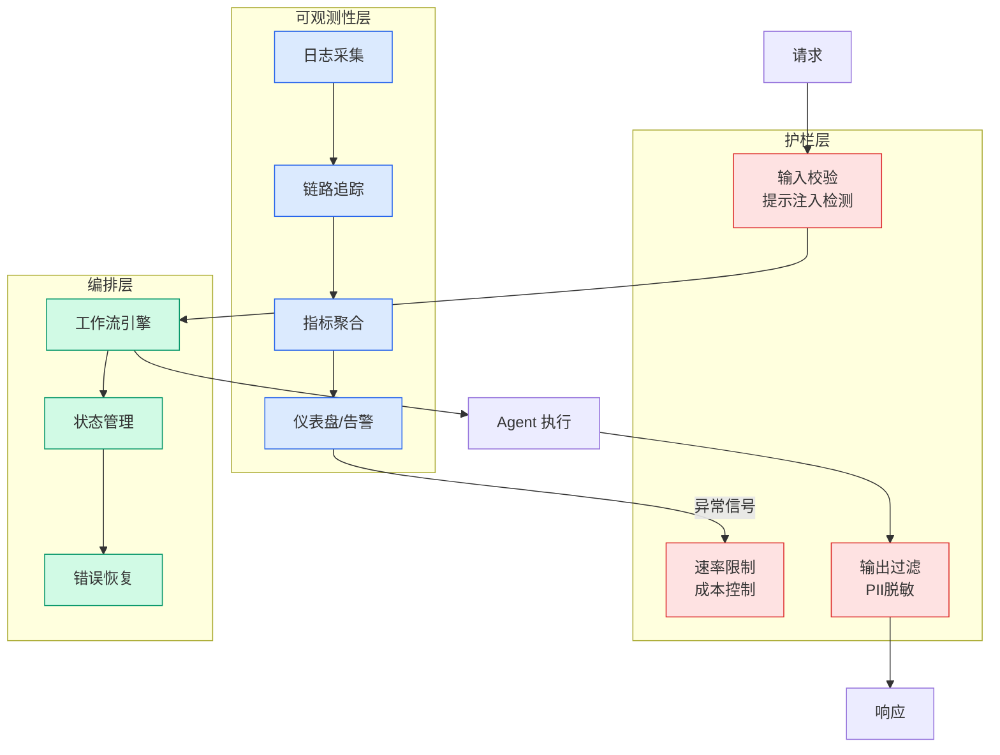

# 微软等提出 SkillOpt：把 Skill 当成模型一样训练

## Ch01.1186 微软等提出 SkillOpt：把 Skill 当成模型一样训练

> 📊 Level ⭐⭐ | 3.2KB | `entities/skillopt-microsoft-train-skill-hyman's-blog.md`

# 微软等提出 SkillOpt：把 Skill 当成模型一样训练

→ [原文存档](https://github.com/QianJinGuo/wiki-book/tree/main/docs/raw/articles/skillopt-microsoft-train-skill-hyman's-blog.md)

## 概念导图

## 深度分析

微软等提出 SkillOpt：把 Skill 当成模型一样训练 涉及agent领域的核心技术议题。
### 核心观点
1. # 微软等提出 SkillOpt：把 Skill 当成模型一样训练
## 一句话

把 Agent 的「技能文档」当作可训练状态，用轨迹反馈、受控文本编辑和验证集门控来优化技能，在不改模型权重、不增加部署期调用的前提下，让多个模型和执行环境稳定涨分。
2. ## 核心问题
Agent 场景里，同一类流程性失败反复出现：同一个表头识别错误今天犯一次，明天换个文件还会再犯；同一个公式写入问题换个 workbook 还会重复出现。
3. ## 三角色
- **目标模型**：被冻结，负责按当前 skill 执行任务
- **执行框架**：可以是单轮 direct chat，也可以是 Codex、Claude Code 这类带文件和工具的 agentic loop
- **优化器模型**：离线读取轨迹，提出 skill 编辑建议
关键设计：**隔离**——优化器模型只在训练 skill 时出现；部署时并不额外调用优化器。
4. ## 训练循环五步
### 第一步：带着当前 skill 跑任务
目标模型在训练集上执行一批任务。
5. 记录：任务元信息、消息、工具调用、观测结果、命令输出、验证器反馈，以及特定任务上下文。

### 内容结构
- 微软等提出 SkillOpt：把 Skill 当成模型一样训练
- 一句话
- 核心问题
- 核心思路
- 三角色
- 训练循环五步
- 第一步：带着当前 skill 跑任务
- 第二步：把失败和成功分开反思

### 技术要点

- **agent架构**: 本文在agent方向提出的设计理念与实现路径
- **工程挑战**: 实际落地中面临的关键问题与应对策略
- **code趋势**: 相关技术演进方向与新兴范式
### 关联实体

- [Karpathy 最新访谈从 Vibe Coding 到 Agentic Engineering](../ch04/237-agentic.html)
- [Karpathy Vibe Coding Agentic Engineering](../ch04/126-karpathy-vibe-coding-agentic-engineering.html)
- [Ethan He Cosmos Grok Imagine Latent Space Video Agent 20260606](../ch03/035-agent.html)
- [你不知道的 Agent原理架构与工程实践 V2](../ch03/035-agent.html)
- [Openclaw 完全指南这可能是全网最新最全的系统化教程了32W字建议收藏](../ch11/235-openclaw.html)
- [Agentops Operationalize Agentic Ai At Scale With Amazon Bedr](../ch04/299-agentops-operationalize-agentic-ai-at-scale-with-amazon-bed.html)

## 实践启示
1. **工程落地**: agent领域方案需关注可观测性、可维护性和成本效率
2. **技术选型**: 根据场景选择合适的技术栈，避免过度设计或盲目追新
3. **持续迭代**: 建立数据驱动的反馈闭环，持续优化系统表现
4. **风险管控**: 引入新技术需评估对现有系统稳定性的影响，做好降级预案

---

