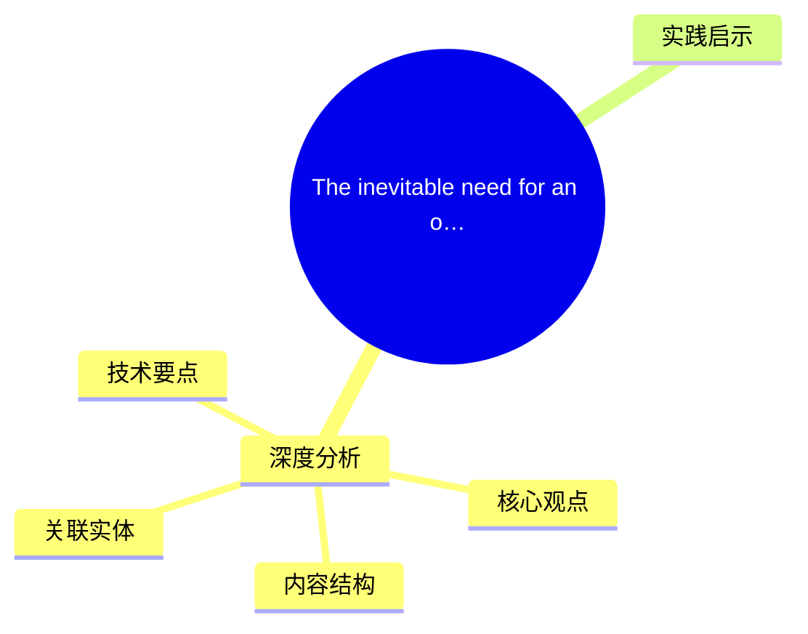
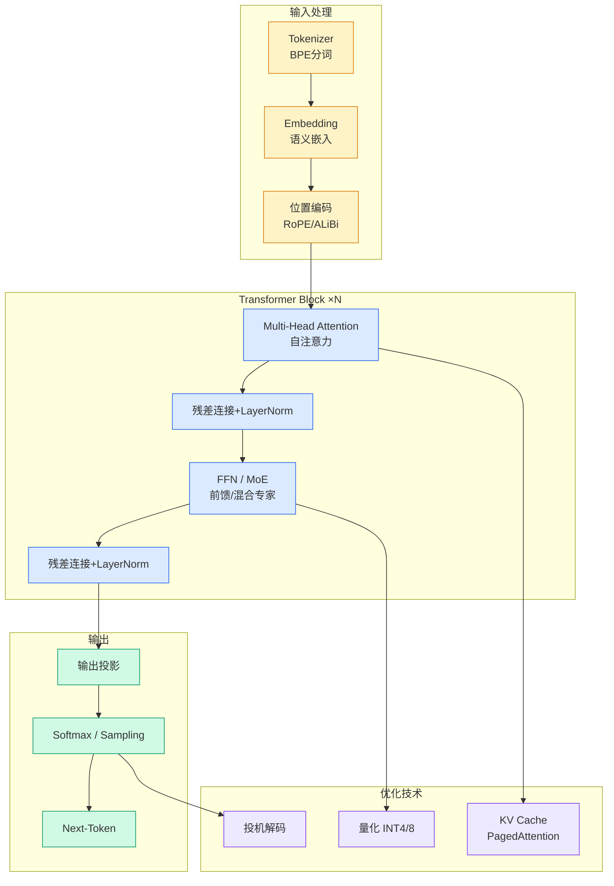

# The inevitable need for an open model consortium

## Ch01.1188 The inevitable need for an open model consortium

> 📊 Level ⭐⭐ | 3.2KB | `entities/the-inevitable-need-for-an-open-model-consortium.md`

# The inevitable need for an open model consortium

→ [原文存档](https://github.com/QianJinGuo/wiki-book/tree/main/docs/raw/articles/the-inevitable-need-for-an-open-model-consortium.md)

## 概念导图

## 深度分析

The inevitable need for an open model consortium 涉及agent领域的核心技术议题。
### 核心观点
1. It’s not clear when this’ll emerge, and Nemotron (Coalition) is Nvidia’s attempt to bankroll and bootstrap this approach within a single wealthy company, but a consortium is the only long-term stable path to well-funded, near-frontier open models.
2. In recent months, we’ve seen a lot of turnover in open model labs, with high-profile departures at Qwen and Ai2 (my comment).
3. This shouldn’t be super surprising to followers of the ecosystem — it’s happened before with Meta shifting its focus away from Llama, and it’ll only happen more as the cost of trying to keep pace at the frontier of AI only increases.
4. The other leading labs with models available today include Chinese startups such as Moonshot AI, MiniMax, and Z.
5. ai — all of which look precarious on their ability to fund continued growth in the cost of training or R&D.

### 内容结构
- The inevitable need for an open model consortium

### 技术要点

- **agent架构**: 本文在agent方向提出的设计理念与实现路径
- **工程挑战**: 实际落地中面临的关键问题与应对策略
- **data趋势**: 相关技术演进方向与新兴范式
### 关联实体

- [Scale Robot Reinforcement Learning With Nvidia Isaac Lab On ](ch01/1170-scale-robot-reinforcement-learning-with-nvidia-isaac-lab-on.html)
- [Nvidia Isaac Lab Sagemaker Robot Rl Humanoid](https://github.com/QianJinGuo/wiki/blob/main/entities/nvidia-isaac-lab-sagemaker-robot-rl-humanoid.md)
- [3Citzkdleedm0Olz9Wudrg](ch01/742-9.html)
- [Karpathy 最新访谈从 Vibe Coding 到 Agentic Engineering](../ch04/237-agentic.html)
- [Openclaw 完全指南这可能是全网最新最全的系统化教程了32W字建议收藏](../ch11/235-openclaw.html)
- [Ethan He Cosmos Grok Imagine Latent Space Video Agent 20260606](../ch03/035-agent.html)

## 实践启示

1. **工程落地**: agent领域方案需关注可观测性、可维护性和成本效率
2. **技术选型**: 根据场景选择合适的技术栈，避免过度设计或盲目追新
3. **持续迭代**: 建立数据驱动的反馈闭环，持续优化系统表现
4. **风险管控**: 引入新技术需评估对现有系统稳定性的影响，做好降级预案

---

