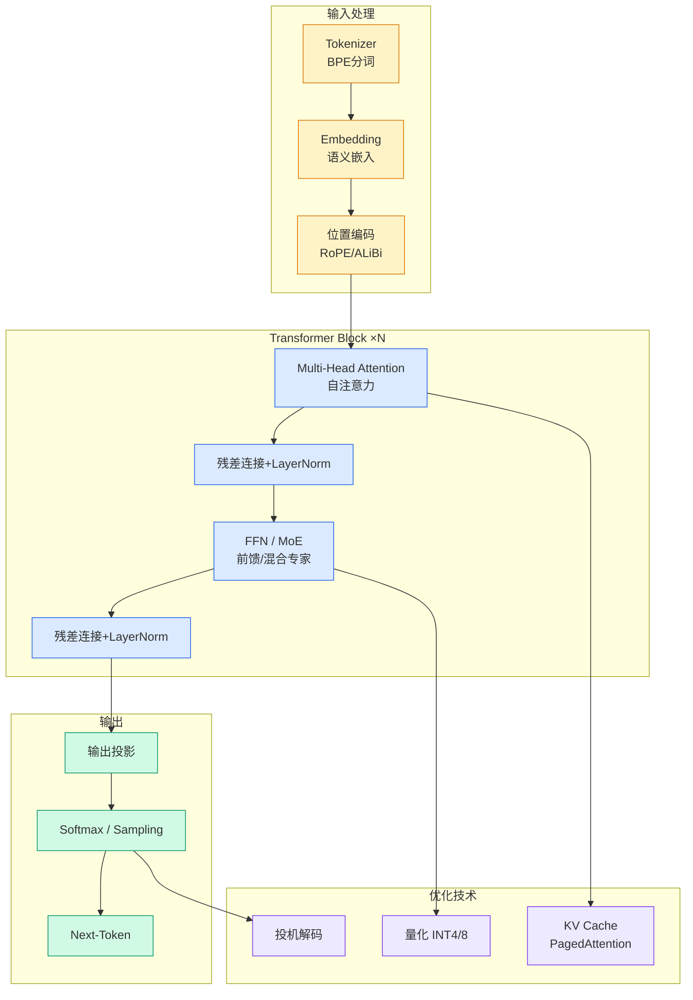

# lightseek tokenspeed

## Ch01.1189 lightseek tokenspeed

> 📊 Level ⭐⭐ | 3.2KB | `entities/lightseek-tokenspeed.md`

## 深度分析
TokenSpeed 的核心竞争力来自三个正交的技术决策，针对 agentic inference workload 做了系统性优化，而非对 TensorRT-LLM 的局部改进。
**架构层面：控制平面与执行平面解耦**。TokenSpeed Scheduler 用 C++ finite-state machine 做控制平面，将 KV cache 生命周期、请求状态转移、overlap timing 的正确性在编译时强制约束，而非依赖 Python runtime 约定。这意味着在生产环境中，即使模型出现异常推理行为，控制平面的 FSM 也不会进入未定义状态。相比之下，TensorRT-LLM 的调度逻辑更多依赖 CUDA graph 和 runtime convention，在复杂并发场景下可观测性和可预测性较弱。
**Kernel 层面：SMG + MLA 双路径优化**。TokenSpeed MLA 已进入 vLLM 主干，对 decode 场景做了针对性优化——将 q_seqlen 和 num_heads 在 BMM1 tile 级别折叠以提升 Tensor Core 利用率。这是非常底层的 CUDA kernel 优化，直接影响首 token 延迟。配合 SMG（PyTorch 新增的低开销 CPU 侧请求入口），TokenSpeed 在 PD disaggregation 场景下有更大优化空间。
**Benchmark 的局限性**：官方数据基于 SWE-smith traces（Kimi K2.5），这是 coding agent 场景，不代表通用推理或长文本生成场景。TokenSpeed 在其他模型架构（如 DeepSeek V4、Qwen 3.6）上的 Pareto frontier 是否同样优于 TensorRT-LLM，需要独立验证。另外官方明确说明生产 hardening 还在进行中——这是 2026 年 5 月的预览版，工程化程度待观察。

## 实践启示

- **选型评估**：对于日均 GPU 消耗量大、coding agent 场景占比高的基础设施团队，TokenSpeed 是值得关注的选项。但建议等待生产 hardening 完成（官方预期 1 个月后）再做大规模部署。
- **benchmark 验证**：在采用 TokenSpeed 前，需要在自己的真实 traffic 分布上做 benchmark，特别是非 coding 场景的尾延迟（p99）。官方数据是 Kimi K2.5 单模型，你的 workload 可能差异很大。
- **MLA 关注**：TokenSpeed MLA 已进入 vLLM，意味着 Blackwell 架构的 MLA 优化不再只有 TensorRT-LLM 一条路。如果你在使用支持 MLA 的模型（Kimi 系列为主），TokenSpeed 或其 MLA kernel 是可迁移的优化路径。
- **生态整合**：vLLM 集成意味着 TokenSpeed 不需要你重写 inference serving layer——如果已在用 vLLM，关注其上游 PR 进展可能是更低的迁移成本。

## 相关资源
- [Agent Memory 架构](../ch04/430-perplexity-brain-self-improving-agent-memory-architecture.html)

→ [原文存档](https://github.com/QianJinGuo/wiki-book/tree/main/docs/raw/articles/lightseek-tokenspeed.md)

- [Claude Managed Agents 开发者指南](../ch04/710-claude-managed-agents.html)

## 相关实体

- [MOC](https://github.com/QianJinGuo/wiki/blob/main/moc/nvidia-gpu-acceleration.md)

---

