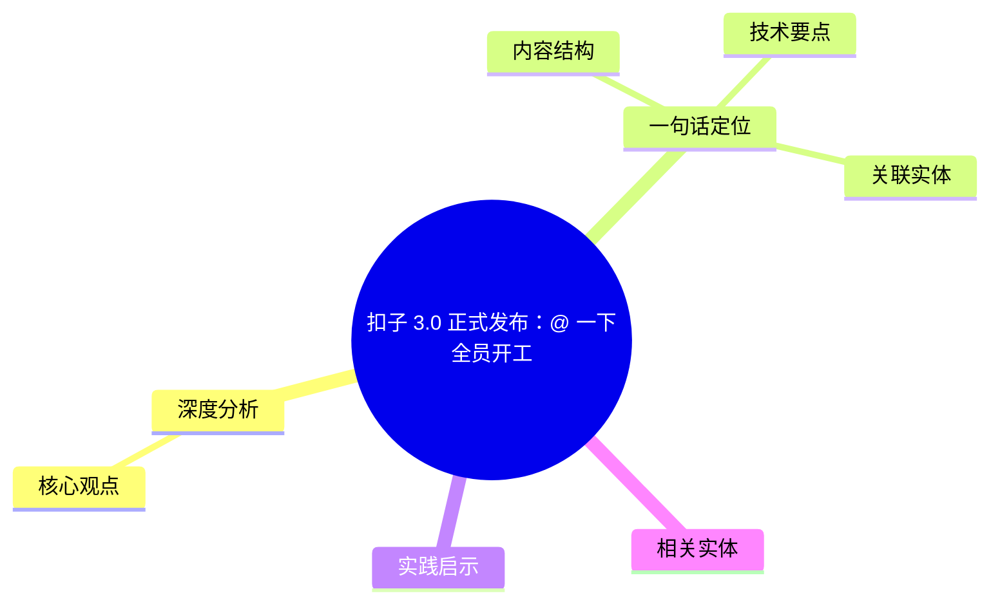
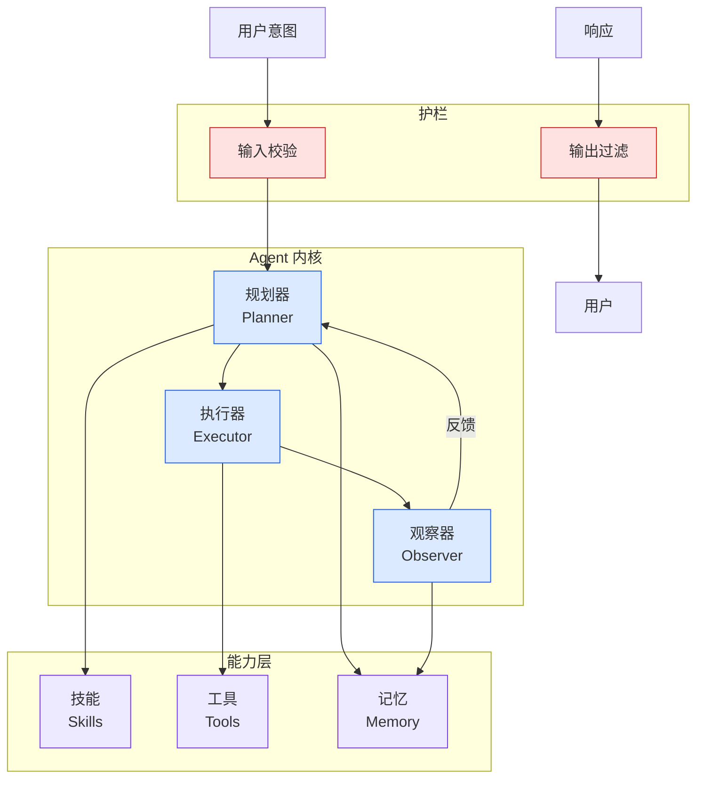

# 扣子 3.0 正式发布：@ 一下全员开工

## Ch01.1194 扣子 3.0 正式发布：@ 一下全员开工

> 📊 Level ⭐⭐ | 3.1KB | `entities/coze-3-release-official-quantum-bit.md`

# 扣子 3.0 正式发布：@ 一下全员开工

→ [原文存档](https://github.com/QianJinGuo/wiki-book/tree/main/docs/raw/articles/coze-3-release-official-quantum-bit.md)

## 概念导图

## 深度分析

扣子 3.0 正式发布：@ 一下全员开工 涉及agent领域的核心技术议题。
### 核心观点
1. 0 正式发布：@ 一下全员开工
> 整理自量子位（编辑：金磊）报道
> 原文：https://mp.
2. com/s/lN9DgdfrN-If5BWPT495sg
## 一句话定位

**扣子 3.
3. 0 = 把 AI 对话升级为"项目化 + Agent 协作 + 工具链打通"的协作系统**。
4. 用户在一个项目里 @ 多个 Agent，每个 Agent 负责一个角色（选题/资料/产品/前端/视频/本地 Claude Code.
5. > 核心转变：**从"随问随答的聪明人"到"能开工的小团队"**。

### 内容结构
- 扣子 3.0 正式发布：@ 一下全员开工
- 一句话定位
- 三大核心升级
- 4 组实测
- 实测 1：4 Agent 协作 = AI 热点追踪仪表盘
- 实测 2：本地 Agent 接入 = 工程化项目
- 实测 3：AI 编辑部桌宠
- 实测 4：选题 → 文章 → 视频 一气呵成

### 技术要点

- **agent架构**: 本文在agent方向提出的设计理念与实现路径
- **工程挑战**: 实际落地中面临的关键问题与应对策略
- **code趋势**: 相关技术演进方向与新兴范式
### 关联实体

- [你不知道的 Agent原理架构与工程实践 V2](../ch03/035-agent.html)
- [龙虾装上了可以用来干啥分享下我的 Openclaw 多智能体团队搭建经验 V2](../ch11/235-openclaw.html)
- [Openclaw 完全指南这可能是全网最新最全的系统化教程了32W字建议收藏 V2](../ch11/235-openclaw.html)
- [Karpathy 最新访谈从 Vibe Coding 到 Agentic Engineering](../ch04/237-agentic.html)
- [Openclaw 完全指南这可能是全网最新最全的系统化教程了32W字建议收藏](../ch11/235-openclaw.html)
- [Ethan He Cosmos Grok Imagine Latent Space Video Agent 20260606](../ch03/035-agent.html)

## 实践启示
1. **工程落地**: agent领域方案需关注可观测性、可维护性和成本效率
2. **技术选型**: 根据场景选择合适的技术栈，避免过度设计或盲目追新
3. **持续迭代**: 建立数据驱动的反馈闭环，持续优化系统表现
4. **风险管控**: 引入新技术需评估对现有系统稳定性的影响，做好降级预案

## 相关实体

- [MOC](https://github.com/QianJinGuo/wiki/blob/main/moc/prompt-engineering-guide.md)

---

