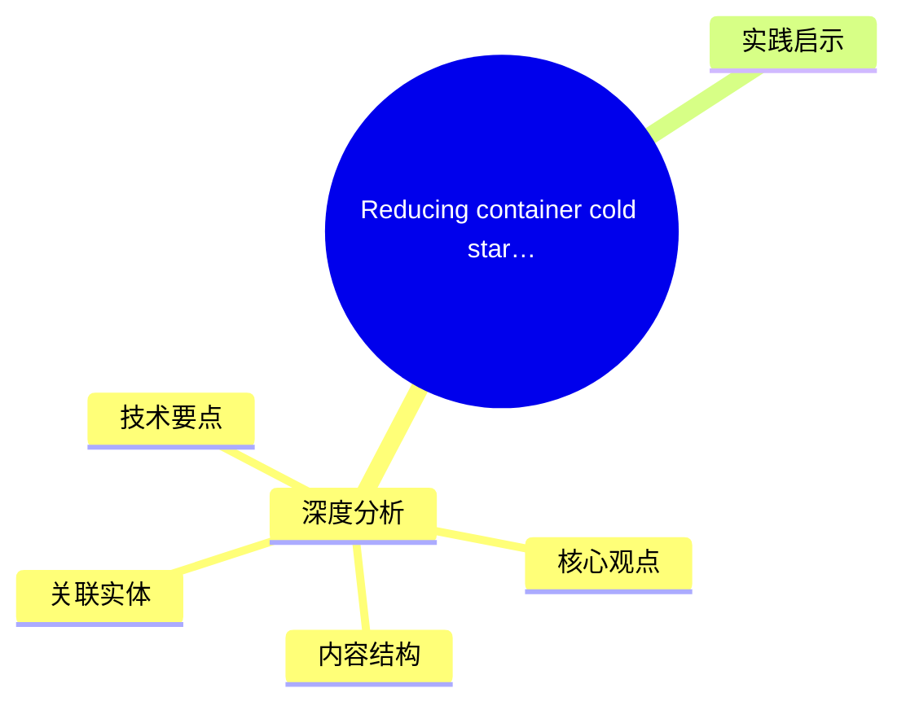
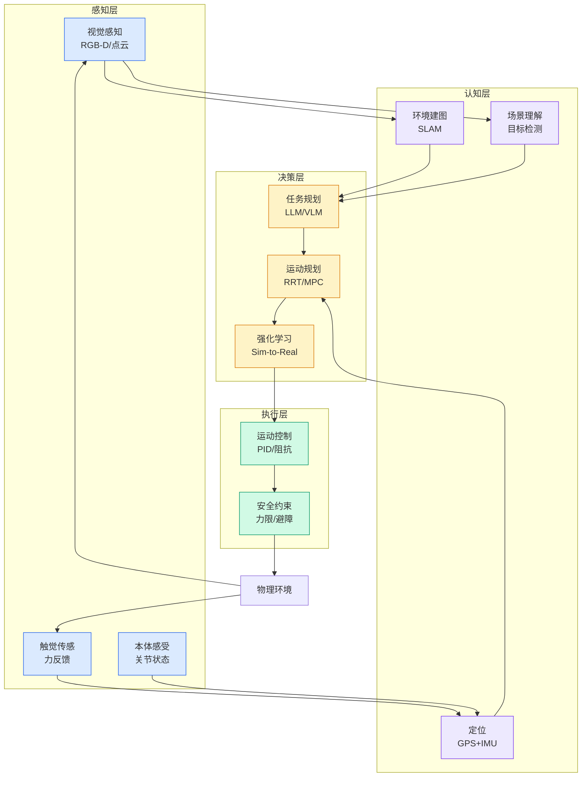

# Reducing container cold start times using SOCI index on DLAMI and DLC

## Ch01.1198 Reducing container cold start times using SOCI index on DLAMI and DLC

> 📊 Level ⭐⭐ | 3.1KB | `entities/reducing-container-cold-start-times-using-soci-index-on-dlam.md`

# Reducing container cold start times using SOCI index on DLAMI and DLC

→ [原文存档](https://github.com/QianJinGuo/wiki-book/tree/main/docs/raw/articles/reducing-container-cold-start-times-using-soci-index-on-dlam.md)

## 概念导图

## 深度分析

Reducing container cold start times using SOCI index on DLAMI and DLC 涉及architecture领域的核心技术议题。
### 核心观点
1. # Reducing container cold start times using SOCI index on DLAMI and DLC
Deep Learning AMI and AWS Deep Learning Containers are now enabled with support for SOCI snapshotter and index.
2. Seekable OCI (SOCI) is a technology that enables efficient container image management through selective file downloading.
3. It uses a layer-based indexing system to map file locations within container images, allowing containers to start with only the necessary files loaded (lazy loading).
4. This approach reduces network bandwidth usage and improves container startup times, making it particularly valuable for organizations managing large container images in cloud environments.
5. In this post, we look at how to use SOCI on publicly available Deep Learning AMIs and Containers, when to use the various SOCI modes provided by the tool, and how to quickly and efficiently use this tool in your workloads today.

### 内容结构
- Reducing container cold start times using SOCI index on DLAMI and DLC
- Background
- Container pulling mechanisms
- Solution architecture
- Container startup time comparison with SOCI snapshotter
- Lazy loading mode
- output
- output

### 技术要点

- **architecture架构**: 本文在architecture方向提出的设计理念与实现路径
- **工程挑战**: 实际落地中面临的关键问题与应对策略
- **aws趋势**: 相关技术演进方向与新兴范式
### 关联实体

- [Scale Robot Reinforcement Learning With Nvidia Isaac Lab On ](ch01/1170-scale-robot-reinforcement-learning-with-nvidia-isaac-lab-on.html)
- [Nvidia Isaac Lab Sagemaker Robot Rl Humanoid](https://github.com/QianJinGuo/wiki/blob/main/entities/nvidia-isaac-lab-sagemaker-robot-rl-humanoid.md)
- [Ethan He Cosmos Grok Imagine Latent Space Video Agent 20260606](../ch03/035-agent.html)
- [存之有序治之有矩Agent 记忆系统的工程实践与演进](../ch03/035-agent.html)
- [Karpathy 最新访谈从 Vibe Coding 到 Agentic Engineering](../ch04/237-agentic.html)
- [Openclaw 完全指南这可能是全网最新最全的系统化教程了32W字建议收藏](../ch11/235-openclaw.html)

## 实践启示

1. **工程落地**: architecture领域方案需关注可观测性、可维护性和成本效率
2. **技术选型**: 根据场景选择合适的技术栈，避免过度设计或盲目追新
3. **持续迭代**: 建立数据驱动的反馈闭环，持续优化系统表现
4. **风险管控**: 引入新技术需评估对现有系统稳定性的影响，做好降级预案

---

