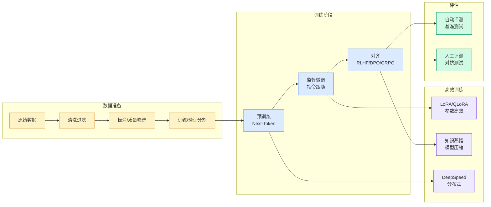

# AI生图免训练提速1000%，办法：最简洁的“三阶段流水线”

## Ch01.1199 AI生图免训练提速1000%，办法：最简洁的“三阶段流水线”

> 📊 Level ⭐⭐ | 3.1KB | `entities/ai生图免训练提速1000办法最简洁的三阶段流水线.md`

# AI生图免训练提速1000%，办法：最简洁的“三阶段流水线”

# AI生图免训练提速1000%，办法：最简洁的“三阶段流水线”
---
source: wechat
source_url: https://mp.weixin.qq.com/s/auqVphW7fdjGWabJc73zxA
ingested: 2026-07-08
source_published: 2026年7月8日 11:33
---
# AI生图免训练提速1000%，办法：最简洁的“三阶段流水线”
##### MrFlow团队 投稿   
量子位 | 公众号 QbitAI
AI画图能力越来越强，但用户体感还是一个字：**慢。**
一张1024分辨率的图像，从prompt到出图，扩散模型往往得在高分辨率空间里一遍遍采样。质量是上来了，等待时间也跟着上来了。能力越强，推理账单越厚。
过往扩散模型的主流加速方法中，量化、高效Attention等方法强依赖于硬件协同；步数蒸馏依赖高成本微调，且训练时常不稳定；特征缓存类方法需要动态识别并缓存中间特征，且加速比难以超过5倍。
**有没有可能不依赖特定硬件、不蒸馏微调模型、不需要运行时做动态识别，也能把图像生成速度直接抬上去？**
来自北航、NTU、ETH的研究团队最近做了一个非常简洁的尝试：
> **先低清打草稿，再放大，最后高清补一笔。**
**MrFlow** （Multi-Resolution Flow Matching）就用这样的三阶段，在Qwen-Image等模型上把端到端生成时间从49.32s压到4.77s，实际加速10.35x。
文章发布当日即登上Hugging Face Daily Papers；发布三天内，GitHub已收获200+stars；目前也已登上Hugging Face Trending Papers。
与此同时，社区创作者们已经开始围绕MrFlow做尝试、讨论和扩展：
回到MrFlow本身，它为

→ [原文存档](https://github.com/QianJinGuo/wiki-book/tree/main/docs/raw/articles/ai生图免训练提速1000办法最简洁的三阶段流水线.md)

## 概念导图

## 第 2 Source — 量子位

> From WeChat MP 量子位, supplemental coverage of the same topic.

-> [原文存档](https://github.com/QianJinGuo/wiki-book/tree/main/docs/raw/articles/ai生图免训练提速1000办法最简洁的三阶段流水线-2026-07-08.md)

---
## 关联

- 相关概念: [Harness Engineering](https://github.com/QianJinGuo/wiki/blob/main/concepts/harness-engineering-framework.md)
- 相关: [Agent 架构](https://github.com/QianJinGuo/wiki/blob/main/concepts/agent-architecture.md)

---

