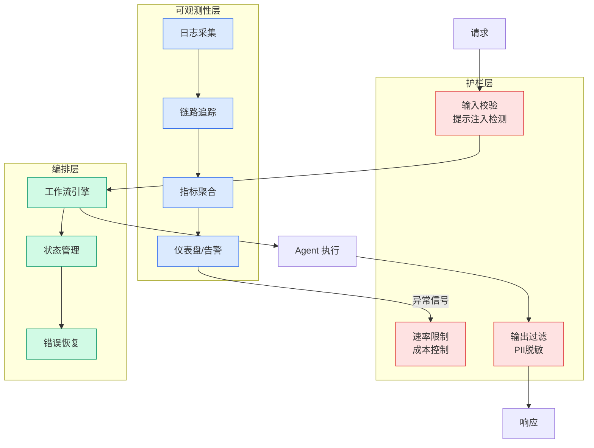

# NVIDIA Nemotron 3 Ultra now available on Amazon SageMaker JumpStart

## Ch01.1200 NVIDIA Nemotron 3 Ultra now available on Amazon SageMaker JumpStart

> 📊 Level ⭐⭐ | 3.1KB | `entities/nvidia-nemotron-3-ultra-now-available-on-amazon-sagemaker-ju.md`

# NVIDIA Nemotron 3 Ultra now available on Amazon SageMaker JumpStart

→ [原文存档](https://github.com/QianJinGuo/wiki-book/tree/main/docs/raw/articles/nvidia-nemotron-3-ultra-now-available-on-amazon-sagemaker-ju.md)

## 深度分析

NVIDIA Nemotron 3 Ultra now available on Amazon SageMaker JumpStart 涉及agent领域的核心技术议题。
### 核心观点
1. # NVIDIA Nemotron 3 Ultra now available on Amazon SageMaker JumpStart
Today, we are excited to announce the day-zero availability of **NVIDIA Nemotron 3 Ultra** on Amazon SageMaker JumpStart.
2. With this launch, you can now deploy the Nemotron 3 Ultra model using a one-click deployment experience.
3. Nemotron 3 Ultra is an open model built for frontier reasoning and orchestration in long-running autonomous agents, delivering 5x faster inference and up to 30% lower cost for agentic workloads.
4. Nemotron 3 Ultra is optimized for the NVFP4 format, which makes the model much faster and cost effective to host.
5. ## Overview of NVIDIA Nemotron 3 Ultra
NVIDIA Nemotron 3 Ultra is an open large language model with 550 billion total parameters and 55 billion active parameters.

### 内容结构
- NVIDIA Nemotron 3 Ultra now available on Amazon SageMaker JumpStart
- Overview of NVIDIA Nemotron 3 Ultra
- ## Why agentic AI needs purpose-built models
- Enterprise use cases
- Getting started with SageMaker JumpStart
- Prerequisites
- Deploy using SageMaker Studio
- Deploy using the SageMaker Python SDK

### 技术要点

- **agent架构**: 本文在agent方向提出的设计理念与实现路径
- **工程挑战**: 实际落地中面临的关键问题与应对策略
- **architecture趋势**: 相关技术演进方向与新兴范式
### 关联实体

- [Scale Robot Reinforcement Learning With Nvidia Isaac Lab On ](ch01/1170-scale-robot-reinforcement-learning-with-nvidia-isaac-lab-on.html)
- [Nvidia Isaac Lab Sagemaker Robot Rl Humanoid](https://github.com/QianJinGuo/wiki/blob/main/entities/nvidia-isaac-lab-sagemaker-robot-rl-humanoid.md)
- [Karpathy 最新访谈从 Vibe Coding 到 Agentic Engineering](../ch04/237-agentic.html)
- [Karpathy Vibe Coding Agentic Engineering](../ch04/126-karpathy-vibe-coding-agentic-engineering.html)
- [Agentops Operationalize Agentic Ai At Scale With Amazon Bedr](../ch04/299-agentops-operationalize-agentic-ai-at-scale-with-amazon-bed.html)
- [存之有序治之有矩Agent 记忆系统的工程实践与演进](../ch03/035-agent.html)

## 实践启示

1. **工程落地**: agent领域方案需关注可观测性、可维护性和成本效率
2. **技术选型**: 根据场景选择合适的技术栈，避免过度设计或盲目追新
3. **持续迭代**: 建立数据驱动的反馈闭环，持续优化系统表现
4. **风险管控**: 引入新技术需评估对现有系统稳定性的影响，做好降级预案

## 相关实体

- [MOC](https://github.com/QianJinGuo/wiki/blob/main/moc/nvidia-gpu-acceleration.md)

---

