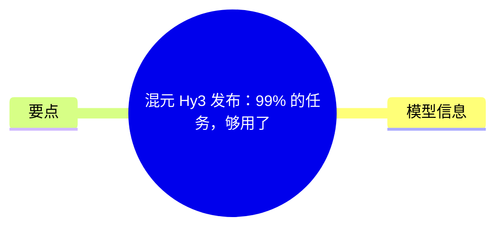
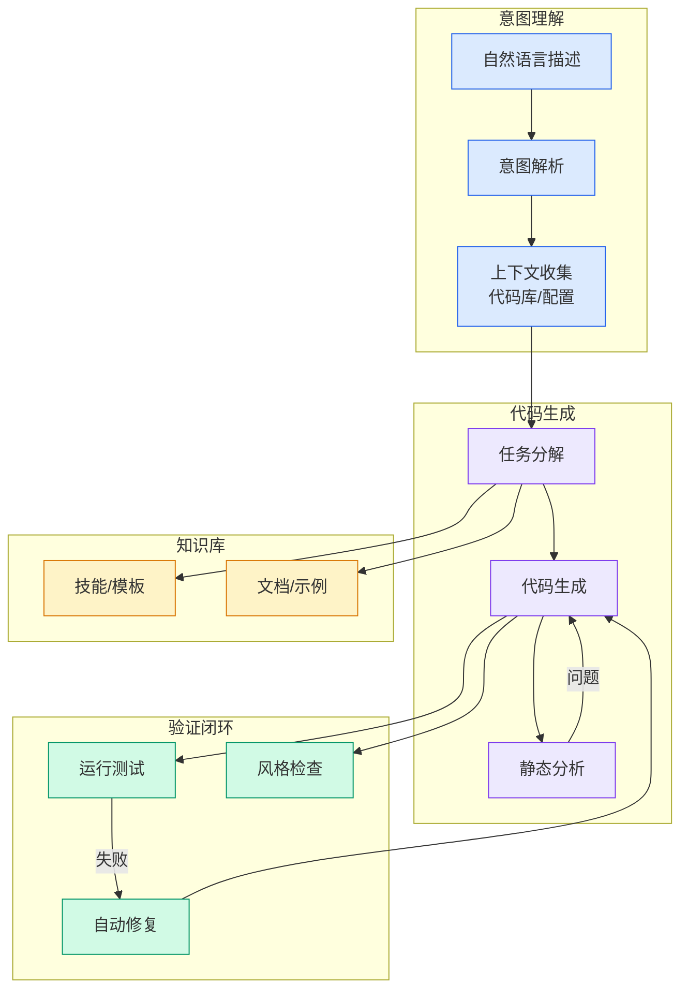

# 混元 Hy3 发布：99% 的任务，够用了

## Ch01.1203 混元 Hy3 发布：99% 的任务，够用了

> 📊 Level ⭐⭐ | 3.0KB | `entities/混元-hy3-发布99-的任务够用了.md`

# 混元 Hy3 发布：99% 的任务，够用了

继 4 月底发布 Hy3 preview 后，腾讯混元模型 Hy3 终于在今天正式上线！

还直接给了两周的免费时长，所有人可以在 WorkBuddy 中随意使用：

这消息对最近的我来说，来得还有点点及时……

因为我前阵子一直想搞个智谱 GLM 5.2 的 Coding Plan，用来跑些 claude -p 的体力活任务。但 GLM 5.2 是真的难抢，后来我好不容易搞到了个号，结果……高峰期还是会经常爆 429，我还得再给它找个 backup 兜底（为保障稳定性，我是真的有个 fallback chain）

正好混元的新模型上来就是两周免费，看完我各家的巨额 token 账单后，我真是觉得是时候把薅羊毛这事认真搞搞了。。

01

## 概念导图

## 模型信息

在薅 Hy3 这把羊毛前，我们先来看下模型的情况：

Hy3 是一个快慢思考融合的 MoE 模型，总参数 295B、激活 21B，上下文 256K，官方声称主打 Coding 和 Agent 场景。

官方基准上，Hy3 的 Coding 和 DeepSeek V4 Pro、Seed2.1 Pro 打得有来有回，而 Agent 类

## 要点

- 任务（浏览、MCP、Skills）在国产模型中实现领先，好几项都只差 Claude Opus 4.8 一个身位，甚至个别项还反超了。
- 价格方面，输入输出每百万 tokens 的价格分别为 1 元和 4 元，命中缓存的输入为部分则是 0.25 元。这个性能和价格，如果我没算错，应该属于最强性价比了：
- 当然，官方的案例和官方的声称毕竟是官方的，真实水平如何还得我自己测了才行。于是我用 Hy3 跑了些测试，甚至还让 Claude Code 当裁判，拉它和 GLM 模型进行了一场 PK（胆大如我依然敢用 cc）。
- 我最近在用 Codex 和 cc 时，已经有超过一半是在 GUI 而非 TUI 的终端了。之前总觉得 TUI 是真好用，但用着用着，就会自己给 TUI 做各种小的 UI 改进和美化，把 TUI 做成了 GUI 去了……
- 文件查看、页面加载、元素选取、和 AI 进行交互式反馈，等等，这类需要人来用的工具，还是得 GUI，效率才会更高。
- 我现在一般都推荐使用 Codex（Claude Code 还是先缓缓吧，太 \ 了），但这个对许多没基础的人来说，确实成本还是有些高……后来我才发现，是对面 Windows 电脑的微软应用商店里压根没有 Codex……

→ [原文存档](https://github.com/QianJinGuo/wiki-book/tree/main/docs/raw/articles/混元-hy3-发布99-的任务够用了.md)

---
## 关联
- 相关概念: [Harness Engineering](https://github.com/QianJinGuo/wiki/blob/main/concepts/harness-engineering-framework.md)
- 相关: [Agent 架构](https://github.com/QianJinGuo/wiki/blob/main/concepts/agent-architecture.md)

---

