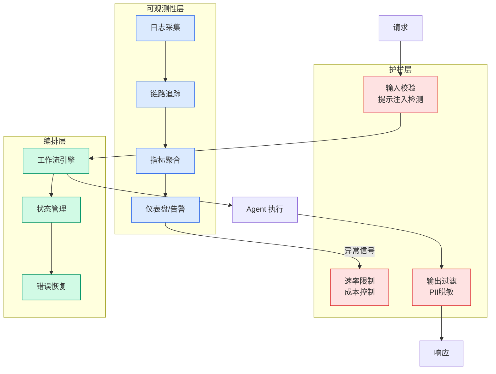

# 从日志学习到风洞验证：构建 GPU 集群的 AI Native 稳定性闭环

## Ch01.1204 从日志学习到风洞验证：构建 GPU 集群的 AI Native 稳定性闭环

> 📊 Level ⭐⭐ | 3.0KB | `entities/从日志学习到风洞验证构建-gpu-集群的-ai-native-稳定性闭环.md`

# 从日志学习到风洞验证：构建 GPU 集群的 AI Native 稳定性闭环

# 从日志学习到风洞验证：构建 GPU 集群的 AI Native 稳定性闭环
---
source: wechat
source_url: https://mp.weixin.qq.com/s/vz5AUT8eqsedUeUu7VmIWQ
ingested: 2026-07-08
source_published: 2026年7月8日 08:30
---
# 从日志学习到风洞验证：构建 GPU 集群的 AI Native 稳定性闭环
阿里妹导读
  
当万卡集群每日遭遇数十次 GPU 故障，当超节点适配困于"无环境可验、无数据可训、无路径可推"，我们不再等待故障发生——而是用数字的方式主动创造一个可控、可测、可进化的"算力风洞"。（文章内容基于作者个人技术实践与独立思考，旨在分享经验，仅代表个人观点。）
引言
随着智算集群规模从千卡迈向万卡乃至十万卡，GPU 芯片的引入节奏不断加快，而每一款新芯片从入场到稳定投产，都需经历漫长的兼容性验证与故障治理打磨。传统模式下，这一过程高度依赖人工经验，周期以月计，且难以覆盖大规模集群中的复合故障场景。
为此，我们构建了"算力风洞"——一套面向新引入 GPU 芯片稳定性验证的 AI Native 治理体系。其核心目标是：用 AI 重构稳定性验证的全流程，通过厂商环境自动复刻、海量虚拟 GPU 算力生成、生产日志自学习、故障自动注入与排查沉淀等手段，将新芯片的稳定性适配效率提升 10 倍以上，将版本适配节奏从月级收敛到天级，推动智算集群稳定性建设从"人等问题"走向"AI 主动闭环"。
本文介绍这套基于 AI Native 理念的 GPU 稳定性治理闭环，我们将 AI Native 的能力拆解为三个递进的层次：
  1. 认知层——从生产日志中萃取故障知识：Agent 同时从两个来源获取知识——一方面，从厂商文档、驱动代码、芯片规格中学习

→ [原文存档](https://github.com/QianJinGuo/wiki-book/tree/main/docs/raw/articles/从日志学习到风洞验证构建-gpu-集群的-ai-native-稳定性闭环.md)

## 第 2 Source — 阿里云开发者

> From WeChat MP 阿里云开发者, supplemental coverage of the same topic.

-> [原文存档](https://github.com/QianJinGuo/wiki-book/tree/main/docs/raw/articles/从日志学习到风洞验证构建-gpu-集群的-ai-native-稳定性闭环-2026-07-08.md)

---
## 关联

- 相关概念: [Harness Engineering](https://github.com/QianJinGuo/wiki/blob/main/concepts/harness-engineering-framework.md)

---

