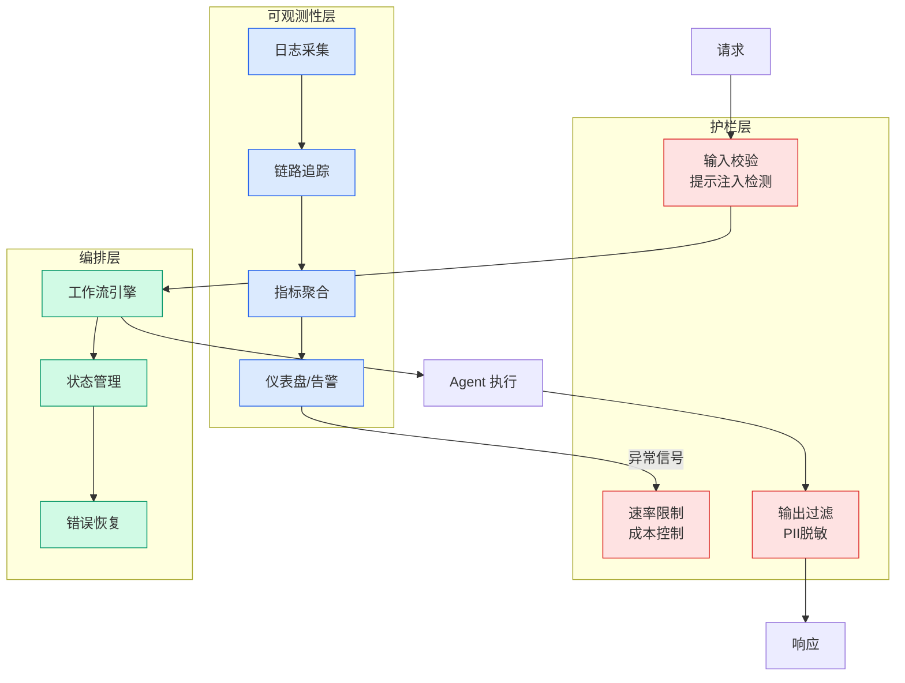

# OpenAI buys AI consultancy to sell enterprises on its models

## Ch01.1206 OpenAI buys AI consultancy to sell enterprises on its models

> 📊 Level ⭐⭐ | 3.0KB | `entities/5238213.md`

# OpenAI buys AI consultancy to sell enterprises on its models

## 相关实体

- [the inevitable need for an open model consortium](ch01/1188-the-inevitable-need-for-an-open-model-consortium.html)
- [ai-driven layoffs aren’t making business sense | cio](../ch03/011-cio.html)
→ [原文存档](https://github.com/QianJinGuo/wiki-book/tree/main/docs/raw/articles/5238213.md)

- [MOC](https://github.com/QianJinGuo/wiki/blob/main/moc/mlops-training-inference.md)
## 深度分析

OpenAI buys AI consultancy to sell enterprises on its models 涉及agent领域的核心技术议题。
### 核心观点
1. Title: OpenAI buys AI consultancy to sell enterprises on its models
URL Source: https://www.
2. com/ai-ml/2026/05/11/openai-buys-ai-consultancy-to-sell-enterprises-on-its-models/5238213/
Published Time: 2026-05-11T18:33:11.
3. *   AWS New Horizon
*   Resources
*   Intelligence
*   Webinars & Events
*   Newsletters
Search
!
4. [Image 1: Go to frontpage.
5. Logo, The Register](https://www.

### 内容结构
- OpenAI buys AI consultancy to sell enterprises on its models
- MORE CONTEXT
- MOST POPULAR
- EVENTS
- [AI](https://beta.theregister.com/tag/ai)
- [Infosec](https://beta.theregister.com/security)
- [FOSS](https://beta.theregister.com/tag/FOSS)
- About Us

### 技术要点

- **agent架构**: 本文在agent方向提出的设计理念与实现路径
- **工程挑战**: 实际落地中面临的关键问题与应对策略
- **aws趋势**: 相关技术演进方向与新兴范式
### 关联实体

- [Scale Robot Reinforcement Learning With Nvidia Isaac Lab On ](ch01/1170-scale-robot-reinforcement-learning-with-nvidia-isaac-lab-on.html)
- [Nvidia Isaac Lab Sagemaker Robot Rl Humanoid](https://github.com/QianJinGuo/wiki/blob/main/entities/nvidia-isaac-lab-sagemaker-robot-rl-humanoid.md)
- [Openclaw 完全指南这可能是全网最新最全的系统化教程了32W字建议收藏](../ch11/235-openclaw.html)
- [存之有序治之有矩Agent 记忆系统的工程实践与演进](../ch03/035-agent.html)
- [Openclaw 完全指南这可能是全网最新最全的系统化教程了32W字建议收藏 V2](../ch11/235-openclaw.html)
- [Agentops Operationalize Agentic Ai At Scale With Amazon Bedr](../ch04/299-agentops-operationalize-agentic-ai-at-scale-with-amazon-bed.html)

## 实践启示
1. **工程落地**: agent领域方案需关注可观测性、可维护性和成本效率
2. **技术选型**: 根据场景选择合适的技术栈，避免过度设计或盲目追新
3. **持续迭代**: 建立数据驱动的反馈闭环，持续优化系统表现
4. **风险管控**: 引入新技术需评估对现有系统稳定性的影响，做好降级预案

---

