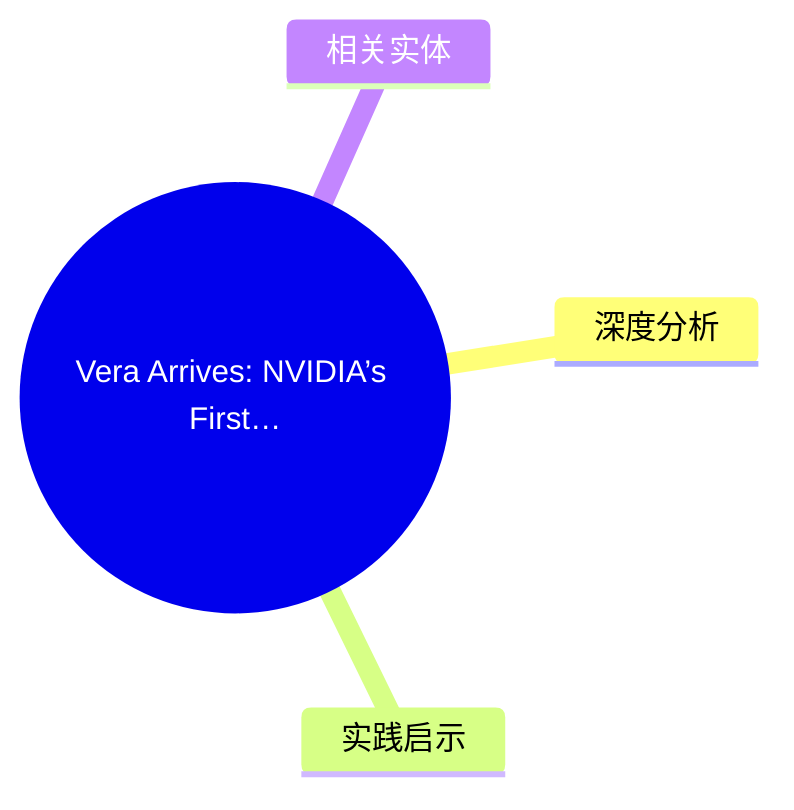
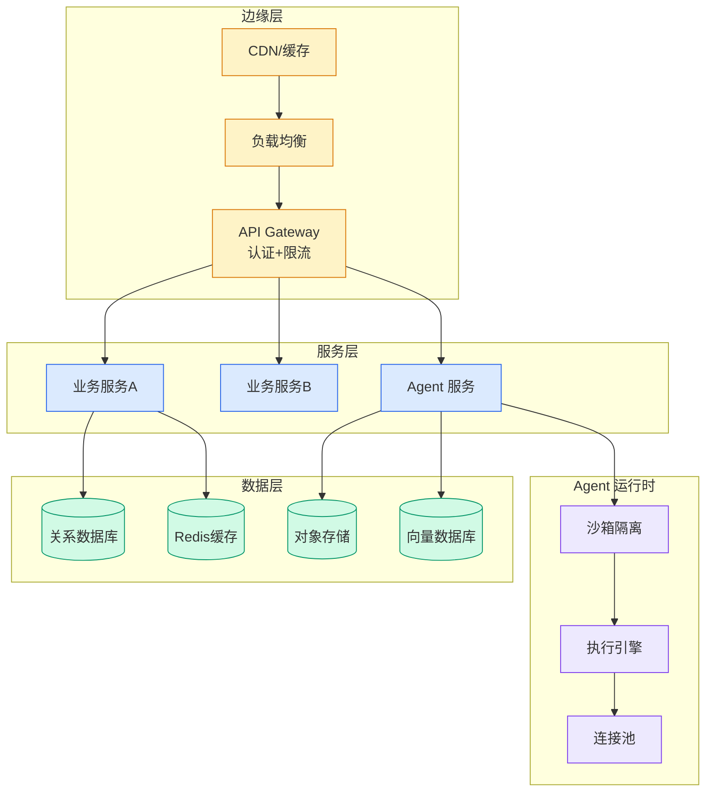

# Vera Arrives: NVIDIA’s First CPU Built for Agents Lands at Top AI Labs

## Ch01.1207 Vera Arrives: NVIDIA’s First CPU Built for Agents Lands at Top AI Labs

> 📊 Level ⭐⭐ | 3.0KB | `entities/vera-arrives-nvidia-s-first-cpu-built-for-agents-lands-at-top-ai-labs.md`

## 概念导图

## 核心要点
- Published Time: 2026-05-18T21:48:17+00:00 Ian Buck hand-delivers the first NVIDIA Vera CPU systems to Anthropic, OpenAI, Oracle Cloud Infrastructure and SpaceXAI — marking the moment agentic CPUs move

## 深度分析

NVIDIA Vera 是全球首款专为 AI Agent 场景设计的 CPU，标志着芯片行业从"通用计算"向"Agent 原生计算"的战略转向。Ian Buck 亲自 hand-deliver 首批系统给 Anthropic、OpenAI、Oracle Cloud Infrastructure 和 SpaceXAI 四家机构，这一交付仪式本身就传递了明确的行业信号——头部实验室的认可比性能跑分更重要。
从架构角度看，Vera 的设计理念与传统数据中心 CPU 存在本质差异。传统 CPU 优化的是单线程性能和指令级并行，而 Vera 针对的是**长周期、多跳推理任务**和**高并发 Agent 协作**场景。这意味着 Vera 在内存带宽、缓存一致性协议和线程调度上做了针对性设计，尤其适合需要维护超大上下文窗口（100K+ tokens）的 Agent 工作负载。
生态影响层面，Vera 的出现补全了 NVIDIA 从 GPU（训练/推理）到 CPU（Agent 编排）的完整闭环。结合 NVIDIA 的 DRIVE Thor、Grace Hopper 和 BlueField DPU，NVIDIA 正在构建一个从芯片到软件栈的垂直整合 Agent 平台，对抗 AMD MI300X 和 Intel Gaudi 的竞争。

## 实践启示
- **基础设施选型**：如果你的 Agent 系统涉及超长上下文（>128K tokens）、频繁的状态切换或多 Agent 并发通信，可以关注 Vera 的实际 benchmark 数据，特别是 Memory-Bound 场景下的 Throughput vs. 传统 x86 的对比
- **行业信号**：Vera 进入头部 Labs 意味着 Agent 推理芯片正在从"可有可无"变成"基础设施层"，建议提前研究 Agent 专用芯片对现有架构（基于 GPU 的 vLLM/Ollama）的影响，尤其是推理延迟和成本结构
- **技术跟进**：密切注意 NVIDIA 未来软件栈（CUDA、TensorRT-LLM、NIM）对 Vera 的支持节奏，硬件就绪不等于软件就绪，生态成熟度是决定 Agent 落地速度的关键变量
## 相关实体
- [Nvidia Nemotron 3 Agents Rag Voice Safety](../ch03/035-agent.html)
- [Blogs.Nvidia.Com Vera Cpu Delivery](https://github.com/QianJinGuo/wiki/blob/main/entities/blogs.nvidia.com-vera-cpu-delivery.md)
- [Anthropic Demystifying Evals For Ai Agents](../ch04/480-anthropic-demystifying-evals-for-ai-agents.html)
- [Nvidia Edge First Llms Av Robotics](ch01/225-nvidia-edge-first-llms-av-robotics.html)
- [Nvidia Nemotron 3 Ultra Sagemaker Jumpstart Moe Agentic](../ch04/237-agentic.html)

→ [原文存档](https://github.com/QianJinGuo/wiki-book/tree/main/docs/raw/articles/vera-arrives-nvidia-s-first-cpu-built-for-agents-lands-at-top-ai-labs.md)
- [从 Cpu 到 Gpu 全链路可信百度智能云新一代 Ai 机密计算实例的探索与落地](../ch05/094-ai.html)

---

