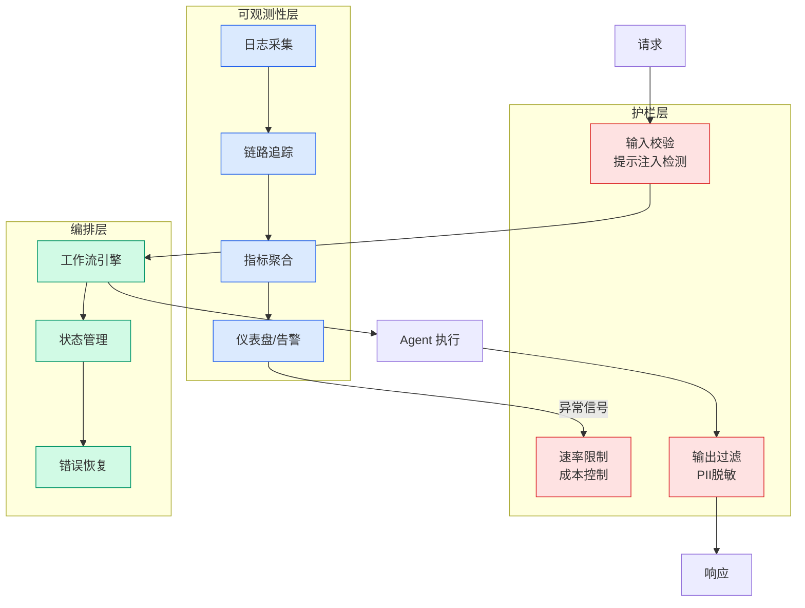

# Perplexity Numbat: Agent Security Suite

## Ch01.1209 Perplexity Numbat: Agent Security Suite

> 📊 Level ⭐⭐ | 1.8KB | `entities/perplexity-numbat-agent-security-2026-07-29.md`

# Perplexity Numbat: Agent Security Suite

Perplexity 开源 Numbat——一个 agent 安全套件，用于帮助防御者预防、检测和缓解 agent 相关的安全事件。

## 核心能力

Numbat 的设计涵盖了三层防御机制：

- **预防（Prevent）**：通过 agent harness 层面的安全检查，在 agent 执行操作前拦截潜在的有害行为
- **检测（Detect）**：监控 agent 运行时行为，识别异常模式
- **缓解（Mitigate）**：对已发生的安全事件快速响应，限制损害范围

## 设计理念

早期 agent 安全研究集中在 prompt injection 和其他形式的对抗性输入。然而，agent 自主性的进步催生了新的安全威胁——这些威胁不需要假设存在对抗性输入或人类对手。当 agent 被指示追求高层目标而没有如何实现这些目标的指导时，agent 本身可能成为对手。

Numbat 直接集成到企业客户端终端上的 agent harness 中，强制执行安全规则并支持快速检测和响应。

## 技术特点

- 开源发布，可供社区审计和改进
- 针对 agent harness 层而非模型层的安全防护
- 集成到 enterprise client endpoints 的运行时环境

## 相关实体

- 参见 [Agent 工具投毒](../ch04/313-ai-tool-poisoning-exposes-a-major-flaw-in-enterprise-agent-s.html) 了解另一类 AI Agent 安全威胁

→ [原文存档](https://github.com/QianJinGuo/wiki-book/tree/main/docs/raw/articles/perplexity-numbat-agent-security-2026-07-29.md)

---

