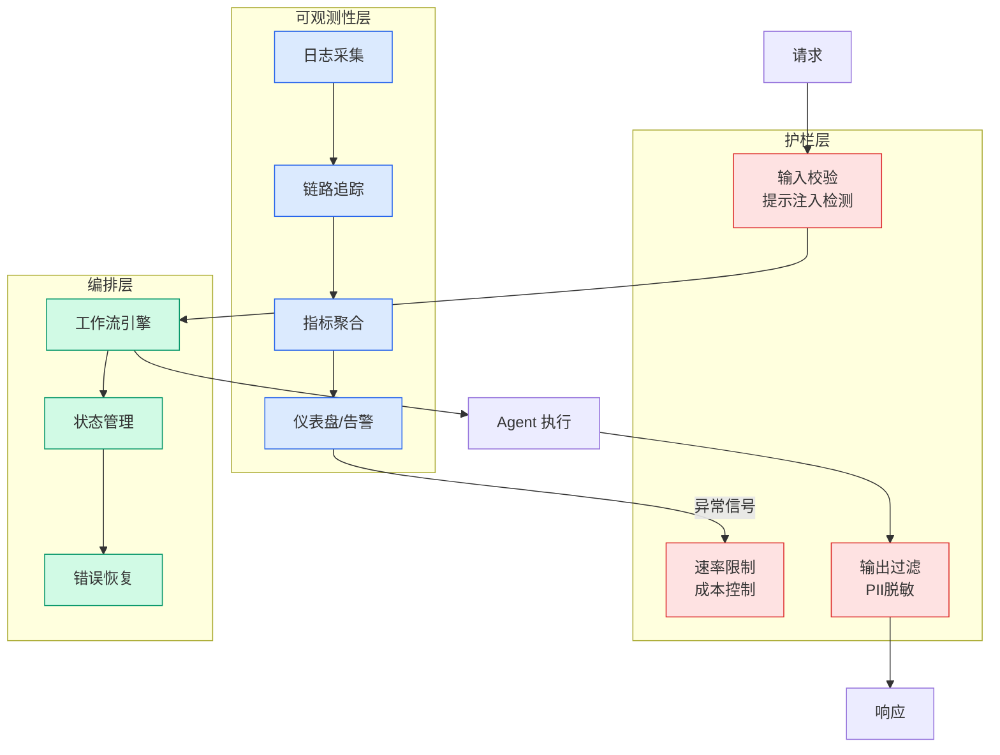

# 阿里云 AI 工程实践合集

## Ch01.1210 阿里云 AI 工程实践合集

> 📊 Level ⭐⭐ | 1.8KB | `entities/alicloud-ai-practices.md`

# 阿里云 AI 工程实践合集

阿里云在 AI 工程化方向的实践集合：涵盖模型服务、Agent 平台、向量检索、知识库构建等场景。其特点是大规模真实业务验证。

## 深度分析

本页作为知识图谱锚点，连接了以下关键实体：[Microsoft for Startups | Microsoft](https://github.com/QianJinGuo/wiki/blob/main/entities/Microsoft-for-Startups-Microsoft-v2.md)。 相关主题通过 [AWS Reinvent Game Demo 2024-25](../ch11/251-aws-reinvent-game-demo-2024-25.html) 延伸。

> 本页内容将在入库相关溯源素材后进一步深化。

## 实践启示

1. 本领域系统性内容尚待采集——当前知识库在此方向的覆盖密度偏低
2. 建议优先采集 阿里云 AI 工程实践合集 相关的一手来源（论文/官方文档/工程博客）
3. 通过交叉链接密度评估本领域的知识图谱成熟度

## 相关实体

- [Microsoft for Startups | Microsoft](https://github.com/QianJinGuo/wiki/blob/main/entities/Microsoft-for-Startups-Microsoft-v2.md)
- [AWS Reinvent Game Demo 2024-25](../ch11/251-aws-reinvent-game-demo-2024-25.html)
- [AWS 一周综述：AWS Transform 上线一周年、AWS 云端 Claude Platform、EC2 M3 Ultra Mac 实例等（2026 年 5 月 18 日）](ch01/976-claude.html)
- [Mini Shai-Hulud Strikes Again: TanStack + more npm Packages Compromised](ch01/1092-mini-shai-hulud-strikes-again-tanstack-more-npm-packages.html)
- [给野马套上缰绳：Agent Harness 工程实践 — 从范式理论到钉钉AI招聘的真实落地](../ch05/058-agent-harness.html)

---

