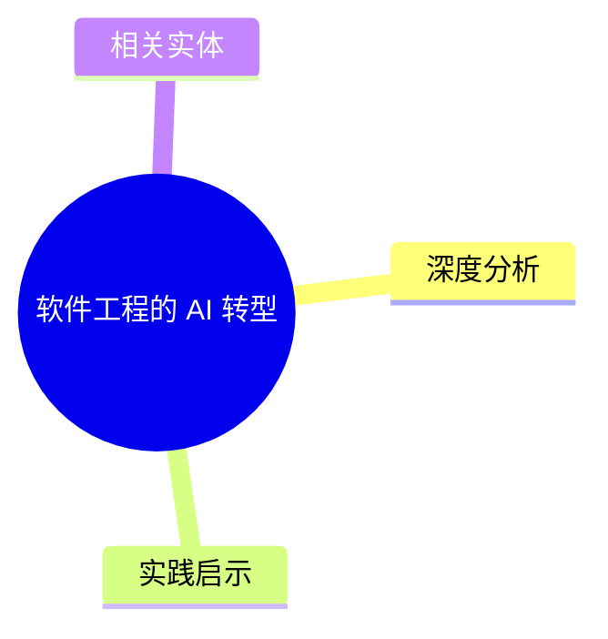
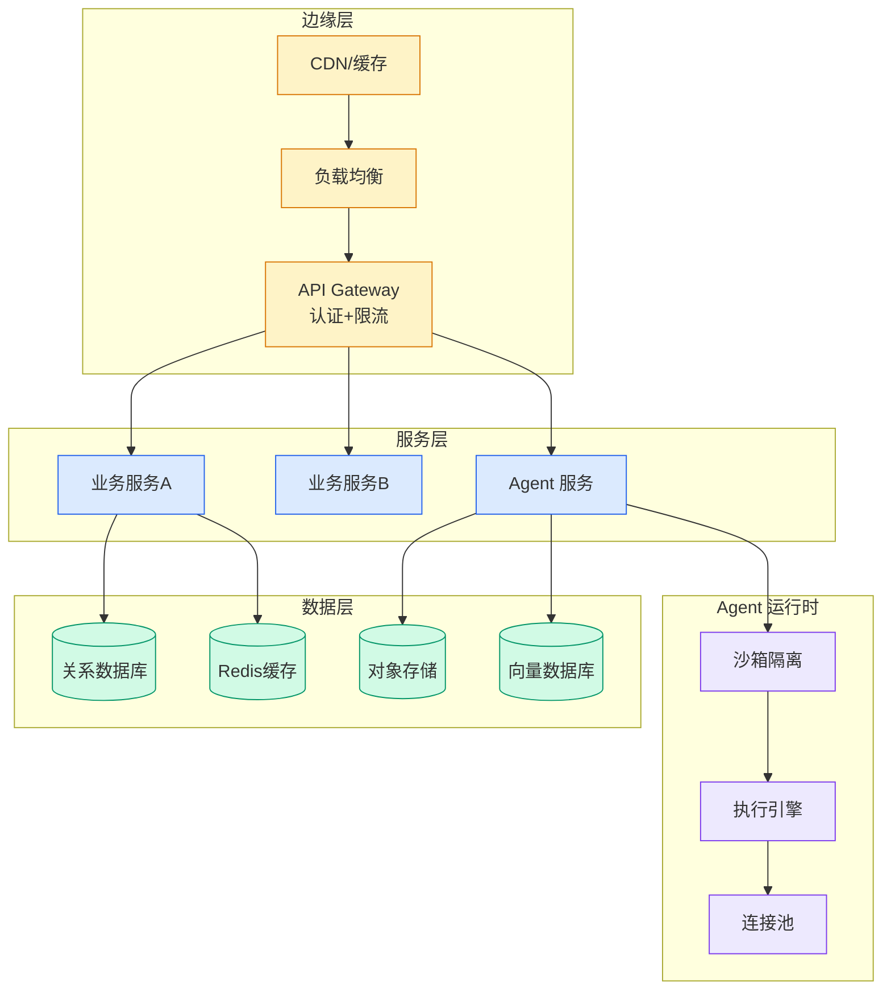

# 软件工程的 AI 转型

## Ch01.1211 软件工程的 AI 转型

> 📊 Level ⭐⭐ | 1.6KB | `entities/software-engineering-ai-transformation.md`

# 软件工程的 AI 转型

软件工程在 AI 冲击下的范式转型：从手工编码到 Spec 驱动、从瀑布敏捷到 Loop Engineering、从代码资产到 Prompt/Skill 资产。软件 3.0 的核心命题。

## 概念导图

## 深度分析

本页作为知识图谱锚点，连接了以下关键实体：[Karpathy 最新访谈：从 Vibe Coding 到 Agentic Engineering](../ch04/237-agentic.html)。 相关主题通过 [Is Software Losing Its Head](ch01/651-is-software-losing-its-head.html) 延伸。

> 本页内容将在入库相关溯源素材后进一步深化。

## 实践启示

1. 本领域系统性内容尚待采集——当前知识库在此方向的覆盖密度偏低
2. 建议优先采集 软件工程的 AI 转型 相关的一手来源（论文/官方文档/工程博客）
3. 通过交叉链接密度评估本领域的知识图谱成熟度

## 相关实体

- [Karpathy 最新访谈：从 Vibe Coding 到 Agentic Engineering](../ch04/237-agentic.html)
- [Is Software Losing Its Head](ch01/651-is-software-losing-its-head.html)
- [Cheap code means formal verification is reasonable now — Antfly Blog](../ch03/035-agent.html)
- [The Primitive is the Product — AI 时代的产品哲学：从功能到原语](../ch05/018-ai-native.html)
- [Vibe Coding and Agentic Engineering Convergence: Simon Willison Interview](../ch04/451-vibe-coding-agentic-engineering.html)

---

