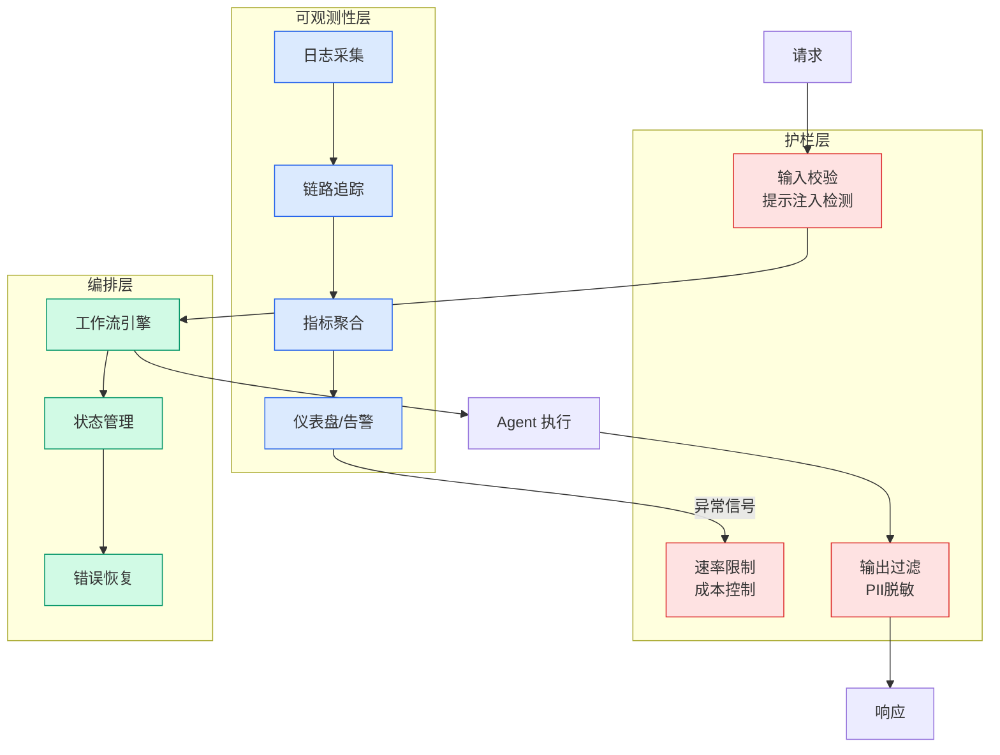

# GPT-2 权重之谜：为什么 OpenAI 的原始权重比自训练模型更擅长指令跟随

## Ch01.1212 GPT-2 权重之谜：为什么 OpenAI 的原始权重比自训练模型更擅长指令跟随

> 📊 Level ⭐⭐ | 1.6KB | `entities/gilesthomas-gpt2-weights-ift-comparison-2026-07-29.md`

# GPT-2 权重之谜：为什么 OpenAI 的原始权重比自训练模型更擅长指令跟随

Giles Thomas 在从零训练 LLM 的项目中发现一个反直觉现象：OpenAI 原始 GPT-2 small 权重在指令跟随评估中始终优于他自训练的模型，即使他的模型在交叉熵损失（cross-entropy loss）等技术指标上表现更好。

## 核心发现

- **反直觉结果**：更低的 test loss 并不意味着更好的指令跟随能力
- **评估分歧**：技术指标（perplexity/loss）与实用指标（instruction-following quality）之间存在 gap
- **研究目标**：作者利用专用 LLM 训练机器（poppy）设计实验来探究这一现象的原因

## 实验设置

作者使用 Build a Large Language Model (from Scratch) 一书第 7 章的指令微调代码，在 Alpaca 指令跟随数据集上训练模型，直到验证损失开始上升。然后使用 LLM 作为评判（LLM-as-judge）来比较不同模型的生成结果。

## 意义

这一发现挑战了"更好的 loss = 更好的模型"的常见假设，表明 LLM 评估需要从单一技术指标转向多维评估体系——尤其是对于指令跟随这类实用能力。

→ [原文存档](https://github.com/QianJinGuo/wiki-book/tree/main/docs/raw/articles/gilesthomas-gpt2-weights-ift-comparison-2026-07-29.md)

---

