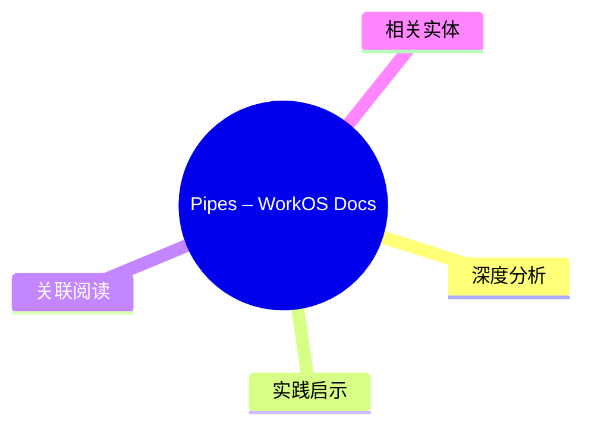
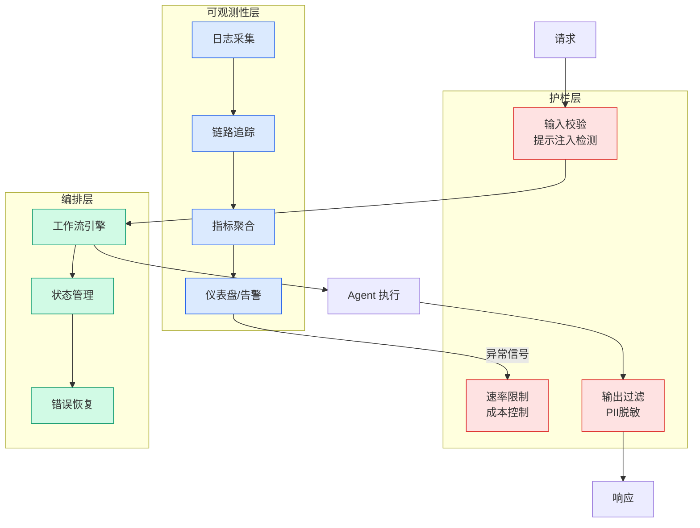

# Pipes – WorkOS Docs

## Ch01.129 Pipes – WorkOS Docs

> 📊 Level ⭐ | 4.6KB | `entities/pipes-workos-docs.md`

## 概念导图

## 核心要点
- Pipes is an OAuth integration-as-a-service product by WorkOS 
- 抽象掉了 token 刷新、凭证存储、OAuth 流程管理等工程负担 
- 支持 GitHub、Slack、Google、Salesforce 等主流服务 
- 提供预构建的 Pipes Widget UI，降低前端集成成本 

## 深度分析

**定位与市场空间**
WorkOS Pipes 属于 **OAuth aggregator** 赛道，本质上是把"连接用户第三方账户"这件事做成托管服务。类似的产品包括 Stitch Fix 的 auth-portal、Nango、以及一些开源方案如 NextAuth 的 provider 生态。Pipes 的差异化在于：(1) 预建的 Widget UI 让终端用户交互开箱即用；(2) WorkOS 本身的 SSO/JIT provisioning 产品矩阵提供了天然的交叉销售场景。
**技术抽象层次**
从架构角度看，Pipes 做了三层封装：
| 层级 | 职责 | Pipes 实现 |
|------|------|-----------|
| OAuth Flow | 授权跳转、回调处理 | WorkOS 代为处理 |
| Token 管理 | 存储、刷新、轮转 | WorkOS 生命周期管理 |
| API 代理 | 以用户身份调用第三方 API | fetch access tokens API |
这种分层让接入方只需调用一个 REST API 即可"以用户身份"调用第三方服务，省去了维护 OAuth state machine 的工程成本 。对于不熟悉 OAuth 2.0 RFC6749 细节的团队，这个抽象价值显著。
**Credential 模式的双重路径**
Shared Credentials 模式允许使用 WorkOS 提供的沙箱凭证，这对快速原型和早期开发非常友好 。Custom Credentials 模式则要求接入方在各个 provider 自建 OAuth App 。两者的边界实际上就是"开发阶段"和"生产阶段"的分野——这和 Stripe 的 test/live mode 逻辑如出一辙。
**Token 刷新与错误恢复**
Pipes 在 token 刷新上做了自动化处理，API 返回的始终是"新鲜"的 token 。当 token 失效时，API 返回结构化的错误信息，接入方据此引导用户重新授权。这个设计让应用层代码不需要感知 token 过期时间，只处理"需要重新授权"这个业务事件即可。
**安全考量**
虽然文档没有详述，但作为 OAuth 中介服务，Pipes 的安全边界值得注意：所有 token 流经 WorkOS 基础设施，意味着 WorkOS 本身成为第三方服务的事实上的 credential 保管方。对于高度监管行业（如金融、医疗）的合规团队，这种架构需要通过 vendor security assessment。

## 实践启示
1. **MVP 阶段的效率工具**：如果你的应用需要快速集成 GitHub/Google 登录以外的其他 API（如让用户连接他们的 GitHub repos、Slack workspace），Pipes 可以将工程时间从"2-3 周OAuth实现"压缩到"1-2 天对接"。
2. **Widget vs. DIY UI**：Pipes Widget 提供了完整的连接管理 UI，包含 provider 列表、授权状态、re-authorization 提示。如果你的产品中"用户第三方账户管理"不是核心差异化功能，使用 Widget 能显著减少前端工程量。
3. **Credential 模式的切换节奏**：建议先用 Shared Credentials 跑通流程、上线 beta，切换到 Custom Credentials 的时机是：(a) provider 开始要求你的应用通过 OAuth 审核；(b) 你需要生产级别的 token 可靠性和独立的 provider 配置控制。
4. **错误处理设计**：接入 Pipes 时，务必实现"re-authorization flow"的优雅降级：检测到 `token_error` 时，将用户重定向到 Pipes Widget 的连接页面，而不是直接报错。

## 关联阅读
## 相关实体
- [Workos Pipes Third Party Integrations](ch01/059-workos-pipes-third-party-integrations-without-the-headache.html)
- [From Doer To Director The Ai Mindset Shift](ch01/031-from-doer-to-director-the-ai-mindset-shift.html)
- [Microsoft For Startups Microsoft](ch01/1010-microsoft-for-startups-microsoft.html)
- [Running An Ai Native Engineering Org](ch01/055-running-an-ai-native-engineering-org.html)

→ [原文存档](https://github.com/QianJinGuo/wiki-book/tree/main/docs/raw/articles/pipes-workos-docs.md)

---

