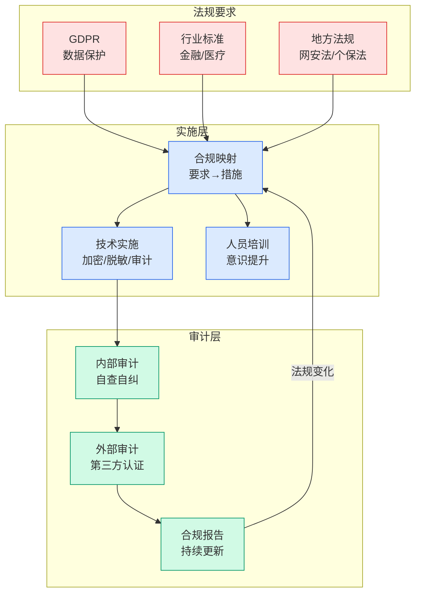

# Why Internally-Built AI Fails Fund Accounting Audits

## Ch01.130 Why Internally-Built AI Fails Fund Accounting Audits

> 📊 Level ⭐ | 4.6KB | `entities/why-internally-built-ai-fails-fund-accounting-audits.md`

> -> [原文存档](https://github.com/QianJinGuo/wiki-book/tree/main/docs/raw/articles/why-internally-built-ai-fails-fund-accounting-audits.md)

## 核心要点
- ...
→ [原文存档](https://github.com/QianJinGuo/wiki-book/tree/main/docs/raw/articles/why-internally-built-ai-fails-fund-accounting-audits.md)

## 深度分析

**AI 在基金会计中面临的是审计架构问题，而非性能问题。** COSO 2026 年生成式 AI 指引与 PCAOB AS 2201 共同将 AI 审计标准明确为两个核心问题：①能否证明 AI 看了什么（输入的可验证性）；②能否证明系统与上季度运行的是同一个（可重现性）。这两个问题对任何通用聊天界面包装的内部 AI 都是结构性挑战：会话历史可编辑、模型静默漂移、输出非确定性、缺乏版本控制。
**六大失败模式揭示内部构建的系统性缺陷。** 会话历史可编辑意味着审计证据可以被事后修改；模型静默漂移意味着上次通过审计的版本与当前版本可能已不同；非确定性输出意味着相同输入无法复现相同结果；无变更治理意味着任何代码修改都可能重新打开所有历史审计问题；交给 IT 部门不能转移合规责任——Finance 仍为 AI 的输出负责；每次变更都需要重新验证，成本随变更频率指数增长。
**「构建时 AI，运行时代码」是唯一可通过审计的架构范式。** 文章提出最核心的架构原则：在构建时使用 AI 生成已验证的逻辑（瀑布图规则引擎、GP/LP 分配逻辑），验证后以确定性代码执行——运行时不发起任何实时 LLM 调用。这与当前许多企业「用 LLM 处理基金计算」的做法截然相反，但这是唯一能在审计中站住脚的方案。
**合规性的根本转变：从「功能证明」到「架构证明」。** 传统软件审计验证的是「功能是否正确实现」；AI 审计的新维度要求证明「这个 AI 看过哪些数据、用什么逻辑处理、版本是否与上次一致」——这是一套全新的证明体系，而大多数内部 AI 构建方式根本无法满足。

## 实践启示
- **基金/财务团队**：在评估 AI 供应商或内部构建方案时，将「审计就绪性」作为架构要求而非功能清单——要求提供防篡改的输入/输出记录、模型版本可证明性、确定性执行证明；询问「上次审计与本次审计之间，模型版本是否变化」应当得到明确的书面回答。
- **IT 团队**：将 AI 的角色定位从「运行时的智能计算」重新定义为「构建时的逻辑生成」——用 AI 辅助编写基金会计规则引擎，然后以确定性代码执行；避免在任何涉及基金计算的环节保留实时 LLM 调用。
- **审计人员**：重点关注 AI 系统的版本控制机制、变更管理流程和防篡改审计日志——这些是判断 AI 是否「审计就绪」的核心证据，而非 AI 的输出准确性本身；平台层面的 maker/checker（而非邮件/Slack 审批）是 SOX 等效控制的基本要求。
- **AI 产品设计者**：面向金融行业的 AI 产品，必须从一开始内置审计轨迹（输入记录、逻辑版本、执行时间戳），而非事后补充；这是产品能否进入金融行业控制环境的准入门槛。

## 相关实体
- [Why Internally-Built AI Fails Fund Accounting Audits](ch01/130-why-internally-built-ai-fails-fund-accounting-audits.html)
- [Why Internally-Built AI Fails Fund Accounting Audits](ch01/130-why-internally-built-ai-fails-fund-accounting-audits.html)
- [How Superset built the IDE for AI agents on Vercel](ch01/080-how-superset-built-the-ide-for-ai-agents-on-vercel.html)- [agentic code review](ch01/171-agentic-code-review.html)- [apple foundation models](ch01/154-apple-foundation-models.html)- [the oracle and the firm](https://github.com/QianJinGuo/wiki/blob/main/entities/calv-oracle-and-the-firm.md)- [what job interviews taught me about kubernetes](https://github.com/QianJinGuo/wiki/blob/main/entities/notnotp-k8s-interviews-non-technical.md)- [here](https://github.com/QianJinGuo/wiki/blob/main/entities/randsinrepose-we-dont-believe-you-rub.md)- [a backdoor in a linkedin job offer](../ch05/094-ai.html)- [every frame perfect](ch01/169-every-frame-perfect.html)

---

