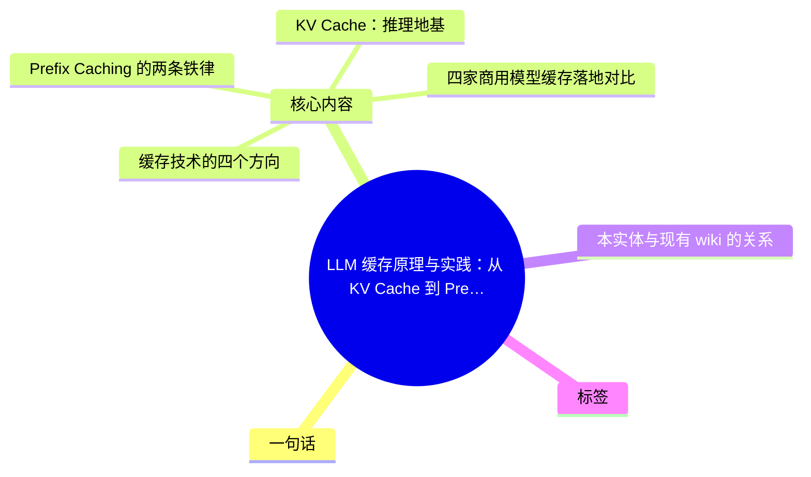
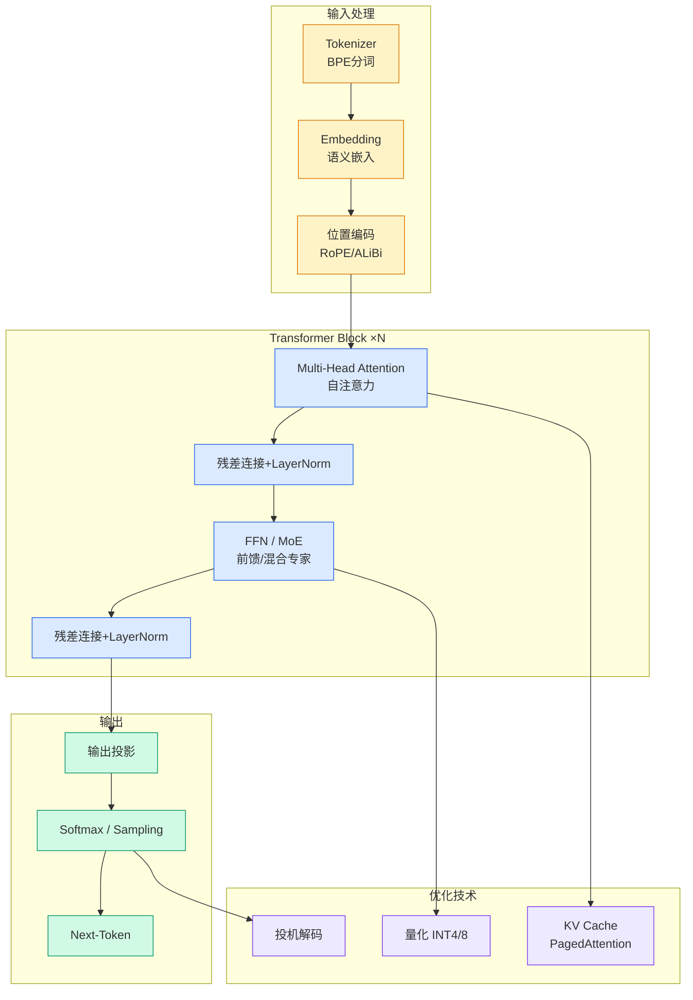

# LLM 缓存原理与实践：从 KV Cache 到 Prefix Caching，Agent 命中率常挂 90% 的机制与工程含义

## Ch01.1306 LLM 缓存原理与实践：从 KV Cache 到 Prefix Caching，Agent 命中率常挂 90% 的机制与工程含义

> 📊 Level ⭐⭐⭐ | 5.6KB | `entities/llm-prefix-caching-comprehensive-guide.md`

# LLM 缓存原理与实践

> 原文归档：[原文归档](https://github.com/QianJinGuo/wiki-book/tree/main/docs/raw/articles/llm-prefix-caching-comprehensive-guide-2026-07-03.md)

LLM 缓存技术的完整梳理，从 KV Cache 第一性原理到 Prefix Caching 跨请求复用，再到 vLLM/SGLang 引擎实现和四家商用模型落地策略，最后揭示 agent 工作负载如何天然匹配"只追加"模式驱动 90% 缓存命中率。

## 概念导图

## 一句话

**Agent 多轮对话的"只追加"模式天然匹配 Prefix Caching 的前缀精确匹配规则，导致主力模型缓存命中率普遍落在 90% 上下——这不是某家模型的特殊能力，而是工作负载形态的必然结果；高命中率本身也不等于低成本，因为它意味着每一轮都把整段大上下文重发了一遍。**

## 核心内容

### KV Cache：推理地基

自回归模型每生成一个新 token，都需要"回看"前面所有 token 计算注意力。KV Cache 将历史 token 的 Key/Value 缓存下来避免重算，把每步计算从 O(n²) 降到 O(n)。但局限是默认只在单请求内有效，无法跨请求复用。

### Prefix Caching 的两条铁律

1. **必须精确匹配**：RoPE 位置编码下，每个 token 的 K/V 既取决于内容也取决于位置，前缀中间一改后面全废
2. **只能追加**：在已缓存内容后面接新内容，缓存照命中；插改前置内容则全部失效

推论：稳定内容（系统提示、工具定义）放在最前面，易变内容（用户问题、时间戳）放最后。

### 缓存技术的四个方向

| 方向 | 技术 | 核心思想 |
|------|------|---------|
| 内存管理 | PagedAttention (vLLM) | KV Cache 分页虚拟化，显存浪费 60-80% → <4%，吞吐 2-4× |
| 前缀复用（哈希表） | vLLM APC | 定长 block 链式哈希，LRU 淘汰 |
| 前缀复用（前缀树） | SGLang RadixAttention | 基数树显式建模共享前缀，递归 LRU 叶子淘汰，吞吐最高 6.4× |
| 位置无关缓存 | Prompt Cache / CacheBlend / EPIC | 突破"必须是前缀"限制，模块化预计算/KV 融合/attention sink 修正 |

所有四个方向的详细机制见原文。

### 四家商用模型缓存落地对比

| 维度 | Claude | OpenAI | Gemini | DeepSeek |
|------|--------|--------|--------|----------|
| 开启 | 手动/自动 | 全自动 | 隐式+显式 | 全自动 |
| 命中折扣 | ~0.1× | ~5折→90% | ~75% | ~1/10 |
| TTL | 5min(自动续) | 5-10min | 1h(可自定义) | 数小时至数天 |
| 最小粒度 | 1024-4096 | 1024(128增量) | 1024-2048 | **64 token** |
| 存储 | 厂商侧 | 厂商侧 | 厂商侧 | **硬盘阵列(MLA压缩)** |

DeepSeek 的硬盘缓存方案独树一帜：靠 MLA 架构大幅压缩 KV 体积，得以低成本落地到分布式硬盘上长期保留。

### 命中率 ≈ (T−1)/(T+1)

agent 多轮对话的"只追加"模式使前缀不断增长。简化模型推导得出命中率公式 ≈ (T−1)/(T+1)：

| T（会话轮数） | 命中率 |
|--------------|--------|
| 10 | 81.8% |
| 20 | 90.5% |
| 40 | 95.1% |

典型 agent 编码会话十几到几十轮工具调用，命中率自然落在 90% 上下。TTL 短但每次命中自动续期，整场会话几乎不过期。

### 反直觉提醒

高命中率 ≠ 低成本。命中率高恰恰是"每轮都重发整段大上下文"的副产物。真实成本 = 命中读 + 写入 + 未缓存三部分总和。降成本的杠杆往往在掉到 50% 的少数流量上（绑定单一模型、稳定工具集），而非已 90% 的主力模型。

## 本实体与现有 wiki 的关系

本实体是 wiki 中首个系统性覆盖 LLM 推理缓存的实体。与以下实体形成互补：

- 与 [DeepSeek 成本迁移与系统层 KV Cache + Harness 工程](ch01/1091-deepseek.html) 互补——该实体聚焦 DeepSeek 的迁移案例，本文提供全行业全景
- 与 [OpenClacky Prompt Cache Harness](../ch05/009-harness.html) 互补——该实体聚焦特定提示缓存方案，本文覆盖原理和所有主流方案
- 与 [Claude Cache Tokenomics](ch01/976-claude.html) 互补——该实体聚焦 Anthropic 的 5 分钟 TTL 机制，本文提供跨厂商对比

## 标签

#LLM推理 #KVCache #前缀缓存 #PagedAttention #RadixAttention #推理优化 #成本优化 #延迟 #Agent工作负载 #vLLM #SGLang

→ [原文存档](https://github.com/QianJinGuo/wiki-book/tree/main/docs/raw/articles/llm-prefix-caching-comprehensive-guide-2026-07-03.md)

---

