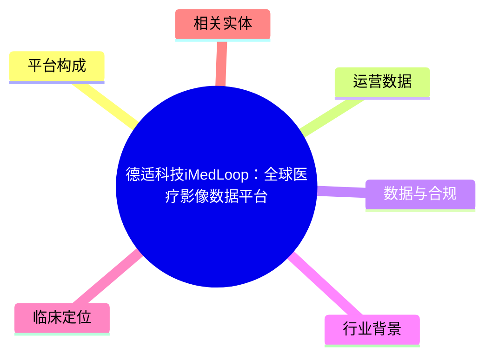
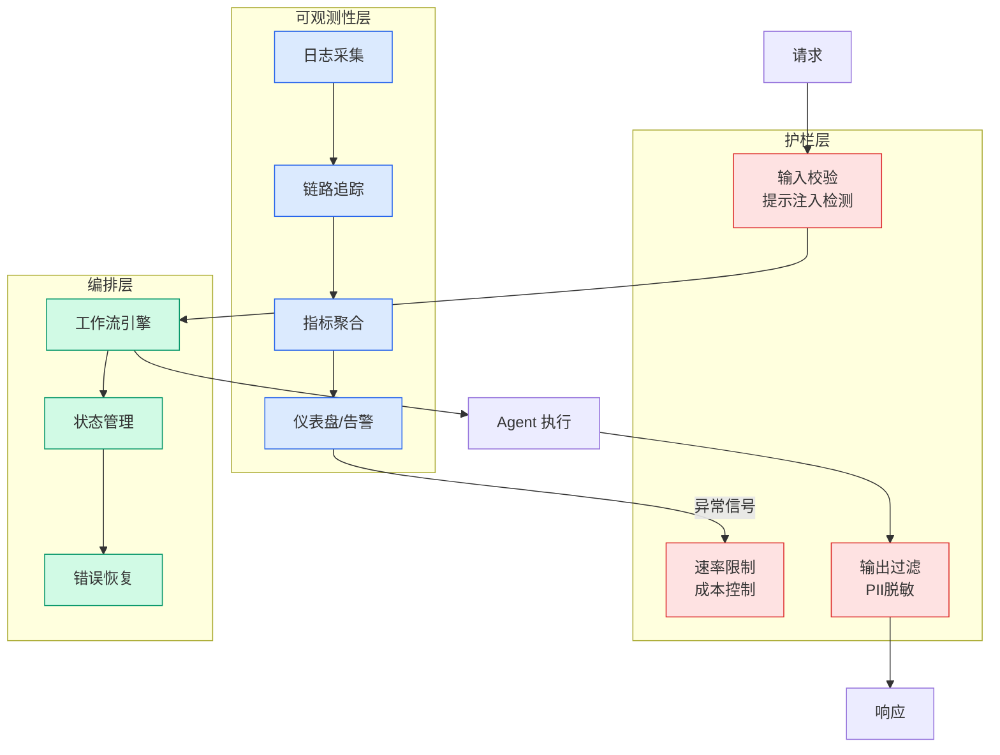

# 德适科技iMedLoop：全球医疗影像数据平台

## Ch01.1314 德适科技iMedLoop：全球医疗影像数据平台

> 📊 Level ⭐⭐⭐ | 4.0KB | `entities/imedloop-medical-image-platform-deshi-2026.md`

# 德适科技iMedLoop：全球医疗影像数据平台

iMedLoop 是德适科技（Deshi Tech）发布的全球医疗影像数据合规协同平台，建立在可信数据空间框架之下，将高质量数据集、专业数据标注、模型训练开发与临床应用打通为完整链路。

## 概念导图

## 平台构成

iMedLoop 由三块核心拼图构成：

- **iMedImage**：全球同领域参数规模最大的医疗影像基座大模型，以医疗影像为输入直接输出诊断结果。基于该基座，训练专科模型所需的标注数据量降至原来的约 1/200，开发周期、成本和算力支出下降 10 倍以上。
- **iMedStudio**：AI 嵌入标注环节的专业标注工具，医生仅需点一次鼠标指示方向，AI 即可在数百张三维影像上完成精准标注，标注时间从数小时缩短至一分钟内，多专家标注结果交并比从 65% 提升至 99%。
- **iMedMaaS**：基于托管云和私有化部署的模型训练与发布平台，医疗机构可直接在平台上完成模型训练和成果发布。

## 运营数据

截至发布日，iMedLoop 平台已与全国 97 家三甲医院合作，训练了 145 个垂直模型（其中 30 个达到全球领先水平），积累 2895 万条高质量医疗影像数据、100 余款医疗 AI 模型，超 3000 名专业标注人员入驻。

> 专病模型训练所需标注数据量缩减至原来的 1/200，整体开发周期压缩至 1/12，资金与算力综合投入成本直降 90%。

## 数据与合规

平台建立在可信数据空间框架下，实现医疗影像数据在合规前提下的流通和授权使用。已有多家医疗机构、数据要素供应商和 AI 科技企业完成可信数据空间合作签约，涉及五个层次：可信数据空间合作、产业战略合作、数据生态合作、标注生态合作、全域共建生态合作。

## 行业背景

iMedLoop 的发布背景是医疗 AI 市场的快速扩张——德适科技援引世界经济论坛白皮书预测，到 2032 年全球 AI 医疗市场总价值将达到约 4910 亿美元，而当前市场规模还不到 400 亿美元。同时，国务院《国民健康"十五五"规划》将医学影像数据明确列为健康领域新质生产力培育的关键资源。

## 临床定位

AI 在 iMedLoop 中的角色是辅助医生、服务临床决策——中国工程院院士詹启敏明确指出技术是提高诊疗水平的辅助工具，浙江省肿瘤医院院长张宏判断未来是人机协同模式：机器人负责精度，医生把控方案与风险。

## 相关实体

- [医疗预约Agent](../ch04/621-build-a-healthcare-appointment-agent-with-amazon-nova-2-soni.html)
- [Heidi Health 临床AI](../ch05/094-ai.html)
- [Anthropic 生物学Agent](ch01/989-anthropic.html)
- [NVIDIA BioNeMo Agent](../ch04/326-nvidia-bionemo-agent-toolkit.html)
- [Data Agent 平台架构](https://github.com/QianJinGuo/wiki/blob/main/concepts/data-agent-platform-architecture.md)
- 多模态AI (`concepts/multimodal-ai` 待创建)

→ [原文存档](https://github.com/QianJinGuo/wiki-book/tree/main/docs/raw/articles/杭州再出王炸医疗影像黑马德适推出imedloop打通医疗ai全链路.md)

---

