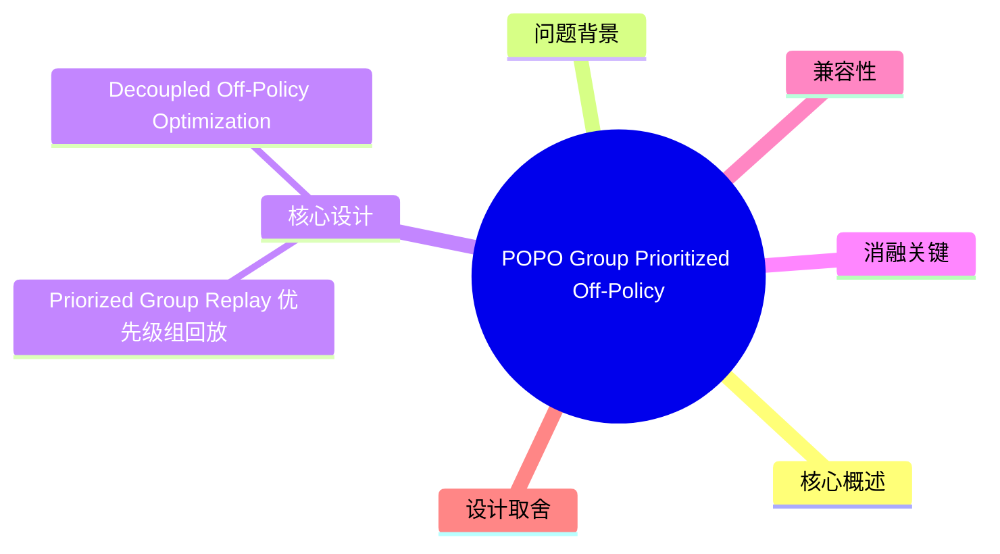
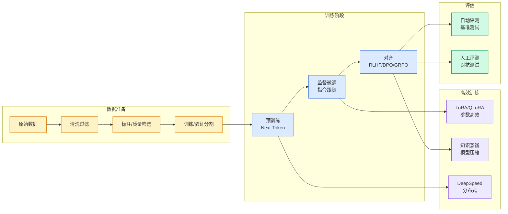

# POPO (Group Prioritized Off-Policy Optimization)：清华 RLVR 训练高效组级回放框架

## Ch01.1316 POPO (Group Prioritized Off-Policy Optimization)：清华 RLVR 训练高效组级回放框架

> 📊 Level ⭐⭐⭐ | 3.9KB | `entities/tsinghua-popo-group-prioritized-off-policy-optimization-rlvr.md`

## 概念导图

## 核心概述

清华大学自动化系提出的 POPO（Group Prioritized Off-Policy Optimization），面向 LLM reasoning RLVR 训练的高效 off-policy 优化框架。核心洞察：GRPO 类 RLVR 训练中大量 rollout 生成的是 "无效样本"（组内 reward 方差为 0，无训练信号）。POPO 不额外做 rollout，而是将当前 batch 中的无效组替换为最近缓存过的高质量有效组，并通过解耦式 off-policy 重要性采样稳定更新。

→ [原文存档](https://github.com/QianJinGuo/wiki-book/tree/main/docs/raw/articles/tsinghua-popo-group-prioritized-off-policy-optimization-rlvr.md)

## 问题背景

在 GRPO 等组内归一化 RLVR 算法中，模型对同一 prompt 生成一组回答并计算相对优势。当组内全部正确或全部错误时，reward 方差为 0，优势消失——这些样本被称为 **ineffective samples**。这类问题在 RLVR 训练中非常普遍，简单题全部答对、难题全部答错，均消耗 rollout 成本却无学习信号。

## 核心设计

### Priorized Group Replay（优先级组回放）
- 维护小型 FIFO replay buffer，存放最近遇到的有效（reward 方差 > 0）response group
- 每步训练：rollout → 按方差分离有效/无效组 → 保留有效组 → 无效组由 buffer 中最近有效组补齐
- **组级回放**而非轨迹级：整组来自同一历史策略，维持组内一致性，可做 off-policy 校正

### Decoupled Off-Policy Optimization（解耦式 off-policy 优化）
- 行为策略（说明回放数据来源）与近端约束策略（约束更新不偏离旧策略）拆开
- 重要性采样校正 off-policy bias + trust-region 保持稳定性

## 实验结果

| 设置 | POPO | DAPO | 节省 |
|------|------|------|------|
| DSR-7B 分布内 | 63.3 | 63.2 | — |
| DSR-7B 训练时间 | **34h** | 55h | 38% |
| Countdown 准确率 | 60.4 | 61.5 | — |
| Countdown rollout | **205k** | 877k | 77% |
| Countdown 训练时间 | **3.2h** | 5.6h | 43% |
| Geometry 准确率 | 50.0 | 50.6 | — |
| Geometry rollout | **492k** | 1438k | 66% |
| Geometry 训练时间 | **6.8h** | 11.2h | 39% |

POPO 用约 **30%** 的 DAPO rollout 预算达到接近 DAPO 的性能，通常只需 40%-70% 训练步数即达 GRPO 终值。

## 消融关键

- 仅过滤不补齐（GRPO-filter）：效果不足
- 久远历史回放（POPO-stale）：性能崩溃 → replay 必须足够近 β
- 解耦式目标优于简单 on-policy 处理或完全对齐行为策略

## 兼容性

不同 response group size (k=4~32) 稳定优于 GRPO；可结合 RLOO、PPO、MoPPS 使用。

## 设计取舍

| 选择 | 收益 | 代价 |
|------|------|------|
| 组级回放 vs 轨迹级回放 | 组内一致性 + off-policy 可校正 | buffer 更大 |
| FIFO recency 近似 vs KL 选择 | 更高效 | 略低精确度 |
| 解耦式优化 | 稳定 off-policy 训练 | 多维护一个行为策略引用 |

## 相关实体

- [2026 年面向 LLM 的 RL 方法总结](ch01/1274-llm.html) — PPO/DPO/GRPO 全景综述
- [APPO：阿里高德 Agent RL 信用分配到每个决策点](../ch04/237-agentic.html) — 另一 ARPO 系列 RL 方法
- [Self-Taught RLVR：京东让大模型自己教自己](ch01/888-self-taught-rlvr.html)

---

