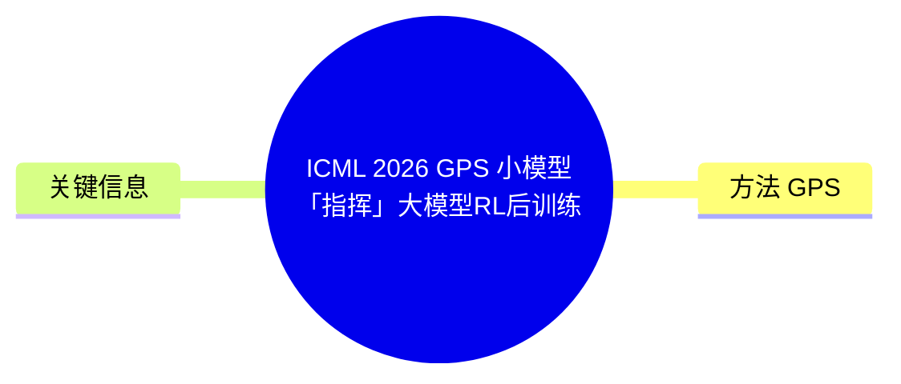
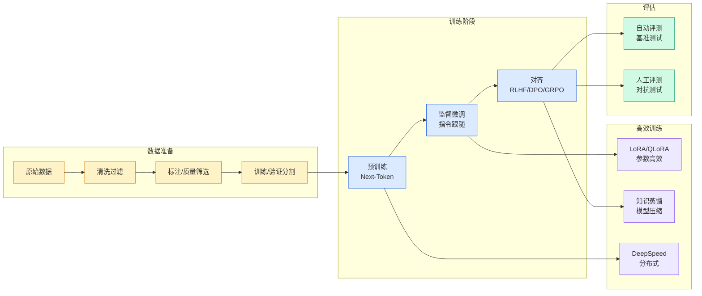

# ICML 2026: GPS — 小模型「指挥」大模型RL后训练，最高减少69% Rollout成本

## Ch01.1318 ICML 2026: GPS — 小模型「指挥」大模型RL后训练，最高减少69% Rollout成本

> 📊 Level ⭐⭐⭐ | 3.5KB | `entities/icml-2026-gps-prompt-predictive-model-rl-post-training-tsinghua-tencent.md`

# ICML 2026: GPS — 小模型「指挥」大模型RL后训练，最高减少69% Rollout成本

GPS（Generalizable Predictive Prompt Selection）是清华大学与腾讯在 ICML 2026 上提出的方法，通过训练一个小型 Prompt Predictive Model（PPM）预测 prompt 难度，从而在 RL 后训练中减少无效 rollout，降低训练成本。

## 概念导图

## 核心问题

RLVR（Reinforcement Learning with Verifiable Rewards）已经成为提升大模型推理能力的重要后训练路线，但存在一个很现实的问题：每个训练 step 都需要大量 rollout，而这些 rollout 往往需要反复调用大模型生成长答案，计算和显存开销都很大。

并非所有 prompt 都同样有训练价值——太简单的 prompt 几乎每次都答对，梯度信号弱；太难的 prompt 几乎每次都答错，同样难以提供有效学习信号。真正有价值的往往是中等难度的 prompt。

## 方法：GPS

GPS 的做法是：先训练一个小型、可泛化的 Prompt Predictive Model（PPM），让它预测不同 prompt 在当前模型下的难度；再根据难度和 batch 多样性选择训练样本，从而减少无效 rollout。

与已有的方法相比：
- **基于真实评估的方法**（如 Dynamic Sampling/DS）：效果好但额外评估本身非常昂贵
- **基于预测的方法**（如 MoPPS、GRESO）：把每个 prompt 当成独立对象建模，难以跟上模型训练的持续变化
- **GPS**：使用轻量 PPM，利用整个优化历史在 prompt 之间共享信息，用更好的 batch 选择策略提升 RL 后训练效率

## 实验结果

GPS 在数学推理和逻辑推理任务上带来了明显收益：

- **训练加速**：相比 Uniform 随机采样，训练步数加速 1.4×–2.0×
- **成本降低**：相比 DS Oracle 基线，最多减少 69% rollout 成本，训练时间减少 28%–47%
- **测试时计算复用**：小预测模型可复用到测试时计算分配中，固定预算下最高提升 3.2%，或性能不下降时节省 36.4% 推理计算

## 关键信息

- 论文：Small Generalizable Prompt Predictive Models Can Steer Efficient RL Post-Training of Large Reasoning Models
- 链接：https://arxiv.org/abs/2602.01970
- 代码：https://github.com/thu-rllab/GPS
- 机构：清华大学自动化系季向阳教授团队 + 腾讯混元

→ [原文存档](https://github.com/QianJinGuo/wiki-book/tree/main/docs/raw/articles/icml-2026-gps-prompt-predictive-model-rl-post-training-tsinghua-tencent.md)

---
## 关联
- 相关概念: [Harness Engineering](https://github.com/QianJinGuo/wiki/blob/main/concepts/harness-engineering-framework.md)
- 相关: [Agent 架构](https://github.com/QianJinGuo/wiki/blob/main/concepts/agent-architecture.md)

---

